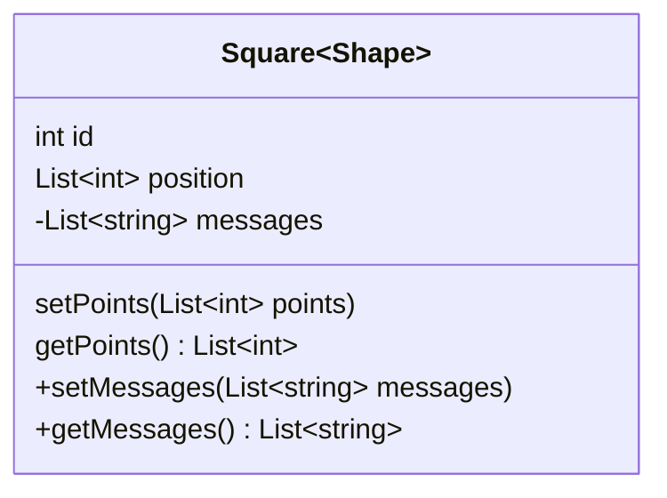
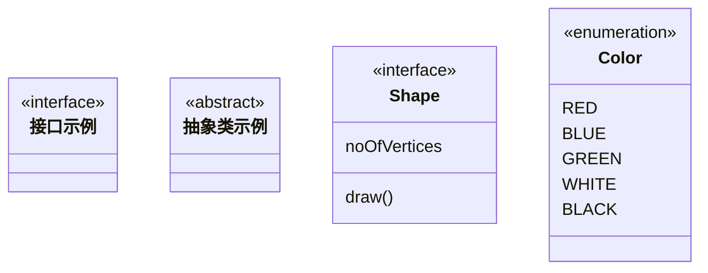
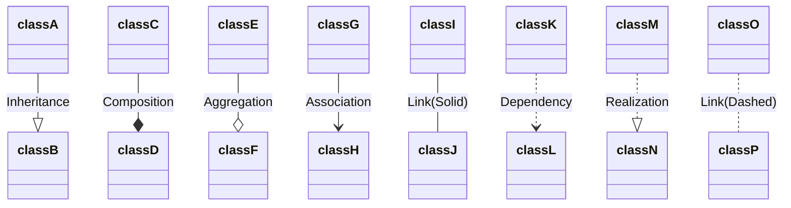
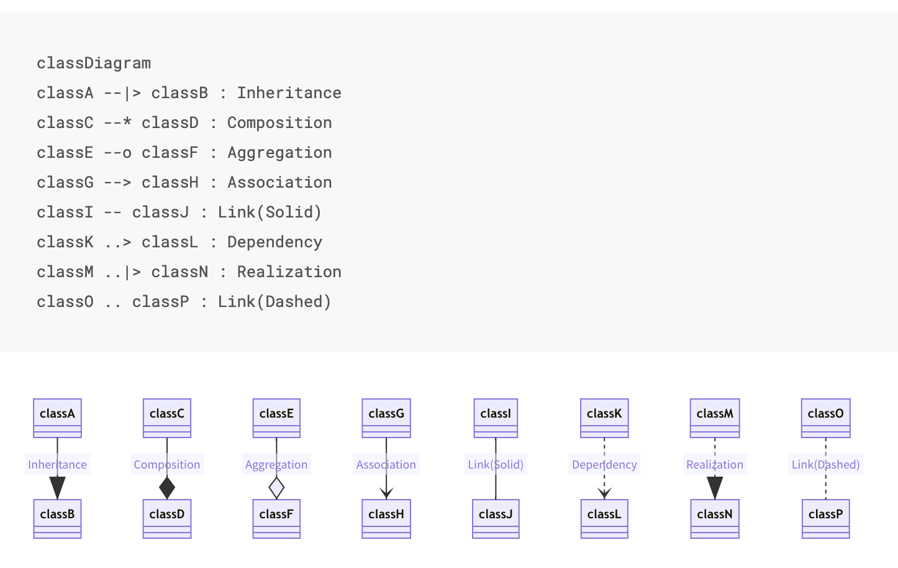
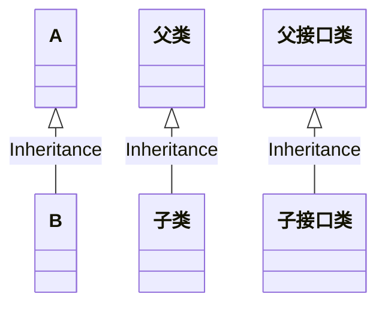
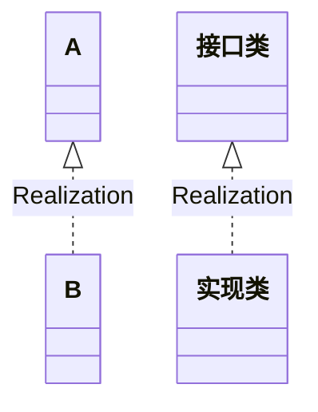
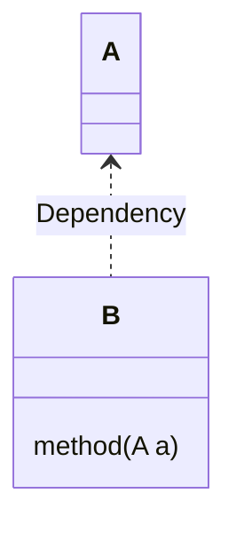
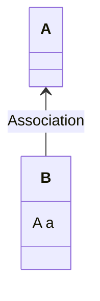
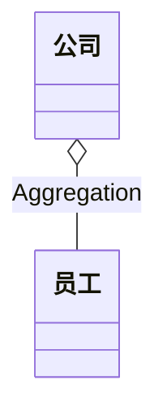
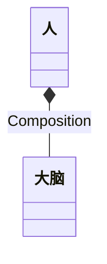

<!--more-->

# 更改字体、大小、颜色

<font color=Blue>Markdown语法</font>

```txt
<font face="黑体">我是黑体字</font>
<font face="微软雅黑">我是微软雅黑</font>
<font face="STCAIYUN">我是华文彩云</font>
<font color=red>我是红色</font>
<font color=#008000>我是绿色</font>
<font color=Blue>我是蓝色</font>
<font size=5>我是尺寸</font>
<font face="黑体" color=green size=5>我是黑体，绿色，尺寸为5</font>

```

<font color=Blue>效果如下：</font>

<font face="黑体">我是黑体字</font>
<font face="微软雅黑">我是微软雅黑</font>
<font face="STCAIYUN">我是华文彩云</font>
<font color=red>我是红色</font>
<font color=#008000>我是绿色</font>
<font color=Blue>我是蓝色</font>
<font size=5>我是尺寸</font>
<font face="黑体" color=green size=5>我是黑体，绿色，尺寸为5</font>

------

# 为文字添加背景色

由于 style 标签和标签的 style 属性不被支持，所以这里只能是借助 table, tr, td 等表格标签的 bgcolor 属性来实现背景色。故这里对于文字背景色的设置，只是将那一整行看作一个表格，更改了那个格子的背景色（bgcolor）

<font color=Blue>Markdown语法</font>

```txt
<table><tr><td bgcolor=yellow>背景色yellow</td></tr></table>

```

<font color=Blue>效果如下</font>

<table><tr><td bgcolor=yellow>背景色yellow</td></tr></table>

------

# 设置图片大小

## 设置设置图片百分比

<font color=Blue>Markdown语法</font>

```


```

<font color=Blue>效果如下</font>


## 设置图片大小

<font color=Blue>Markdown语法</font>

```

1
```

<font color=Blue>效果如下</font>


## 设置图片居中

<font color=Blue>Markdown语法</font>

```html
<div align=center></div>

```

<font color=Blue>效果如下</font>

<div align=center></div>


# 类图

## 定义类

```md
classDiagram
class Square~Shape~{
    int id
    List~int~ position
    setPoints(List~int~ points)
    getPoints() List~int~
}

Square : -List~string~ messages
Square : +setMessages(List~string~ messages)
Square : +getMessages() List~string~
```





### 类的标识

- `<<Interface>>` To represent an Interface class
- `<<abstract>>` To represent an abstract class
- `<<Service>>` To represent a service class
- `<<enumeration>>` To represent an enum

### 示例
```txt
classDiagram
class 接口示例
<<interface>> 接口示例

class 抽象类示例
<<abstract>> 抽象类示例

class Shape{
    <<interface>>
    noOfVertices
    draw()
}
class Color{
    <<enumeration>>
    RED
    BLUE
    GREEN
    WHITE
    BLACK
}
```





## 定义成员

- `+` Public
- `-` Private
- `#` Protected
- `~` Package/Internal

## 关系分类

| Type  | Description   |
| ----- | ------------- |
| <\|-- | Inheritance   |
| *--   | Composition   |
| o--   | Aggregation   |
| -->   | Association   |
| --    | Link (Solid)  |
| ..>   | Dependency    |
| ..\|> | Realization   |
| ..    | Link (Dashed) |

```md
classDiagram
classA --|> classB : Inheritance
classC --* classD : Composition
classE --o classF : Aggregation
classG --> classH : Association
classI -- classJ : Link(Solid)
classK ..> classL : Dependency
classM ..|> classN : Realization
classO .. classP : Link(Dashed)
```


### 关系-示例

[官网](https://mermaid-js.github.io/mermaid/#/classDiagram?id=syntax)



### 继承

- 继承
  - java：extends
  - 继承是类与类的关系；
  - 接口与接口之间的关系

```text
classDiagram
A  <|-- B : Inheritance
父类  <|-- 子类 : Inheritance
父接口类  <|-- 子接口类 : Inheritance
```

### 实现


- 实现
  - java：implements
  - 实现是类与接口之间最常见的关系; 
  - B类实现A接口

```text
classDiagram
A  <|.. B : Realization
接口类  <|.. 实现类 : Realization
```


### 依赖
- 依赖
  - 一个类A使用到了另一个类B
  - A作为B类方法的入参使用

```text
classDiagram
A  <.. B : Dependency
class B{
	method(A a)
}
```


### 关联
- 关联
  - 一种强依赖关系
  - 类A以类属性的形式出现在关联类B中

```text
classDiagram
A  <-- B : Association
```


### 聚合
- 聚合
  - 关联关系的一种特例；
  - 他体现的是整体与部分、拥有的关系；
  - 即has-a的关系
  - 语义级别的区分
  - 公司与员工的关系
  

```text
classDiagram
公司  o-- 员工 : Aggregation
```


### 组合
- 组合
  - 组合也是关联关系的一种特例
  - 他体现的是一种contains-a的关系；
  - 这种关系比聚合更强，也称为强聚合
  - 人和大脑的关系

```text
classDiagram
人  *-- 大脑 : Composition
```

# 参考链接

[RGB颜色对照表](https://blog.csdn.net/heimu24/article/details/81192697)

[Markdown 语法大全 包括设置字体 颜色](https://blog.csdn.net/qcx321/article/details/53780672)

[Markdown: Basics （快速入门）](https://www.appinn.com/markdown/basic.html)

[CSDN-markdown 文字样式设置（字体, 大小, 颜色, 高亮底色）](https://blog.csdn.net/thither_shore/article/details/52181464)

[Markdown进阶](https://blog.csdn.net/heimu24/article/details/81189700)

[类图](https://blog.csdn.net/sfdev/article/details/3906243)

[markdonw绘制类图](https://mermaid-js.github.io/mermaid/#/classDiagram?id=syntax)

