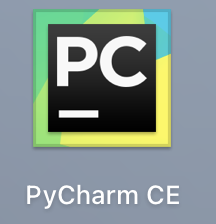
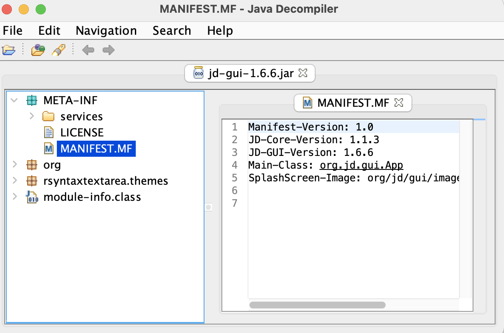
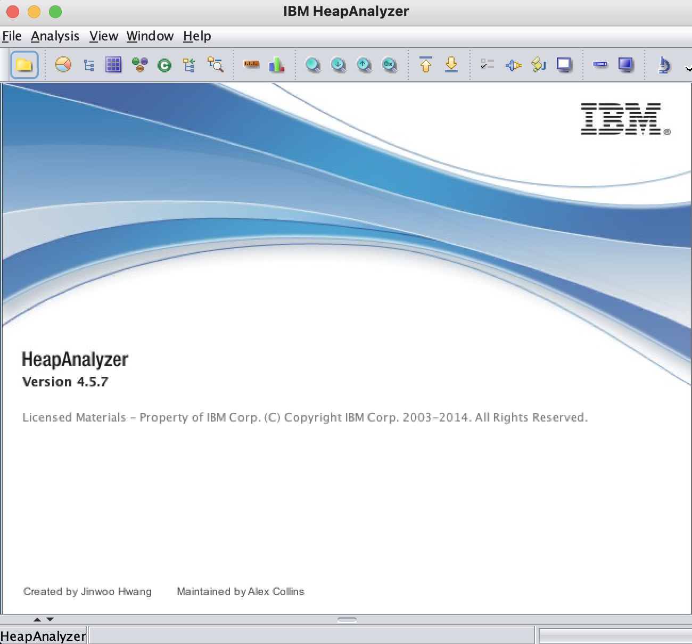
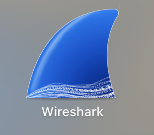
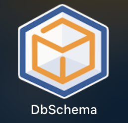
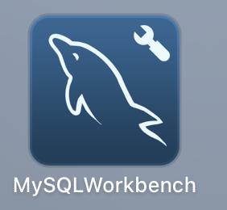
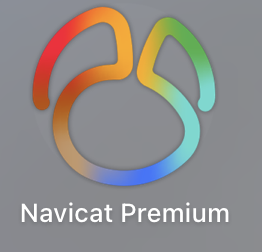
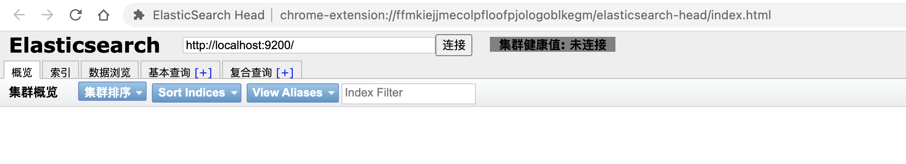

# 一路走来

# Hadoop

## 基础

- [x] 《Hadoop权威指南》
- [ ] [《大数据入门指南》](https://www.bookstack.cn/books/BigData-Notes)

## 文件系统

### HDFS

## 消息队列

### Apache Kafka
- [ ] 《Kafka权威指南》

### Apache Pulsar

## 存储

### Apache Hbase
- [x] 《HBase权威指南》
- [x] 《HBase原理与实践》

### Druid

- [x] 《Druid实时大数据分析原理与实践》

### ClickHouse
- [x] 《ClickHouse原理解析与应用实践》

### Hive
- [ ] 《》

## 计算

### Apache Spark

### Apache Flink

- [ ] 《Flink内核原理与实现》

# 其它

- [ ] 《剑指Offer》
- [ ] 《数学之美》
- [ ] 《编程之美》
- [ ] [《十大经典排序算法》][https://www.bookstack.cn/read/JS-Sorting-Algorithm/README.md]

# 计算机基础

## Http服务器

### Nginx
- [x] 《精通Nginx》

## 网络编程

### Netty
- [x] 《Netty权威指南》

## Linux

- [x] 《鸟哥的私房菜》
- [x] [《Linux C编程一站式学习》](https://www.bookstack.cn/books/linux-c)

## 缓存

### Redis

- [ ] [Redis中文文档](http://www.redis.cn/commands.html)
- [ ] 《Redis设计与实现》
- [ ] 《Redis入门指南》
## 容器
### Docker
- [ ] [《Docker — 从入门到实践》](https://vuepress.mirror.docker-practice.com/)

# 编程语言

## Java

### 多线程

- [x] [深入浅出Java多线程](https://redspider.gitbook.io/concurrent/)
- [ ] [Java并发编程的艺术](http://itmyhome.com/java-concurrent-programming/java-concurrent-programming.pdf)

### JVM

- [x] 《深入理解Java虚拟机》

## Python

### Scrapy

- [ ] [Scrapy官网](https://scrapy-chs.readthedocs.io/zh_CN/1.0/intro/overview.html)

# 工欲善其事必先利其器

## 软件开发

### 开发工具

#### IDEA

#### VsCode

#### XCode

#### PyCharm

#### GoLand

### 开发环境

#### Anaconda

### 反编译工具

#### jd-gui

#### CFR

- 终端版

- [官网](http://www.benf.org/other/cfr/index.html)

#### procyon

### 项目构建

#### Maven

#### Gradle

#### Ant

#### FIS3

#### Webpack

#### Rollup

### 项目管理

#### Teambition

#### TAPD

#### Jira

#### 禅道

#### Worktile

### 版本控制

#### Github

#### Gitee

#### Gitlab

#### SVN

### 质量管理工具

#### Sonarqube

## 远程终端工具

### SecureCRT 

- [x] [下载地址](https://macwk.com/soft/securecrt)

### 向日葵

## 测试工具

## 测试-监控&管理

### Java

- [x] [eclipse memory analyzer](https://www.eclipse.org/mat/downloads.php)

#### ha457

- [ ] ibm heap anayler [ha457.jar](https://www.ibm.com/support/pages/ibm-heapanalyzer)

#### jconsole

#### JProfiler

## 测试-性能测试

### Jmeter

- [x] 《零成本实现Web性能测试：基于Apache JMeter和Gatling》

## 测试-功能测试

### PostMan

## 测试-抓包工具

### Fiddler

### Charles

- [x] [下载地址](https://macwk.com/soft/charles)

### Writeshark

- [x]  [下载地址](https://macwk.com/soft/wireshark) 

## 文档协同

### 蓝湖

### Confluence

## 画图工具

### Draw.io

### Visio

### ProcessOn

## 画图-原型设计

### Axure

## 画图-思维导图

### XMind

### MindMaster

## 画图-数据库设计

### PowerDesigner

### Dbschema

### PDMain

## 画图-UML

### starUML

### omnigraffle

## 笔记工具

### 有道笔记

### 语雀

## 文本编辑

### Typora

## 数据库管理工具

### 通用

#### dbeaber

### Kafka

- [ ] kafdrop

### Redis

- [x] Another Redis Desktop Manager

- [x] Redis Desktop Manager

### MySql

- [x] workbench

- [x] Navicat

### ElasticSearch

- [x]  谷歌插件`elasticsearch-head`

### phoenix

- [x] SQuirreLSQL

- [x] sqlLine

## 数据分析-报表统计

### Tableau

### FineBi

### Banana

### Grafana

### Superset

# 虚拟服务

## 虚拟机

### Parallels

### VirtualBox

## 容器

### Docker

