<!--more-->


# 编程基础

## C编译执行

- C源代码
  - 系统调用
  - Windows程序设计
  - Linux程序设计
- C可执行文件【机器码】
  - 需要兼容对应的操作系统
- 操作系统
  - 需要兼容对应CPU指令集
- 硬件指令集
  - 驱动CPU执行

总结一下编译执行的过程，首先你用文本编辑器写一个C程序，然后保存成一个文件，例如program.c（通常C程序的文件名后缀是.c），这称为源代码（Source Code）或源文件，然后运行编译器对它进行编译，编译的过程并不执行程序，而是把源代码全部翻译成机器指令，再加上一些描述信息，生成一个新的文件，例如a.out，这称为可执行文件，可执行文件可以被操作系统加载运行，计算机执行该文件中由编译器生成的指令。

## 汇编指令

## 机器码


**机器码(machine code)**，学名机器语言指令，有时也被称为原生码（Native Code），**是电脑的CPU可直接解读的数据。**

通常意义上来理解的话，机器码就是计算机可以直接执行，并且执行速度最快的代码。

用机器语言编写程序，编程人员要首先熟记所用计算机的全部指令代码和代码的涵义。手编程序时，程序员得自己处理每条指令和每一数据的存储分配和输入输出，还得记住编程过程中每步所使用的工作单元处在何种状态。这是一件十分繁琐的工作，编写程序花费的时间往往是实际运行时间的几十倍或几百倍。而且，编出的程序全是些0和1的指令代码，直观性差，还容易出错。现在，除了计算机生产厂家的专业人员外，绝大多数的程序员已经不再去学习机器语言了。

机器语言是微处理器理解和使用的，用于控制它的操作二进制代码。
8086到Pentium的机器语言指令长度可以从1字节到13字节。
尽管机器语言好像是很复杂的，然而它是有规律的。
存在着多至100000种机器语言的指令。这意味着不能把这些种类全部列出来

## 字节码


**字节码（Bytecode）**是一种包含执行程序、由一序列 op 代码/数据对 组成的二进制文件。**字节码是一种中间码，它比机器码更抽象，需要直译器转译后才能成为机器码的中间代码。**

通常情况下它是已经经过编译，但与特定机器码无关。字节码通常不像源码一样可以让人阅读，而是编码后的数值常量、引用、指令等构成的序列。

字节码主要为了实现特定软件运行和软件环境、与硬件环境无关。字节码的实现方式是通过编译器和虚拟机器。编译器将源码编译成字节码，特定平台上的虚拟机器将字节码转译为可以直接执行的指令。字节码的典型应用为Java bytecode。

字节码在运行时通过JVM（JAVA虚拟机）做一次转换生成机器指令，因此能够更好的跨平台运行。


## 编译型语言和解释型语言

什么是编译型语言和解释型语言：

- 编译型语言（compiled language）指通过编译器（compiler）将源代码编译为机器码（machine code）后运行的语言，例如C、C++；
- 解释型语言（interpreted language）指由解释器（interpreter）直接执行，不需要编译成机器语言，例如 PHP、JavaScript。


## Java-编译-解释-执行

- java的编译器先将其编译为class文件，也就是字节码；
- 然后将字节码交由jvm(java虚拟机)解释执行；
- 所以很多地方都说“java是一种半编译、半解释执行”的语言；


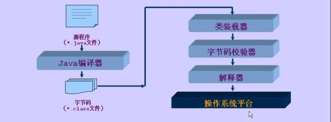

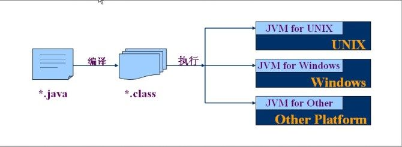


## 总结

> 1. 机器码是电脑CPU直接读取运行的机器指令，运行速度最快，但是非常晦涩难懂，也比较难编写，一般从业人员接触不到。
> 2. 字节码是一种中间状态（中间码）的二进制代码（文件）。需要直译器转译后才能成为机器码。


# 开发语言

- 不过，既然有那么多新、旧编程语言的兴起躁动，说明必然有其需求动力所在，譬如
  - 互联网之于JavaScript、
  - 人工智能之于Python，
  - 微服务风潮之于Golang等。

# Java

## JVM

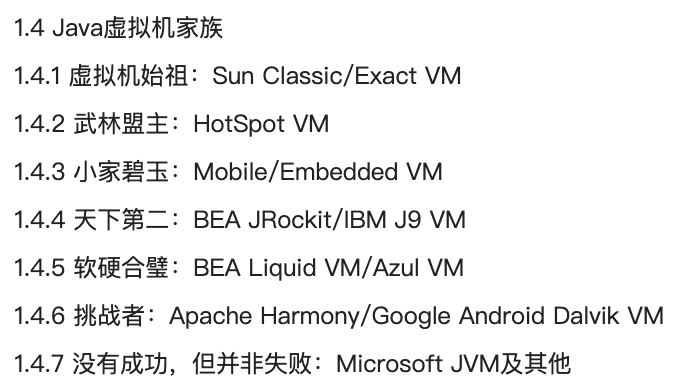

### HotSpot

### BEA JRockit

### IBM J9


## Java技术体系

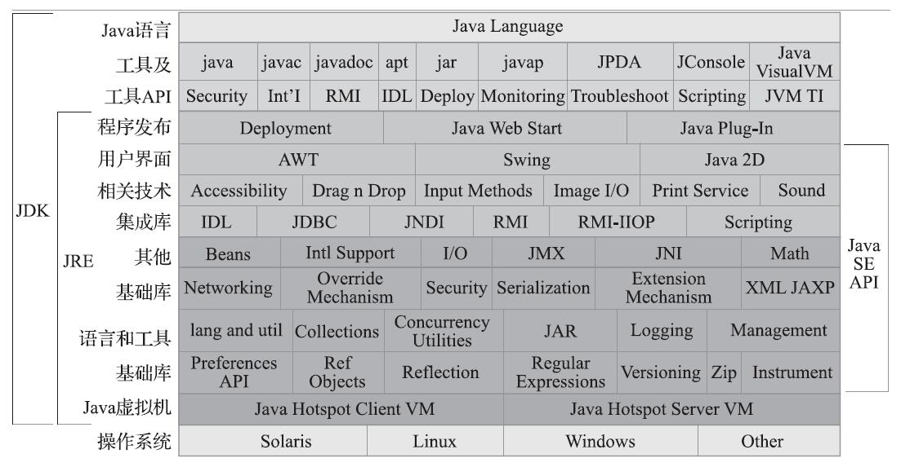


## Java发展线

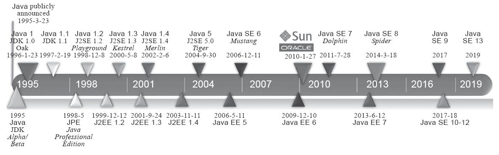


# java启动参数

- app.vmoptions
```bash
-Xmn512m
-Xms640m
-Xmx1024m
-XX:MetaspaceSize=128m
-XX:MaxMetaspaceSize=128m
-XX:ReservedCodeCacheSize=64m
-server
-XX:-UseConcMarkSweepGC

# spring 自定义的参数
-Dserver.port=28001

```

- 加载参数
```shell script
JVM_ARGS=""
if [ -r app.vmoptions ];then
JVM_ARGS="$JVM_ARGS `tr '\n' ' ' < app.vmoptions`"
fi
```

- 启动
```shell script
nohup java $JVM_ARGS -jar $CLASSPATH $MAIN_CLASS_NAME > ${APP_HOME}/output.log &
```

## TLAB设定
- TLAB--本地线程分配缓冲
```bash
# 虚拟机是否使用TLAB，可以通过如下参数来设定
-XX:+/-UserTLAB 
-XX:+UserTLAB 
-XX:-UserTLAB 
```

## 内存参数
```bash
-Xms20m		# 堆的最小值
-Xmx20m		# 堆的最大值
-Xmn10m		# 设置年轻代的大小
-Xoss 		# 参数，设置本地方法栈大小
-Xss 			# 设置栈的容量（虚拟机栈）
-XX:PermSize	# jdk1.6及以前的版本中，限制方法区大小（使用 永久代  实现的方法区）
-XX:MaxPermSize	
-XX:MaxDirectMemorySize	 # 本机直接内存	，如果不指定，则默认与Java堆最大值一样


```

- java8元空间

```bash
# 设置元空间最大值默认是-1，即不限制，或者说只受限于本地内存大小。
-XX:MaxMetaspaceSize=128m
-XX:MaxMetaspaceSize=-1

# 指定元空间的初始空间大小，以字节为单位;
# 达到该值就会触发垃圾收集进行类型卸载，同时收集器会对该值进行调整：
# 如果释放了大量的空间，就适当降低该值；
# 如果释放了很少的空间，那么在不超过-XX：MaxMetaspaceSize（如果设置了的话）的情况下，适当提高该值。
-XX:MetaspaceSize=128m


#　作用是在垃圾收集之后控制最小的元空间剩余容量的百分比
# 可减少因为元空间不足导致的垃圾收集的频率
-XX:MinMetaspaceFreeRatio


# 用于控制最大的元空间剩余容量的百分比。
-XX：Max-MetaspaceFreeRatio
```


·直接内存：可通过-XX：MaxDirectMemorySize调整大小，内存不足时抛出OutOf-MemoryError或者OutOfMemoryError：Direct buffer memory。


·线程堆栈：可通过-Xss调整大小，内存不足时抛出StackOverflowError（如果线程请求的栈深度大于虚拟机所允许的深度）或者OutOfMemoryError（如果Java虚拟机栈容量可以动态扩展，当栈扩展时无法申请到足够的内存）。


·Socket缓存区：每个Socket连接都Receive和Send两个缓存区，分别占大约37KB和25KB内存，连接多的话这块内存占用也比较可观。如果无法分配，可能会抛出IOException：Too many open files异常。


·JNI代码：如果代码中使用了JNI调用本地库，那本地库使用的内存也不在堆中，而是占用Java虚拟机的本地方法栈和本地内存的。


NIO操作


## 调试参数

```bash
# 可以让虚拟机再出现内存溢出异常时，dump出当前内存堆转储快照以便事后进行分析
-XX:+HeapDumpOnOutOfMemoryError 
```

## GC 日志
```bash
# 输出GC日志
-XX:+PrintGC 

# 输出GC的详细日志
-XX:+PrintGCDetails 

# 输出GC的时间戳（以基准时间的形式）
-XX:+PrintGCTimeStamps 

# 输出GC的时间戳（以日期的形式，如 2013-05-04T21:53:59.234+0800）
-XX:+PrintGCDateStamps 

# 输出GC的时间戳（以日期的形式，如 2013-05-04T21:53:59.234+0800）
-XX:+PrintHeapAtGC 在进行GC的前后打印出堆的信息

# 日志文件的输出路径
-Xloggc:../logs/gc.log 
```


##	是否对类进行回收	
```bash
-Xnoclassgc
-verbose:class
# 查看类加载 和 卸载信息
-XX:+TraceClassLoading
-XX:+TraceClassUnLoading
```
##	垃圾收集器
```bash
# 【Parallel Scavenge】
# 限制垃圾收集器的线程数
-XX:ParallelGCThreads=${Num_Of_Thread}   

# 用户设定允许的收集停顿时间，这是一个期望值,单位毫秒
# 默认值是200毫秒
# 停顿时间 VS 吞度量，反比
-XX:MaxGCPauseMillis=200

# 参数的值则应当是一个大于0小于100的整数,也就是垃圾收集时间占总时间的比率，相当于吞吐量的倒数。
# 譬如把此参数设置为19，那允许的最大垃圾收集时间就占总时间的5%（即1/(1+19)）;
# 默认值为99，即允许最大1%（即1/(1+99)）的垃圾收集时间。
-XX:GCTimeRatio=99


# 自适应的大小策略
# 这个参数被激活之后，就不需要人工指定新生代的大小（-Xmn）、Eden与Survivor区的比例（-XX：SurvivorRatio）# 这个参数被激活之后，也不需要指定晋升老年代对象大小（-XX：PretenureSizeThreshold）等细节参数了
# 虚拟机会根据当前系统的运行情况收集性能监控信息，动态调整这些参数以提供最合适的停顿时间或者最大的吞吐量。
# 这种调节方式称为垃圾收集的自适应的调节策略（GC Ergonomics）
-XX:+UseAdaptiveSizePolicy


```
```bash
# 【CMS】
# 开启CMS收集器
# JDK9如果开启，会受到一条警告，提示CMS未来将会被废弃
# 激活CMS后，默认的新生代收集器是ParNew收集器
-XX:+UseConcMarkSweepGC
```
```bash
# 【UseParNewGC】
# 开启
-XX:+UseParNewGC	
# 关闭
-XX:-UseParNewGC
```


```bash

# 【Serial】
# Serial收集器的控制参数
-Xmx20m		# 堆的最大值
# Eden与Survivor区的比例
-XX:SurvivorRatio

# 晋升老年代对象大小
-XX:PretenureSizeThreshold

# 
-XX:HandlePromotionFailure
```


```bash
#【G1】
# 开启G1收集器
-XX:+UseG1GC 
```

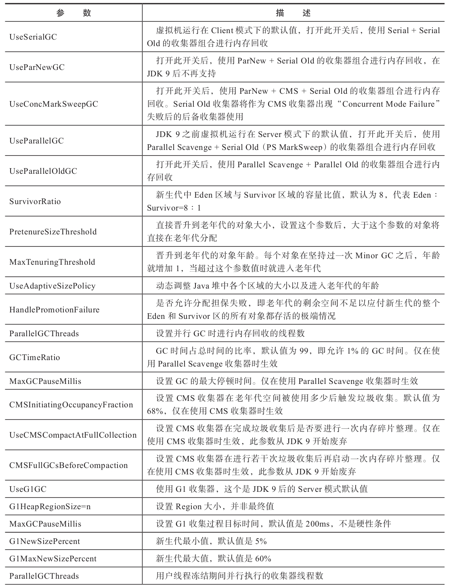


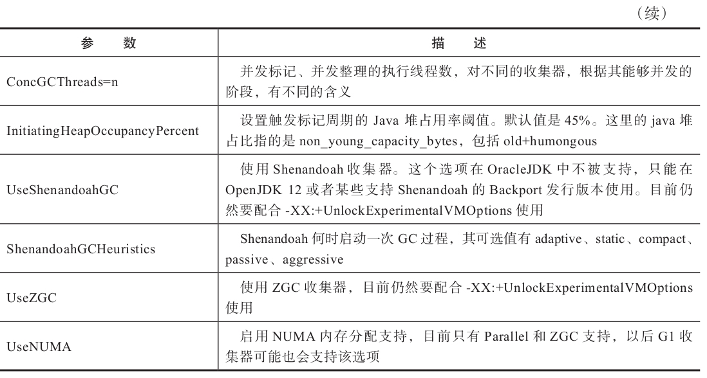


如果不修改程序，仅从GC调优的角度去解决这个问题，可以考虑直接将Survivor空间去掉（加入参数-XX：SurvivorRatio=65536、-XX：MaxTenuringThreshold=0或者-XX：+Always-Tenure），让新生代中存活的对象在第一次Minor GC后立即进入老年代，等到Major GC的时候再去清理它们。这种措施可以治标，但也有很大副作用；治本的方案必须要修改程序，因为这里产生问题的根本原因是用HashMap<Long，Long>结构来存储数据文件空间效率太低了。


## GC调优

- HBase调优参数一

```bash
# 堆的最大值
-Xmx32G 
-XX:+UnlockExperimentalVMOptions 
-XX:+UseG1GC 
-XX:MaxGCPauseMillis=50 
-XX:MaxTenuringThreshold=1 
-XX:G1HeapWastePercent=10 
-XX:G1MixedGCCountTarget=16 
-XX:InitiatingHeapOccupancyPercent=65

```

- HBase调优参数二

```bash

-XX:+PrintGCDetails 
-XX:+PrintGCDateStamps 
-XX:+PrintAdaptiveSizePolicy 
-XX:+PrintGCApplicationStoppedTime 
-XX:+PrintTenuringDistribution
```

## 代理

```bash
# socks代理
-DsocksProxyHost=<proxy host>
-DsocksProxyPort=<proxy port>
```


```java
// HTTP协议，使用代理
Proxy socksProxy 
  = new Proxy(Proxy.Type.SOCKS, new InetSocketAddress("127.0.0.1", 1080));
HttpURLConnection socksConnection 
  = (HttpURLConnection) weburl.openConnection(socksProxy);

// TCP协议，使用代理
Socket proxySocket = new Socket(socksProxy);
InetSocketAddress socketHost 
  = new InetSocketAddress(SOCKET_SERVER_HOST, SOCKET_SERVER_PORT);
proxySocket.connect(socketHost);
```

## 调试参数

- JDK 5 需要手动开启
- JDK 6之后，默认开启

```bash
# 开启JMX管理功能
# 大部分工具都是基于或者要用到JMX（包括下一节的可视化工具）
-Dcom.sun.management.jmxremote
```


　如果读者在工作中需要监控运行于JDK 5的虚拟机之上的程序，在程序启动时请添加参数“-Dcom.sun.management.jmxremote”开启JMX管理功能，否则由于大部分工具都是基于或者要用到JMX（包括下一节的可视化工具），它们都将无法使用，如果被监控程序运行于JDK 6或以上版本的虚拟机之上，那JMX管理默认是开启的，虚拟机启动时无须再添加任何参数。


# 诊断

## jar


```bash
jar cf jar-file input-file...     # 用一个单独的文件创建一个 JAR 文件
jar cf jar-file dir-name          # 用一个目录创建一个 JAR 文件
jar cf0 jar-file dir-name         # 创建一个未压缩的 JAR 文件
jar uf jar-file input-file...     # 更新一个 JAR 文件
jar tf jar-file                   # 查看一个 JAR 文件的内容
jar xf jar-file                   # 提取一个 JAR 文件的内容
jar xf jar-file archived-file...  # 从一个 JAR 文件中提取特定的文件
java -jar app.jar                 # 运行一个打包为可执行 JAR 文件的应用程序
```


## jps

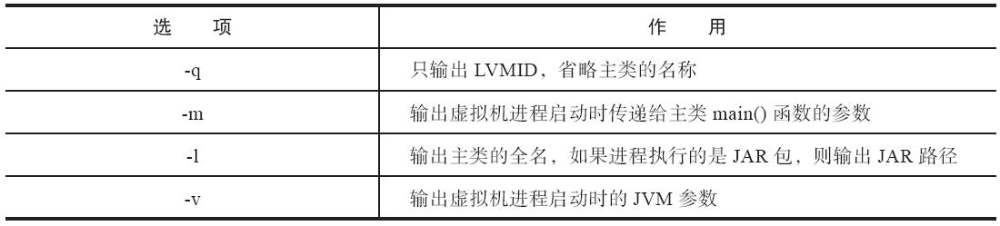

## jcmd

- 查看GC收集器的名称

```bash
# Linux
jcmd ${PID} PerfCounter.print |grep gc.collector.*name
# Windows
jcmd ${PID} PerfCounter.print |findstr gc.collector.*name
```

```bash
$ jcmd 24520 PerfCounter.print |grep gc.collector.*name
sun.gc.collector.0.name="PSScavenge"
sun.gc.collector.1.name="PSParallelCompact"
```

## jstat

- jstat（JVM Statistics Monitoring Tool）是用于监视虚拟机各种运行状态信息的命令行工具。
- 它可以显示本地或者远程虚拟机进程中的**类加载**、**内存**、**垃圾收集**、即时编译等运行时数据，在没有GUI图形界面、只提供了纯文本控制台环境的服务器上;
- 它将是运行期定位虚拟机性能问题的常用工具。
- Jstatd ,RMI支持

```bash
jstat [ option vmid [interval[s|ms] [count]] ]

# vmid = lvmid
```

```bash
[protocol:][//]lvmid[@hostname[:port]/servername]
```


```bash
# 参数interval和count代表查询间隔和次数，如果省略这2个参数，说明只查询一次。
# 假设需要每250毫秒查询一次进程2764垃圾收集状况，一共查询20次，那命令应当是：
jstat -gc 2764 250 20
```

```bash
jstat -gc  24520
 S0C    S1C    S0U    S1U      EC       EU        OC         OU       MC     MU    CCSC   CCSU   YGC     YGCT    FGC    FGCT     GCT   
3072.0 3072.0  0.0   2768.6 83456.0  59900.3   658944.0   231718.4  91096.0 88790.0 11992.0 11231.7   1191   18.356   3      0.471   18.828
```


```bash
查询结果表明：这台服务器的新生代
# Eden区（E，表示Eden）
# 2个Survivor区（S0、S1，表示Survivor0、Survivor1）
# 老年代（O，表示Old）
# 永久代（P，表示Permanent）
# Minor GC（YGC，表示Young GC）,次数 和 时间，单位秒
# Full GC（FGC，表示Full GC），次数 和时间，单位秒
# 所有GC总耗时（GCT，表示GC Time），单位秒

```


- 参数

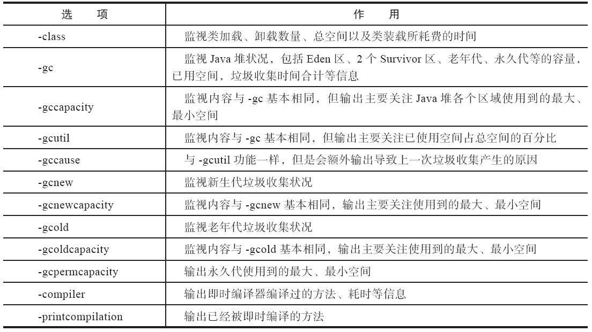


## jinfo

- Java配置信息工具
- jinfo（Configuration Info for Java）的作用是实时查看和调整虚拟机各项参数。
- 使用jps命令的-v参数可以查看虚拟机启动时显式指定的参数列表;
- 如果只限于JDK 6或以上版本的话，使用`java-XX：+PrintFlagsFinal`查看参数默认值也是一个很好的选择。
- jinfo还可以使用`-sysprops`选项把虚拟机进程的`System.getProperties()`的内容打印出来。
  - 这个命令在JDK 5时期已经随着Linux版的JDK发布，当时只提供了信息查询的功能;
  - JDK 6之后，jinfo在Windows和Linux平台都有提供，并且加入了**在运行期修改部分参数值的能力**（可以使用`-flag[+|-]name`或者`-flag name=value`在运行期修改一部分运行期可写的虚拟机参数值）。在JDK 6中，jinfo对于Windows平台功能仍然有较大限制，只提供了最基本的-flag选项。


- 格式

```bash
jinfo [ option ] pid
```

- 示例

```bash
# 执行样例：查询CMSInitiatingOccupancyFraction参数值
jinfo -flag CMSInitiatingOccupancyFraction 1444
-XX:CMSInitiatingOccupancyFraction=85
```


## jmap

- 格式

```bash
jmap [ option ] vmid
```

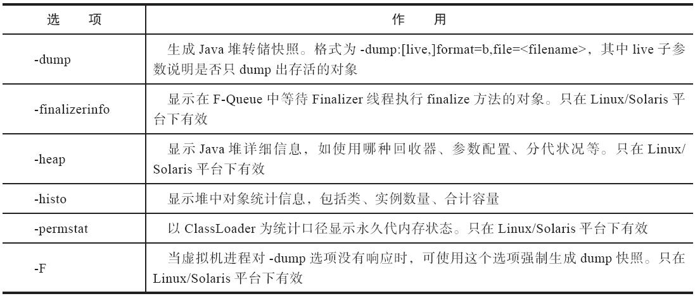

### 生成heap-dump文件

- 堆转储快照（一般称为heapdump或dump文件）

```bash
jmap -dump:live,format=b,file=heap-dump2.bin ${PID}
```

- `-XX：+HeapDumpOnOutOfMemoryError`

  - 可以让虚拟机在内存溢出异常出现之后自动生成堆转储快照文件

- `-XX：+HeapDumpOnCtrlBreak`

  - 可以使用[Ctrl]+[Break]键让虚拟机生成堆转储快照文件

- `Linux系统下通过Kill-3命令发送进程退出信号`

  

## javap


```BASH
# 使用javap工具查看其编译后生成的字节码
javap -v Test.class
```


## jstack

- Java堆栈跟踪工具
- jstack（Stack Trace for Java）命令用于生成虚拟机当前时刻的线程快照（一般称为threaddump或者javacore文件）。
- 线程快照就是当前虚拟机内每一条线程正在执行的方法堆栈的集合
  - 生成线程快照的目的通常是定位线程出现长时间停顿的原因;
    - 如线程间死锁、死循环、请求外部资源导致的长时间挂起等，都是导致线程长时间停顿的常见原因。
  - 线程出现停顿时通过jstack来查看各个线程的调用堆栈，就可以获知没有响应的线程到底在后台做些什么事情，或者等待着什么资源


- 格式

```bash
jstack [ option ] vmid
```


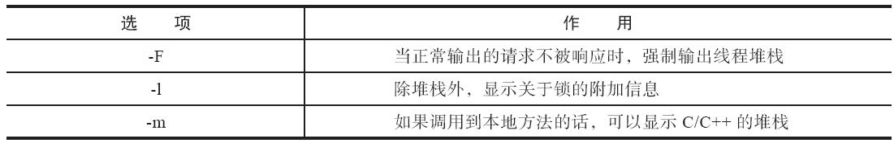


```java
// 打印其它线程的堆栈
for (Map.Entry<Thread, StackTraceElement[]> stackTrace : Thread.getAllStack-Traces().entrySet()) {
        Thread thread = (Thread) stackTrace.getKey();
        StackTraceElement[] stack = (StackTraceElement[]) stackTrace.getValue();
        if (thread.equals(Thread.currentThread())) {
            continue;
        }
        System.out.println("\n线程：" + thread.getName() + "\n");
        for (StackTraceElement element : stack) {
            
        }
    }
```

## 其它

- ·基础工具：用于支持基本的程序创建和运行

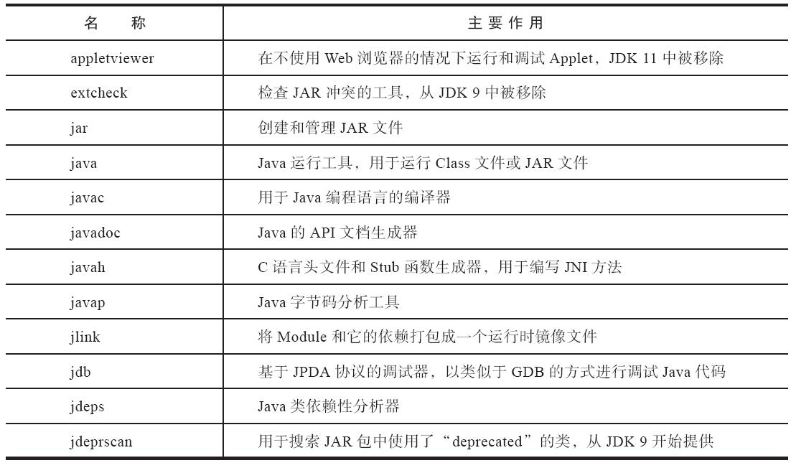

- ·安全：用于程序签名、设置安全测试等

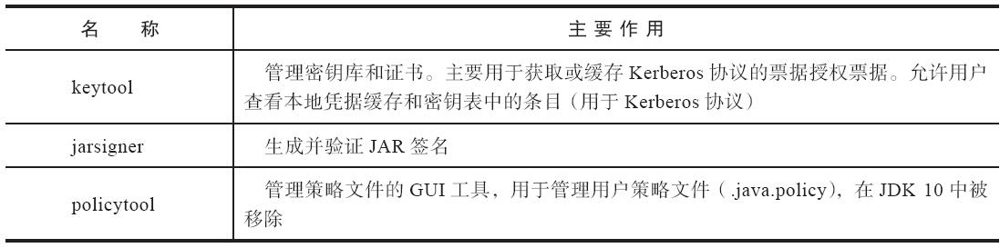


- ·国际化：用于创建本地语言文件（见表4-7）

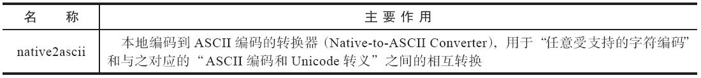


- ·远程方法调用：用于跨Web或网络的服务交互（见表4-8）

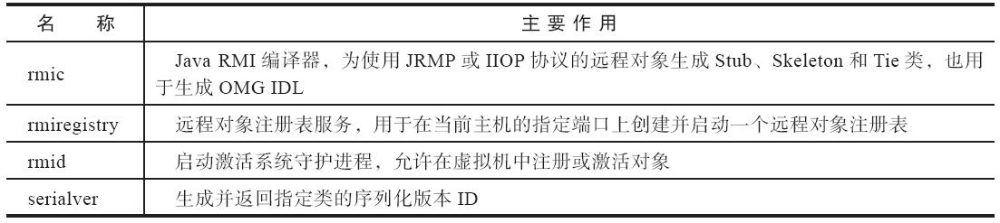


- ·性能监控和故障处理：用于监控分析Java虚拟机运行信息，排查问题（见表4-12）

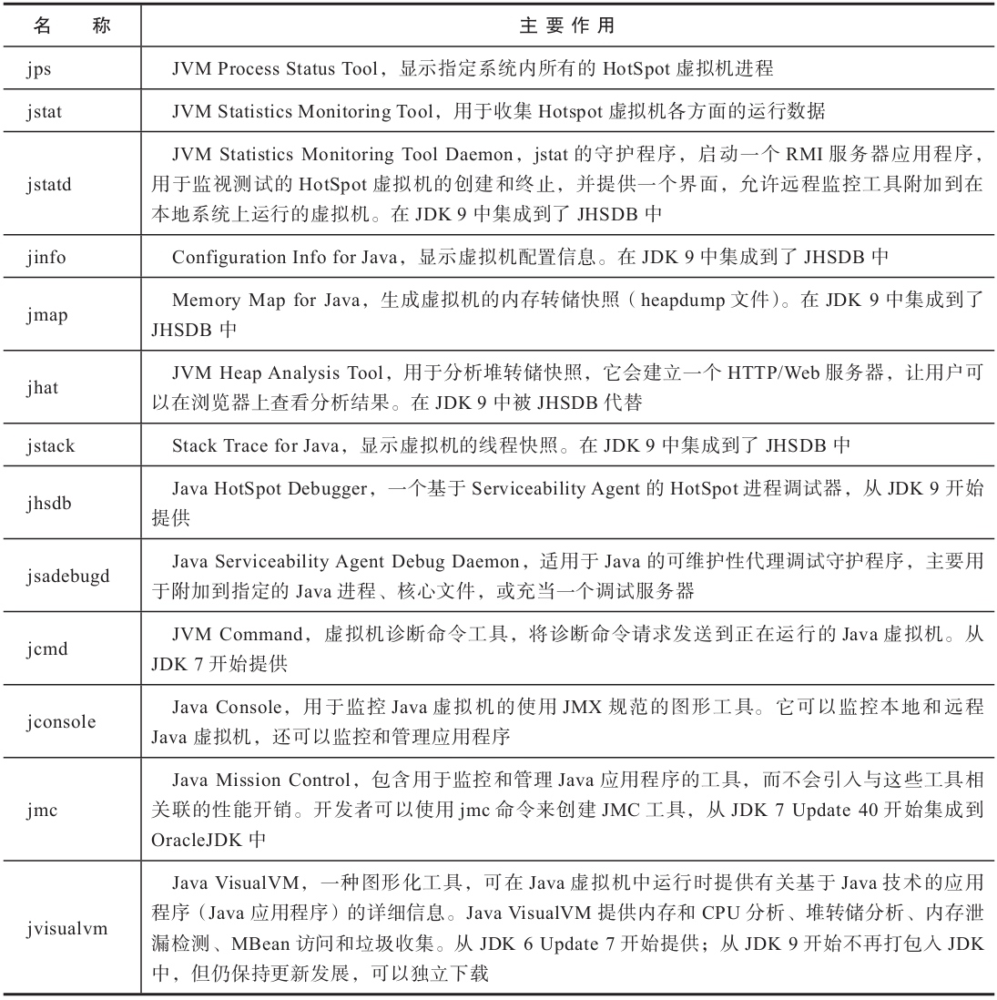


 详细信息见http://openjdk.java.net/jeps/320。

## jdb

```java
$ jdb

正在初始化jdb...
> > help
** 命令列表 **
connectors                -- 列出此 VM 中可用的连接器和传输

run [class [args]]        -- 开始执行应用程序的主类

threads [threadgroup]     -- 列出线程
thread <thread id>        -- 设置默认线程
suspend [thread id(s)]    -- 挂起线程 (默认值: all)
resume [thread id(s)]     -- 恢复线程 (默认值: all)
where [<thread id> | all] -- 转储线程的堆栈
wherei [<thread id> | all]-- 转储线程的堆栈, 以及 pc 信息
up [n frames]             -- 上移线程的堆栈
down [n frames]           -- 下移线程的堆栈
kill <thread id> <expr>   -- 终止具有给定的异常错误对象的线程
interrupt <thread id>     -- 中断线程

print <expr>              -- 输出表达式的值
dump <expr>               -- 输出所有对象信息
eval <expr>               -- 对表达式求值 (与 print 相同)
set <lvalue> = <expr>     -- 向字段/变量/数组元素分配新值
locals                    -- 输出当前堆栈帧中的所有本地变量

classes                   -- 列出当前已知的类
class <class id>          -- 显示已命名类的详细资料
methods <class id>        -- 列出类的方法
fields <class id>         -- 列出类的字段

threadgroups              -- 列出线程组
threadgroup <name>        -- 设置当前线程组

stop in <class id>.<method>[(argument_type,...)]
                          -- 在方法中设置断点
stop at <class id>:<line> -- 在行中设置断点
clear <class id>.<method>[(argument_type,...)]
                          -- 清除方法中的断点
clear <class id>:<line>   -- 清除行中的断点
clear                     -- 列出断点
catch [uncaught|caught|all] <class id>|<class pattern>
                          -- 出现指定的异常错误时中断
ignore [uncaught|caught|all] <class id>|<class pattern>
                          -- 对于指定的异常错误, 取消 'catch'
watch [access|all] <class id>.<field name>
                          -- 监视对字段的访问/修改
unwatch [access|all] <class id>.<field name>
                          -- 停止监视对字段的访问/修改
trace [go] methods [thread]
                          -- 跟踪方法进入和退出。
                          -- 除非指定 'go', 否则挂起所有线程
trace [go] method exit | exits [thread]
                          -- 跟踪当前方法的退出, 或者所有方法的退出
                          -- 除非指定 'go', 否则挂起所有线程
untrace [methods]         -- 停止跟踪方法进入和/或退出
step                      -- 执行当前行
step up                   -- 一直执行, 直到当前方法返回到其调用方
stepi                     -- 执行当前指令
下一步                      -- 步进一行 (步过调用)
cont                      -- 从断点处继续执行

list [line number|method] -- 输出源代码
use (或 sourcepath) [source file path]
                          -- 显示或更改源路径
exclude [<class pattern>, ... | "none"]
                          -- 对于指定的类, 不报告步骤或方法事件
classpath                 -- 从目标 VM 输出类路径信息

monitor <command>         -- 每次程序停止时执行命令
monitor                   -- 列出监视器
unmonitor <monitor#>      -- 删除监视器
read <filename>           -- 读取并执行命令文件

lock <expr>               -- 输出对象的锁信息
threadlocks [thread id]   -- 输出线程的锁信息

pop                       -- 通过当前帧出栈, 且包含当前帧
reenter                   -- 与 pop 相同, 但重新进入当前帧
redefine <class id> <class file name>
                          -- 重新定义类的代码

disablegc <expr>          -- 禁止对象的垃圾收集
enablegc <expr>           -- 允许对象的垃圾收集

!!                        -- 重复执行最后一个命令
<n> <command>             -- 将命令重复执行 n 次
# <command>               -- 放弃 (无操作)
help (或 ?)               -- 列出命令
version                   -- 输出版本信息
exit (或 quit)            -- 退出调试器

<class id>: 带有程序包限定符的完整类名
<class pattern>: 带有前导或尾随通配符 ('*') 的类名
<thread id>: 'threads' 命令中报告的线程编号
<expr>: Java(TM) 编程语言表达式。
支持大多数常见语法。

可以将启动命令置于 "jdb.ini" 或 ".jdbrc" 中
位于 user.home 或 user.dir 中
> 

```

## visualVM

> /Users/hapihu/Documents/program/visualvm_205/bin

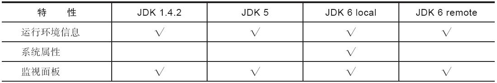


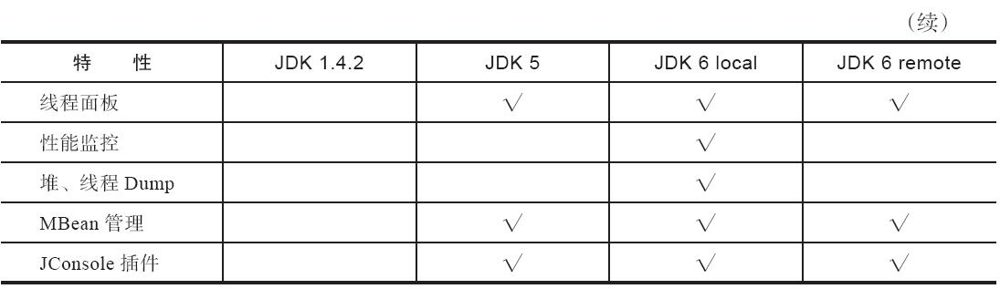

## Java Mission Control
- 可持续在线的监控工具


## JHSDB

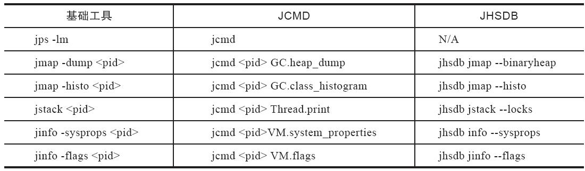


```bash
# 进入图形化模式
jhsdb hsdb --pid 11180
```


 本小节的原始案例来自RednaxelaFX的博客https://rednaxelafx.iteye.com/blog/1847971。


# 内存模型

> 描述内存分布情况。

## 运行时数据区

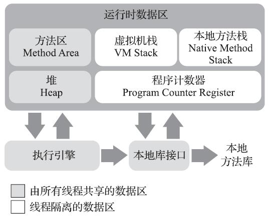

## JVM内存

- 参考：https://www.cnblogs.com/huangwenjie/p/13404788.html

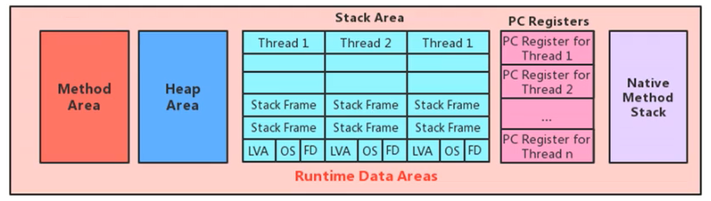

## 线程内存模型

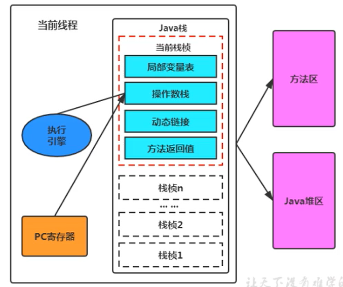

## 程序计数器

程序计数器（Program Counter Register）是一块较小的内存空间，它可以看作是当前线程所执行的字节码的行号指示器。

- CPU的每个核心拥有自己的程序计数器；
- 每个线程拥有自己的程序计数器。

在Java虚拟机的概念模型里，字节码解释器工作时就是通过改变这个计数器的值来选取下一条需要执行的字节码指令，它是程序控制流的指示器，分支、循环、跳转、异常处理、线程恢复等基础功能都需要依赖这个计数器来完成。


由于Java虚拟机的多线程是通过线程轮流切换、分配处理器执行时间的方式来实现的；

在任何一个确定的时刻，一个处理器（对于多核处理器来说是一个内核）都只会执行一条线程中的指令。

因此，为了线程切换后能恢复到正确的执行位置，每条线程都需要有一个独立的程序计数器，各条线程之间计数器互不影响，独立存储，我们称这类内存区域为“线程私有”的内存。


**1、什么是程序计数器**
CPU再执行程序时，需要有一个地方存放下一条要被取走指令的位置，是一个寄存器。
**2.CPU中有几个程序计数器**
只有一个
**3.线程为什么是私有的程序计数器**
线程中的程序计数器可以理解为一段内存，用来保存当前线程执行到的位置，因为系统采用时间片轮转的方法，所以一个线程不可能一直占用CPU，只能执行规定时间，进行线程切换，这里就需要有一个私有的线程计数器，也就是本地计数器，来保存当前线程的执行到的位置，等到下一次再从这个位置继续执行。


## 虚拟机栈

Java虚拟机栈（Java Virtual Machine Stack）是线程私有的，它的生命周期与线程相同。

虚拟机栈描述的是Java方法执行的线程内存模型：每个方法被执行的时候，Java虚拟机都会同步创建一个栈帧，（Stack Frame）用于存储局部变量表、操作数栈、动态连接、方法出口等信息。每一个方法被调用直至执行完毕的过程，就对应着一个栈帧在虚拟机栈中从入栈到出栈的过程。

1. 局部变量表
2. 操作数栈
3. 动态连接
4. 方法出口


- 栈帧

```txt
1、栈帧由三部分组成：局部变量表、操作数栈以及帧数据;

2、每次方法调用都会创建一个栈帧;

3、每个方法涉及的局部变量表和操作数栈的大小取决于每个具体的方法，但是大小在编译后便已确定，而且已经包含在class文件中。
```


```txt
当JVM执行一个方法时，它会检查class中的数据，以便确定一个方法执行时在局部变量表和操作数栈中所需存储的word size。然后，JVM会为当前方法创建一个size相对应的栈帧，然后把它push到栈顶。
```


- <font color =red>局部变量表</font>

局部变量表存放了编译期可知的各种Java虚拟机基本数据类型（boolean、byte、char、short、int、float、long、double）、对象引用（reference类型，它并不等同于对象本身，可能是一个指向对象起始地址的引用指针，也可能是指向一个代表对象的句柄或者其他与此对象相关的位置）和returnAddress类型（指向了一条字节码指令的地址）。

- <font color =red >局部变量槽(Slot)</font>
  - 数据类型在局部变量表中的存储空间以局部变量槽（Slot）来表示；
  - 通常每个数据类型占用一个局部变量槽；
  - 64位长度的long和double类型的数据占用两个变量槽。


局部变量表所需的内存空间在**编译期间**完成分配，当进入一个方法时，这个方法需要在栈帧中分配多大的局部变量空间是完全确定的，在方法运行期间不会改变局部变量表的大小。

请读者注意，**这里说的“大小”是指变量槽的数量**，虚拟机真正使用多大的内存空间（譬如按照1个变量槽占用32个比特、64个比特，或者更多）来实现一个变量槽，这是完全由具体的虚拟机实现自行决定的事情。

## 本地方法栈

本地方法栈（Native Method Stacks）与虚拟机栈所发挥的作用是非常相似的，其区别只是虚拟机栈为虚拟机执行**Java方法**（也就是**字节码**）服务，而本地方法栈则是为虚拟机使用到的**本地（Native）方法**服务。

## 堆

对于Java应用程序来说，Java堆（Java Heap）是虚拟机所管理的内存中最大的一块。

- Java堆是被<font color=red>所有线程共享</font>的一块内存区域，在虚拟机启动时创建。
- 此内存区域的唯一目的就是存放对象实例，Java世界里“几乎”所有的对象实例都在这里分配内存。
- 在《Java虚拟机规范》中对Java堆的描述是：“所有的对象实例以及数组都应当在堆上分配


- Java堆是垃圾收集器管理的内存区域，因此一些资料中它也被称作“GC堆”（Garbage Collected Heap）。
- 从回收内存的角度看，由于现代垃圾收集器大部分都是基于分代收集理论设计的。
  - 所以Java堆中经常会出现“新生代”“老年代”“永久代”“Eden空间”“From Survivor空间”“To Survivor空间”等名词。
  - 这些区域划分仅仅是一部分垃圾收集器的共同特性或者说设计风格而已，而非某个Java虚拟机具体实现的固有内存布局，更不是《Java虚拟机规范》里对Java堆的进一步细致划分。


### TLAB

线程私有的分配缓冲区（Thread Local Allocation Buffer，TLAB）

### 对象创建

**虚拟机中New一个对象的过程？**

- 1、检查类的符号引用：
  - 是否在常量池？：首先将去检查这个指令的参数是否能在常量池中定位到一个类的符号引用；
  - 是否已加载？：并且检查这个符号引用代表的类是否已被加载、解析和初始化过。如果没有，那必须先执行相应的类加载过程。
- 2、为新生对象分配内存？
  - 分配多大？：在类加载完成后可以确定。【参考对象内存分配】
- 3、内存分配方式？
  - `Java堆规整：`指针碰撞（Bump the Pointer）
  - `Java堆不规整：`空闲列表（Free List）


> 选择哪种分配方式由Java堆是否规整决定，而Java堆是否规整又由所采用的垃圾收集器是否带有空间压缩整理（Compact）的能力决定。
>
> 当使用Serial、ParNew等带压缩整理过程的收集器时，系统采用的分配算法是指针碰撞，既简单又高效；而当使用CMS这种基于清除（Sweep）算法的收集器时，理论上就只能采用较为复杂的空闲列表来分配内存。


- 4、分配内存时的线程安全问题？
  - 方式一：`同步处理 - 原子操作：`CMS + 失败重试
  - 方式二：本地线程分配缓冲（Thread Local Allocation Buffer，TLAB）
    - 是把内存分配的动作按照线程划分在不同的空间之中进行，即每个线程在Java堆中预先分配一小块内存，称为本地线程分配缓冲（Thread Local Allocation Buffer，TLAB）；
    - 哪个线程要分配内存，就在哪个线程的本地缓冲区中分配；
    - 只有本地缓冲区用完了，分配新的缓存区时才需要同步锁定。


- 5、对象初始化
  - 虚拟机必须将分配到的内存空间（但不包括对象头）都初始化为零值；
  - 如果使用了TLAB的话，这一项工作也可以提前至TLAB分配时顺便进行。
  - `目的：`这步操作保证了对象的实例字段在Java代码中可以不赋初始值就直接使用，使程序能访问到这些字段的数据类型所对应的零值。
- 6、元数据设置？
  - 这些信息存放在对象的对象头（Object Header）。
    - 这个对象是哪个类的实例？
    - 如何才能找到类的元数据信息；
    - 对象的哈希码（实际上对象的哈希码会延后到真正调用Object::hashCode()方法时才计算）
    - 对象的GC分代年龄等信息；
    - 是否启用偏向锁等。

- 7、虚拟机视角的创建完成，Java程序视角，开始执行构造函数；

  - Class文件中的&lt;init&gt;()方法还没有执行，所有的字段都为默认的零值。

    


在上面工作都完成之后，从虚拟机的视角来看，一个新的对象已经产生了。但是从Java程序的视角看来，对象创建才刚刚开始——构造函数，即Class文件中的&lt;init&gt;()方法还没有执行，所有的字段都为默认的零值，对象需要的其他资源和状态信息也还没有按照预定的意图构造好。一般来说（由字节码流中new指令后面是否跟随invokespecial指令所决定，Java编译器会在遇到new关键字的地方同时生成这两条字节码指令，但如果直接通过其他方式产生的则不一定如此），new指令之后会接着执行&lt;init&gt;()方法，按照程序员的意愿对对象进行初始化，这样一个真正可用的对象才算完全被构造出来。

### 对象内存分布

- 在HotSpot虚拟机里，对象在堆内存中的存储布局可以划分为三个部分：**对象头（Header）**、**实例数据（Instance Data）**和**对齐填充（Padding）**。


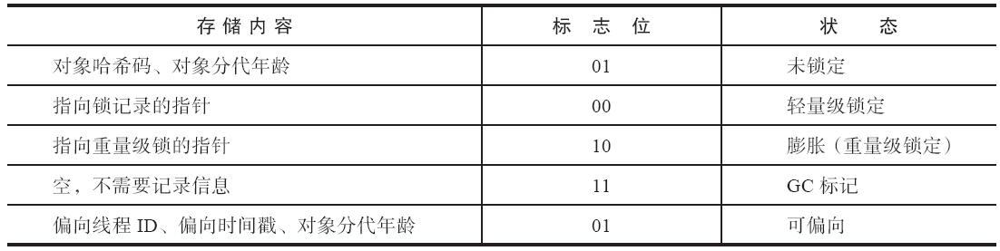


- 实例数据

```txt
实例数据部分是对象真正存储的有效信息，即我们在程序代码里面所定义的各种类型的字段内容，无论是从父类继承下来的，还是在子类中定义的字段都必须记录起来。

这部分的存储顺序会受到虚拟机分配策略参数（-XX：FieldsAllocationStyle参数）和字段在Java源码中定义顺序的影响。

HotSpot虚拟机默认的分配顺序为longs/doubles、ints、shorts/chars、bytes/booleans、oops（Ordinary Object Pointers，OOPs），从以上默认的分配策略中可以看到，相同宽度的字段总是被分配到一起存放，在满足这个前提条件的情况下，在父类中定义的变量会出现在子类之前。

如果HotSpot虚拟机的+XX：CompactFields参数值为true（默认就为true），那子类之中较窄的变量也允许插入父类变量的空隙之中，以节省出一点点空间。
```


- 对其填充

```txt
对象的第三部分是对齐填充，这并不是必然存在的，也没有特别的含义，它仅仅起着占位符的作用。
由于HotSpot虚拟机的自动内存管理系统要求对象起始地址必须是8字节的整数倍，换句话说就是任何对象的大小都必须是8字节的整数倍。
对象头部分已经被精心设计成正好是8字节的倍数（1倍或者2倍），因此，如果对象实例数据部分没有对齐的话，就需要通过对齐填充来补全。
```


### 对象的访问定位

- Java程序会通过栈上的reference数据来操作堆上的具体对象。
- 由于reference类型在《Java虚拟机规范》里面只规定了它是一个指向对象的引用，并没有定义这个引用应该通过什么方式去定位、访问到堆中对象的具体位置，所以对象访问方式也是由虚拟机实现而定的。
- 主流的访问方式主要有使用**句柄**和**直接指针**两种。


- <font color=red>句柄方式</font>
  - 两次寻址

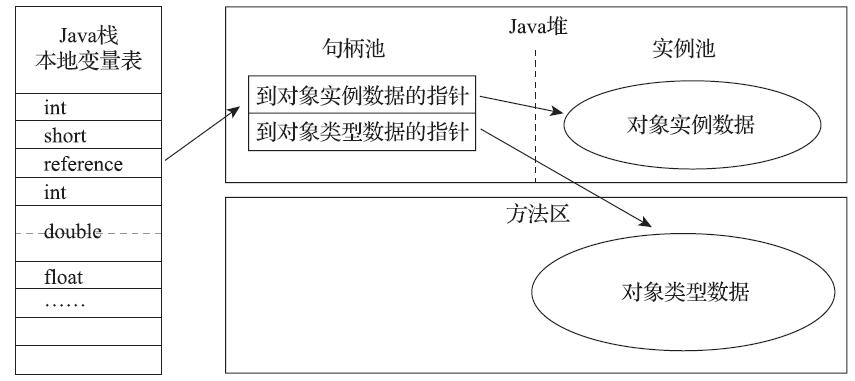


- <font color=red>直接指针方式</font>
  - 一次寻址

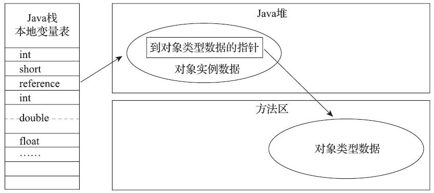


## 方法区

- 别名：No-Heap，非堆。

- 方法区（Method Area）是各个<font color=red>线程共享</font>的内存区域;
  - 它用于存储已被虚拟机加载的类型信息、常量、静态变量、即时编译器编译后的代码缓存等数据。
- 虽然《Java虚拟机规范》中把方法区描述为堆的一个逻辑部分，但是它却有一个别名叫作“非堆”（Non-Heap），目的是与Java堆区分开来。


- BEA JRockit、IBM J9等来说，是不存在永久代的概念的。
- HotSpot
  - JDK 6：HotSpot开发团队就有放弃永久代，逐步改为采用本地内存（Native Memory）来实现方法区的计划；
  - JDK 7：已经把原本放在永久代的字符串常量池、静态变量等移出；
  - 自JDK 7起，原本存放在永久代的字符串常量池被移至Java堆之中；
  - JDK 8：终于完全废弃了永久代的概念，改用与JRockit、J9一样在本地内存中实现的元空间（Meta-space）来代替，把JDK 7中永久代还剩余的内容（主要是类型信息）全部移到元空间中。
  - 在JDK 8以后，永久代便完全退出了历史舞台，元空间作为其替代者登场。


### 常量池

- 运行时常量池（Runtime Constant Pool）是方法区的一部分。
- **Class文件**中除了有类的版本、字段、方法、接口等描述信息外，还有一项信息是常量池表（Constant Pool Table），用于存放编译期生成的各种字面量与符号引用，这部分内容将在类加载后存放到方法区的运行时常量池中。


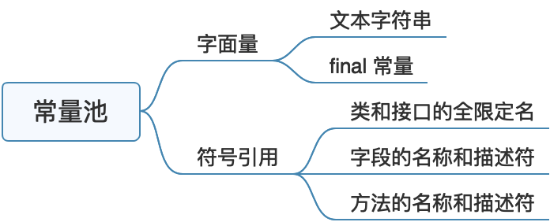

### 方法区回收


方法区溢出也是一种常见的内存溢出异常。一个类如果要被垃圾收集器回收，要达成的条件是比较苛刻的。在经常运行时生成大量动态类的应用场景里，就应该特别关注这些类的回收状况。

- 使用了CGLib字节码增强和动态语言的程序；
- 大量JSP或动态产生JSP文件的应用（JSP第一次运行时需要编译为Java类）
- 基于OSGi的应用（即使是同一个类文件，被不同的加载器加载也会视为不同的类）等。

### 元空间

- GC范畴的概念。


## 直接内存

在JDK 1.4中新加入了NIO（New Input/Output）类，引入了一种基于通道（Channel）与缓冲区（Buffer）的I/O方式，它可以使用Native函数库直接分配**堆外内存**，然后通过一个存储在Java堆里面的DirectByteBuffer对象作为这块内存的引用进行操作。

这样能在一些场景中显著提高性能，因为避免了在Java堆和Native堆中来回复制数据。


## 内存限制

### VM最大内存

首先JVM内存限制于实际的最大物理内存，假设物理内存无限大的话，JVM内存的最大值跟操作系统有很大的关系。

- 简单的说就32位处理器虽然可控内存空间有4GB。

- 但是具体的操作系统会给一个限制，这个限制一般是2GB-3GB一般来说Windows系统下为1.5G-2G，Linux系 统下为2G-3G），

- 而64bit以上的处理器就不会有限制了。

## OOM

### Java堆溢出

```JAVA
/**
 * VM Args：-Xms20m -Xmx20m -XX:+HeapDumpOnOutOfMemoryError
 * @author zzm
 */
public class HeapOOM {

    static class OOMObject {
    }

    public static void main(String[] args) {
        List<OOMObject> list = new ArrayList<OOMObject>();

        while (true) {
            list.add(new OOMObject());
        }
    }
}

/*
java.lang.OutOfMemoryError: Java heap space
  Dumping heap to java_pid3404.hprof ...
  Heap dump file created [22045981 bytes in 0.663 secs]
*/
```


### 虚拟机栈和本地方法栈

- 栈容量只有`-Xss`参数来设定。
  - 1、如果线程请求的栈深度大于虚拟机所允许的最大深度，将抛出StackOverflowError异常。
  - 2、如果虚拟机的栈内存允许动态扩展，当扩展栈容量无法申请到足够的内存时，将抛出OutOfMemoryError异常。

- -Xss参数
  - 设置了每个线程的栈的容量；
  - 影响了栈帧的深度；
    - -Xss参数减少栈内存容量，栈帧深度会减少。
    - 当栈帧的内存无法分配时，会StackOverflowError
  - 局部变量表内容越多，每个栈帧越大，栈深度越小；
  - 影响可创建的线程数：
    - <font color=red>`可分配的栈容量（虚拟机栈 + 本地方法栈） = 虚拟机单进程最大容量 - 最大堆容量 - 最大方法区容量 - 程序计数器容量 - 直接内存 - 虚拟机进程本身的内存`</font>
    - <font color=red>线程数 * 栈容量 = 可分配的栈容量</font>

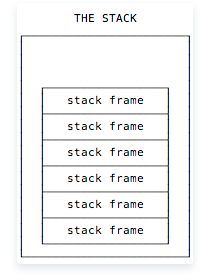

- 《Java虚拟机规范》明确允许Java虚拟机自行选择是否支持栈的动态扩展，HotSpot虚拟机选择不支持扩展；
  - 在线程运行时，不会因为扩展而导致内存溢出；
  - 只会因为栈容量无法分配新的栈帧而导致StackOverflowError。


- oom示例一

```java
/**
 * VM Args：-Xss128k
 * @author zzm
 */
public class JavaVMStackSOF {

    private int stackLength = 1;

    public void stackLeak() {
        stackLength++;
        stackLeak();
    }

    public static void main(String[] args) throws Throwable {
        JavaVMStackSOF oom = new JavaVMStackSOF();
        try {
            oom.stackLeak();
        } catch (Throwable e) {
            System.out.println("stack length:" + oom.stackLength);
            throw e;
        }
    }
}
/*
stack length:2402
Exception in thread "main" java.lang.StackOverflowError
    at org.fenixsoft.oom. JavaVMStackSOF.leak(JavaVMStackSOF.java:20)
    at org.fenixsoft.oom. JavaVMStackSOF.leak(JavaVMStackSOF.java:21)
    at org.fenixsoft.oom. JavaVMStackSOF.leak(JavaVMStackSOF.java:21)
……后续异常堆栈信息省略
*/
```


- 示例二
  - 为每个线程分配到的栈内存越大，可以建立的线程数量自然就越少，建立线程时就越容易把剩下的内存耗尽。

```JAVA
/**
 * VM Args：-Xss2M （这时候不妨设大些，请在32位系统下运行）
 * @author zzm
 */
public class JavaVMStackOOM {

    private void dontStop() {
        while (true) {
        }
    }

    public void stackLeakByThread() {
        while (true) {
            Thread thread = new Thread(new Runnable() {
                @Override
                public void run() {
                    dontStop();
                }
            });
            thread.start();
        }
    }

    public static void main(String[] args) throws Throwable {
        JavaVMStackOOM oom = new JavaVMStackOOM();
        oom.stackLeakByThread();
    }
}

// Exception in thread "main" java.lang.OutOfMemoryError: unable to create native thread
```


### 方法区和常量池溢出

- 情况
  - 1、不断的创建字符串常量；【常量池溢出】
  - 2、不断的创建动态类；【方法区溢出】
    - Java SE API，动态产生类（如反射时的GeneratedConstructorAccessor和动态代理等）
    - CGLib，直接操作字节码，产生大量动态类；


```txt
当前的很多主流框架，如Spring、Hibernate对类进行增强时，都会使用到CGLib这类字节码技术;
当增强的类越多，就需要越大的方法区以保证动态生成的新类型可以载入内存。

另外，很多运行于Java虚拟机上的动态语言（例如Groovy等）通常都会持续创建新类型来支撑语言的动态性，随着这类动态语言的流行，内存溢出场景也越来越容易遇到。
```


我们再来看看方法区的其他部分的内容，方法区的主要职责是用于存放类型的相关信息，如类名、访问修饰符、常量池、字段描述、方法描述等。对于这部分区域的测试，基本的思路是运行时产生大量的类去填满方法区，直到溢出为止。虽然直接使用Java SE API也可以动态产生类（如反射时的GeneratedConstructorAccessor和动态代理等），但在本次实验中操作起来比较麻烦。在代码清单2-8里笔者借助了CGLib

- <font color=red>String::intern()</font>
  - String::intern()是一个本地方法；
  - 它的作用是如果字符串常量池中已经包含一个等于此String对象的字符串，则返回代表池中这个字符串的String对象的引用；
  - 否则，会将此String对象包含的字符串添加到常量池中，并且返回此String对象的引用。
  - 在JDK 6或更早之前的HotSpot虚拟机中，常量池都是分配在永久代中；我们可以通过-XX：PermSize和-XX：MaxPermSize限制永久代的大小，即可间接限制其中常量池的容量。

- 常量池溢出示例

```java
/**
 * VM Args：-XX:PermSize=6M -XX:MaxPermSize=6M
 		限制永久代的内存大小
 * @author zzm
 */
public class RuntimeConstantPoolOOM {

    public static void main(String[] args) {
        // 使用Set保持着常量池引用，避免Full GC回收常量池行为
        Set<String> set = new HashSet<String>();
        // 在short范围内足以让6MB的PermSize产生OOM了
        short i = 0;
        while (true) {
            set.add(String.valueOf(i++).intern());
        }
    }
}

/*
1、OOM在永生代
	Exception in thread "main" java.lang.OutOfMemoryError: PermGen space


2、OOM在堆
	Exception in thread "main" java.lang.OutOfMemoryError: Java heap space
*/
```


- 方法区溢出示例

```java
/**
 * VM Args：-XX:PermSize=10M -XX:MaxPermSize=10M
 * @author zzm
 */
public class JavaMethodAreaOOM {

    public static void main(String[] args) {
        while (true) {
            Enhancer enhancer = new Enhancer();
            enhancer.setSuperclass(OOMObject.class);
            enhancer.setUseCache(false);
            enhancer.setCallback(new MethodInterceptor() {
                public Object intercept(Object obj, Method method, Object[] args, MethodProxy proxy) throws Throwable {
                    return proxy.invokeSuper(obj, args);
                }
            });
            enhancer.create();
        }
    }

    static class OOMObject {
    }
}

/*

1、java7: 方法区
	Caused by: java.lang.OutOfMemoryError: PermGen space
*/
```

### 本机直接内存溢出

- 直接内存（Direct Memory）的容量大小可通过-XX：MaxDirectMemorySize参数来指定;
- 如果不去指定，则默认与Java堆最大值（由-Xmx指定）一致.
- 
- 代码清单2-10越过了DirectByteBuffer类直接通过反射获取Unsafe实例进行内存分配（Unsafe类的getUnsafe()方法指定只有引导类加载器才会返回实例，体现了设计者希望只有虚拟机标准类库里面的类才能使用Unsafe的功能，在JDK 10时才将Unsafe的部分功能通过VarHandle开放给外部使用），因为虽然使用DirectByteBuffer分配内存也会抛出内存溢出异常，但它抛出异常时并没有真正向操作系统申请分配内存，而是通过计算得知内存无法分配就会在代码里手动抛出溢出异常，真正申请分配内存的方法是Unsafe::allocateMemory()。


```java
/**
 * VM Args：-Xmx20M -XX:MaxDirectMemorySize=10M
 * @author zzm
 */
public class DirectMemoryOOM {

    private static final int _1MB = 1024 * 1024;

    public static void main(String[] args) throws Exception {
        Field unsafeField = Unsafe.class.getDeclaredFields()[0];
        unsafeField.setAccessible(true);
        Unsafe unsafe = (Unsafe) unsafeField.get(null);
        while (true) {
            unsafe.allocateMemory(_1MB);
        }
    }
}
/*
Exception in thread "main" java.lang.OutOfMemoryError
    at sun.misc.Unsafe.allocateMemory(Native Method)
    at org.fenixsoft.oom.DMOOM.main(DMOOM.java:20)
*/
```


由直接内存导致的内存溢出，一个明显的特征是在Heap Dump文件中不会看见有什么明显的异常情况，如果读者发现内存溢出之后产生的Dump文件很小，而程序中又直接或间接使用了DirectMemory（典型的间接使用就是NIO），那就可以考虑重点检查一下直接内存方面的原因了。


# GC

- 确定的内存
  - 程序计数器、虚拟机栈、本地方法栈三个区域的生命周期同线程的生命周期；
  - 这几个区域内存分配和回收都具备确定性；
- 不确定的内存【**GC关注的内存**】
  - 而Java堆和方法区这两个区域则有着很显著的不确定性：
  - 一个接口的多个实现类需要的内存可能会不一样；
  - 一个方法所执行的不同条件分支所需要的内存也可能不一样，只有处于运行期间，我们才能知道程序究竟会创建哪些对象，创建多少个对象，这部分内存的分配和回收是动态的。
  - 垃圾收集器所关注的正是这部分内存该如何管理，本文后续讨论中的“内存”分配与回收也仅仅特指这一部分内存。

## 要解决的问题

1. 哪些内存需要回收？
2. 什么时候回收？
3. 如何回收？


## 哪些内存需要回收？

1. 引用计数算法；

   - 使用它来管理内存

   - COM（Component Object Model）技术;
   - 使用ActionScript 3的FlashPlayer;
   - Python语言;
   - 在游戏脚本领域得到许多应用的Squirrel

2. 可达性分析算法；

   - java
   - c#
   - Lisp


### 引用计数算法

- 引用计数算法（Reference Counting）

```TXT
在对象中添加一个引用计数器，每当有一个地方引用它时，计数器值就加一；
当引用失效时，计数器值就减一；
任何时刻计数器为零的对象就是不可能再被使用的。
```


- 问题
  - 对象之间的相互引用问题

```java
/**
 * testGC()方法执行后，objA和objB会不会被GC呢？
 * @author zzm
 */
public class ReferenceCountingGC {

    public Object instance = null;

    private static final int _1MB = 1024 * 1024;

    /**
     * 这个成员属性的唯一意义就是占点内存，以便能在GC日志中看清楚是否有回收过
     */
    private byte[] bigSize = new byte[2 * _1MB];

    public static void testGC() {
        ReferenceCountingGC objA = new ReferenceCountingGC();
        ReferenceCountingGC objB = new ReferenceCountingGC();
        objA.instance = objB;
        objB.instance = objA;

        objA = null;
        objB = null;

        // 假设在这行发生GC，objA和objB是否能被回收？
        System.gc();
    }
}
```


- 虽然占用了一些额外的内存空间来进行计数，但它的原理简单，判定效率也很高，在大多数情况下它都是一个不错的算法。也有一些比较著名的应用案例，例如微软COM（Component Object Model）技术、使用ActionScript 3的FlashPlayer、Python语言以及在游戏脚本领域得到许多应用的Squirrel中都使用了引用计数算法进行内存管理。但是，在Java领域，至少主流的Java虚拟机里面都没有选用引用计数算法来管理内存，主要原因是，这个看似简单的算法有很多例外情况要考虑，必须要配合大量额外处理才能保证正确地工作，譬如单纯的引用计数就很难解决对象之间相互循环引用的问题。


### 可达性分析算法

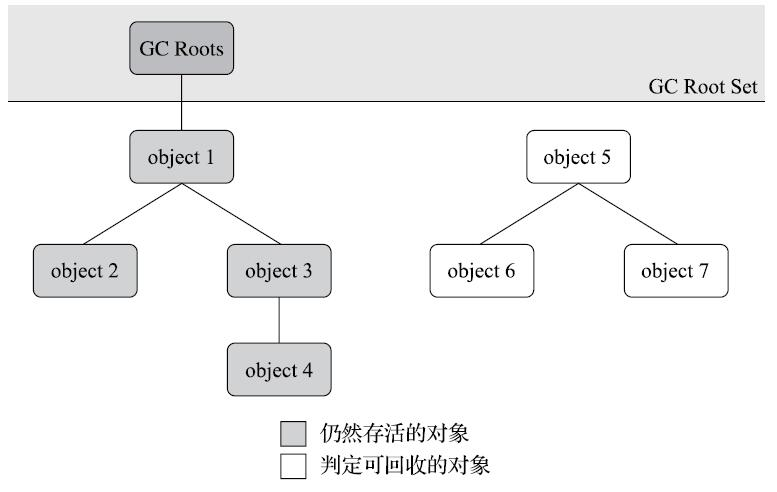

- 固定可作为GC roots的Java对象
  - 1、在虚拟机栈（栈帧中的本地变量表）中引用的对象，譬如各个线程被调用的方法堆栈中使用到的参数、局部变量、临时变量等。
  - 2、在方法区中类静态属性引用的对象，譬如Java类的引用类型静态变量。
  - 3、在方法区中常量引用的对象，譬如字符串常量池（String Table）里的引用。
  - 4、在本地方法栈中JNI（即通常所说的Native方法）引用的对象。
  - 5、Java虚拟机内部的引用，如基本数据类型对应的Class对象，一些常驻的异常对象（比如NullPointExcepiton、OutOfMemoryError）等，还有系统类加载器。
  - 6、所有被同步锁（synchronized关键字）持有的对象。
  - 7、反映Java虚拟机内部情况的JMXBean、JVMTI中注册的回调、本地代码缓存等。

### 引用

```TXT
在JDK 1.2版之后，Java对引用的概念进行了扩充，将引用分为强引用（Strongly Re-ference）、软引用（Soft Reference）、弱引用（Weak Reference）和虚引用（Phantom Reference）4种，这4种引用强度依次逐渐减弱。
```


- 强引用：
  - 传统的引用
  - 不会被回收
- 软引用
  - 非必须的对象
  - OOM之前可以列入回收范围；
  - SoftReference
- 弱引用：
  - 只能存活到下一次垃圾收集发生之前；
  - WeakReference
- 虚引用
  - 不影响生存时间；
  - 仅作为通知机制，唯一目的只是为了能在这个对象被收集器回收时收到一个系统通知

### finalize方法

- 如果这个对象被判定为确有必要执行finalize()方法，那么该对象将会被放置在一个名为F-Queue的队列之中，并在稍后由一条由虚拟机自动建立的、低调度优先级的Finalizer线程去执行它们的finalize()方法。这里所说的“执行”是指虚拟机会触发这个方法开始运行，但并不承诺一定会等待它运行结束。这样做的原因是，如果某个对象的finalize()方法执行缓慢，或者更极端地发生了死循环，将很可能导致F-Queue队列中的其他对象永久处于等待，甚至导致整个内存回收子系统的崩溃。

- finalize()方法是对象逃脱死亡命运的最后一次机会，稍后收集器将对F-Queue中的对象进行第二次小规模的标记，如果对象要在finalize()中成功拯救自己——只要重新与引用链上的任何一个对象建立关联即可；
- 任何一个对象的finalize()方法都只会被系统自动调用一次，如果对象面临下一次回收，它的finalize()方法不会被再次执行，因此第二段代码的自救行动失败了。
- 不推荐
  - 不确定性大
  - 无法保证执行顺序
  - 对C、C++程序员的招揽

```JAVA
/**
 * 此代码演示了两点：
 * 1.对象可以在被GC时自我拯救。
 * 2.这种自救的机会只有一次，因为一个对象的finalize()方法最多只会被系统自动调用一次
 * @author zzm
 */
public class FinalizeEscapeGC {

    public static FinalizeEscapeGC SAVE_HOOK = null;

    public void isAlive() {
        System.out.println("yes, i am still alive :)");
    }

    @Override
    protected void finalize() throws Throwable {
        super.finalize();
        System.out.println("finalize method executed!");
        FinalizeEscapeGC.SAVE_HOOK = this;
    }

    public static void main(String[] args) throws Throwable {
        SAVE_HOOK = new FinalizeEscapeGC();

        //对象第一次成功拯救自己
        SAVE_HOOK = null;
        System.gc();
        // 因为Finalizer方法优先级很低，暂停0.5秒，以等待它
        Thread.sleep(500);
        if (SAVE_HOOK != null) {
            SAVE_HOOK.isAlive();
        } else {
            System.out.println("no, i am dead :(");
        }

        // 下面这段代码与上面的完全相同，但是这次自救却失败了
        SAVE_HOOK = null;
        System.gc();
        // 因为Finalizer方法优先级很低，暂停0.5秒，以等待它
        Thread.sleep(500);
        if (SAVE_HOOK != null) {
            SAVE_HOOK.isAlive();
        } else {
            System.out.println("no, i am dead :(");
        }
    }
}
```


### 方法区内存

- 可回收的部分
  - 废弃的常量
  - 不再使用的类型


- 不再使用的类
  - 1、该类所有的实例都已经被回收，也就是Java堆中不存在该类及其任何派生子类的实例。
  - 2、加载该类的类加载器已经被回收；
    - 这个条件除非是经过精心设计的可替换类加载器的场景，如OSGi、JSP的重加载等，否则通常是很难达成的。
  - 3、该类对应的java.lang.Class对象没有在任何地方被引用，无法在任何地方通过反射访问该类的方法。

```TXT
Java虚拟机被允许对满足上述三个条件的无用类进行回收，这里说的仅仅是“被允许”，而并不是和对象一样，没有引用了就必然会回收。

关于是否要对类型进行回收，HotSpot虚拟机提供了-Xnoclassgc参数进行控制，还可以使用-verbose：class以及-XX：+TraceClass-Loading、-XX：+TraceClassUnLoading查看类加载和卸载信息，
其中-verbose：class和-XX：+TraceClassLoading可以在Product版的虚拟机中使用，
-XX：+TraceClassUnLoading参数需要FastDebug版
```


- 应用场景

```txt
在大量使用反射、动态代理、CGLib等字节码框架，动态生成JSP以及OSGi这类频繁自定义类加载器的场景中，通常都需要Java虚拟机具备类型卸载的能力，以保证不会对方法区造成过大的内存压力。
```


## 什么时候回收？

## 如何回收？

## 分代收集理论

> 当前商业虚拟机的垃圾收集器，大多数都遵循了“分代收集”（Generational Collection）的理论进行设计，分代收集名为理论，实质是一套符合大多数程序运行实际情况的经验法则，它建立在两个分代假说之上。

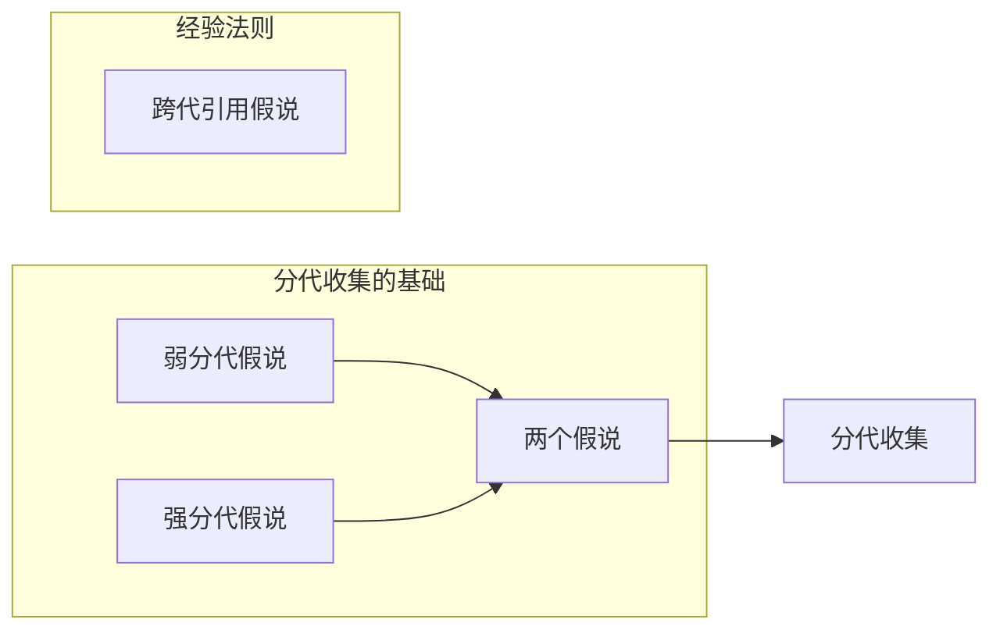
```mermaid
graph LR

	subgraph ide1 [分代收集的基础]
    弱分代假说-->两个假说;
		强分代假说-->两个假说;
  end
  subgraph ide2 [经验法则]
    跨代引用假说;
  end
  两个假说 --> 分代收集;
	
```


- `弱分代假说（Weak Generational Hypothesis）`：绝大多数对象都是朝生夕灭的。

- `强分代假说（Strong Generational Hypothesis）`：熬过越多次垃圾收集过程的对象就越难以消亡。
- `跨代引用假说（Intergenerational Reference Hypothesis）`：跨代引用相对于同代引用来说仅占极少数。
  - 解决性能问题

- 这两个分代假说共同奠定了多款常用的垃圾收集器的一致的**设计原则**：<font color=red>收集器应该将Java堆划分出不同的区域，然后将回收对象依据其年龄（年龄即对象熬过垃圾收集过程的次数）分配到不同的区域之中存储。</font>
  - 如果一个区域中大多数对象都是朝生夕灭，难以熬过垃圾收集过程的话，那么把它们集中放在一起，每次回收时只关注如何保留少量存活而不是去标记那些大量将要被回收的对象，就能以较低代价回收到大量的空间；
  - 如果剩下的都是难以消亡的对象，那把它们集中放在一块，虚拟机便可以使用较低的频率来回收这个区域，这就同时兼顾了垃圾收集的时间开销和内存的空间有效利用。


> 在Java堆划分出不同的区域之后，垃圾收集器才可以每次只回收其中某一个或者某些部分的区域——因而才有了“Minor GC”“Major GC”“Full GC”这样的回收类型的划分；也才能够针对不同的区域安排与里面存储对象存亡特征相匹配的垃圾收集算法——因而发展出了“标记-复制算法”“标记-清除算法”“标记-整理算法”等针对性的垃圾收集算法。


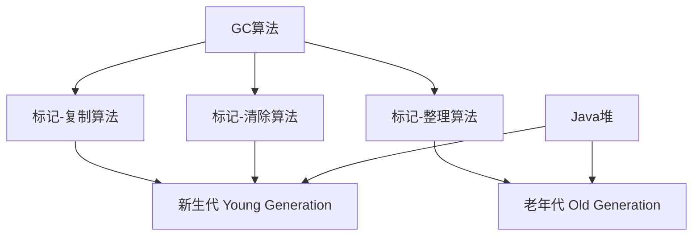
```mermaid
graph TD
	Java堆 --> m1[新生代 Young Generation]
	Java堆 --> m2[老年代 Old Generation]
	GC算法 --> n1[标记-清除算法]
	GC算法 --> n2[标记-复制算法]
	GC算法 --> n3[标记-整理算法]
	n1-->m1
	n2-->m1
	n3-->m2
```

- GC 类型
	- 针对不同分代
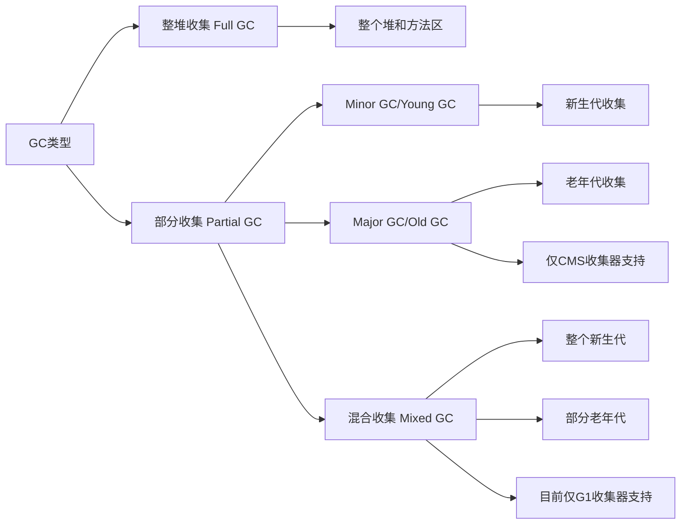
```mermaid
graph LR

	gc-type[GC类型]
	gc-type --> n4[部分收集 Partial GC]
	gc-type --> n5[整堆收集 Full GC]-->整个堆和方法区
	n4 --> n1[Minor GC/Young GC]-->新生代收集
	n4 --> n2[Major GC/Old GC]-->老年代收集
	n4 --> n3[混合收集 Mixed GC]-->整个新生代
	n3-->部分老年代
	n3-->目前仅G1收集器支持
	n2-->仅CMS收集器支持
```


## 内存分配策略


## GC算法

> 追踪式垃圾收集算法


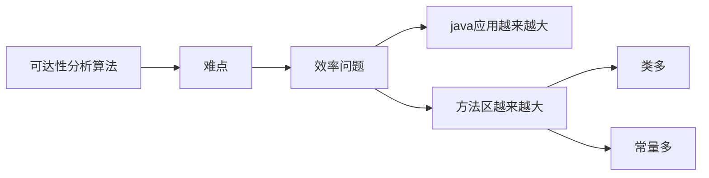
```mermaid
	graph LR
		可达性分析算法-->n1[难点]
		n1-->效率问题
		效率问题-->java应用越来越大
		效率问题-->n2[方法区越来越大]
		n2-->类多
		n2-->常量多
```


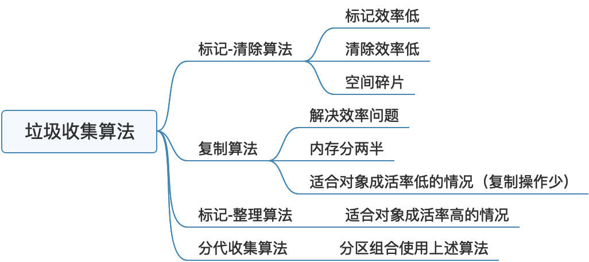


### 标记-清除算法

- 最早出现也是最基础的垃圾收集算法是“标记-清除”（Mark-Sweep）算法；
- 在1960年由Lisp之父John McCarthy所提出。
- 算法分为“**标记**”和“**清除**”两个阶段：
  - 首先标记出所有需要回收的对象，在标记完成后，统一回收掉所有被标记的对象；
  - 也可以反过来，标记存活的对象，统一回收所有未被标记的对象。
  - 标记过程就是对象是否属于垃圾的判定过程。

- 缺点
  - 1、执行效率不稳定；
    - 随对象数量增加，效率变低。
  - 2、内存空间碎片化问题；
    - 不连续内存碎片。
- 解决方法：
  - 依赖更为复杂的内存分配器和内存访问器来解决；
  - 通过“分区空闲分配链表”来解决内存分配问题；
  - <font color=red>内存的访问是用户程序最频繁的操作</font>，甚至都没有之一，假如在这个环节上增加了额外的负担，势必会直接影响应用程序的吞吐量。


### 标记-复制算法

- 背景

```txt
标记-复制算法常被简称为复制算法。为了解决标记-清除算法面对大量可回收对象时执行效率低的问题，1969年Fenichel提出了一种称为“半区复制”（Semispace Copying）的垃圾收集算法，。
```


- 算法
  - 将可用内存按容量划分为大小相等的两块，每次只使用其中的一块。
  - 当这一块的内存用完了，就将还存活着的对象复制到另外一块上面，然后再把已使用过的内存空间一次清理掉。
- 优点
  - 实现简单、运行高效
- 缺点
  - 浪费空间；
  - 产生大量的内存间复制的开销；
- 适合场景：
  - 多数对象都是可回收的情况，算法需要复制的就是占少数的存活对象；
  - 新生代98%的对象熬不过第一轮回收。
  - <font color=red>适合回收新生代</font>

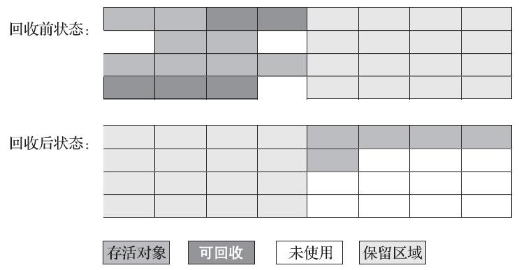

#### 半区复制分代策略

- 历史

```txt
在1989年，Andrew Appel针对具备“朝生夕灭”特点的对象，提出了一种更优化的半区复制分代策略，现在称为“Appel式回收”。
HotSpot虚拟机的Serial、ParNew等新生代收集器均采用了这种策略来设计新生代的内存布局。

```

- Appel式回收
  - 把新生代分为一块较大的Eden空间和两块较小的Survivor空间;
  - 每次分配内存只使用Eden和其中一块Survivor;
  - 发生垃圾搜集时，将Eden和Survivor中仍然存活的对象一次性复制到另外一块Survivor空间上，然后直接清理掉Eden和已用过的那块Survivor空间。
  - HotSpot虚拟机默认Eden和每个Survivor的大小比例是8∶1。
  - 每次新生代中可用内存空间为整个新生代容量的90%（Eden的80%加上一个Survivor的10%），只有一个Survivor空间，即10%的新生代是会被“浪费”的。
  - 当Survivor空间不足以容纳一次Minor GC之后存活的对象时，就需要依赖其他内存区域（实际上大多就是老年代）进行分配担保（Handle Promotion）。

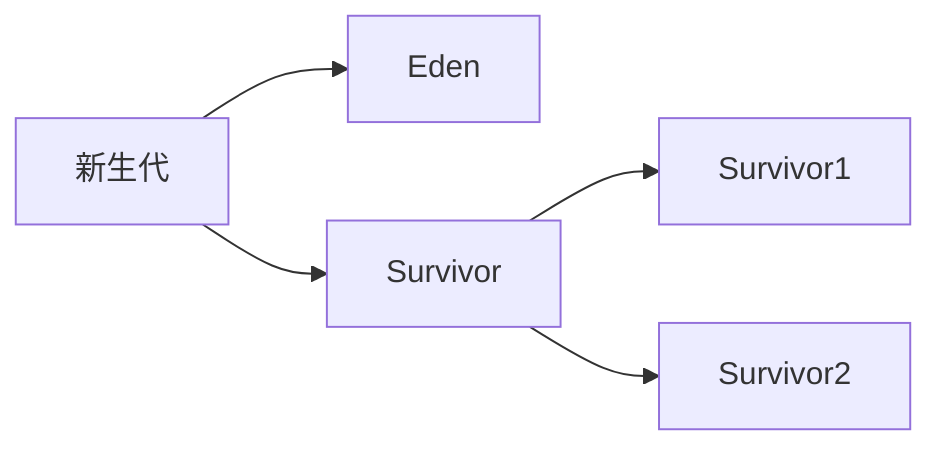
```mermaid
graph LR
	新生代-->Eden
	新生代-->Survivor
	Survivor-->Survivor1
	Survivor-->Survivor2
```

### 标记-整理算法

```txt
针对老年代对象的存亡特征，1974年Edward Lueders提出了另外一种有针对性的“标记-整理”（Mark-Compact）算法，
```

- 算法

  - 标记过程仍然与“标记-清除”算法一样，；
  - 但后续步骤不是直接对可回收对象进行清理，而是让所有存活的对象都向内存空间一端移动，然后直接清理掉边界以外的内存。

- 缺点：

  - 如果移动存活对象，尤其是在老年代这种每次回收都有大量对象存活区域，移动存活对象并更新所有引用这些对象的地方将会是一种极为负重的操作；

  - 而且这种对象移动操作必须全程暂停用户应用程序才能进行。【<font color=red>Stop The World</font>】

    

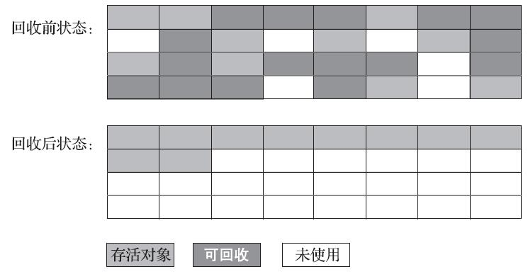


- 移动对象【<font color=red>Stop The World</font>】】 vs 不移动对象
  - 是否移动？
    - 移动则内存回收时会更复杂
    - 不移动则内存分配时会更复杂。【为了同时解决内存碎片问题】
  - 从垃圾收集的停顿时间来看，不移动对象停顿时间会更短，甚至可以不需要停顿。
  - 从整个程序的吞吐量来看，移动对象会更划算。
  - 此语境中，吞吐量的实质是赋值器（Mutator，可以理解为使用垃圾收集的用户程序，本书为便于理解，多数地方用“用户程序”或“用户线程”代替）与收集器的效率总和。
  - 即使不移动对象会使得收集器的效率提升一些，但因内存分配和访问相比垃圾收集频率要高得多，这部分的耗时增加，总吞吐量仍然是下降的。
  - HotSpot虚拟机里面关注吞吐量的**Parallel Scavenge**收集器是基于标记-整理算法的。
  - HotSpot虚拟机里面关注延迟的**CMS**收集器则是基于标记-清除算法的。

### Hotspot的GC细节

```TXT
描述如下几个问题：
	1、HotSpot虚拟机如何发起内存回收；
	2、如何加速内存回收；
	3、如何保证回收正确性等问题？
```


- 跟节点枚举
  - 所有收集器在根节点枚举这一步骤时都是必须暂停用户线程的。

```txt
面临“Stop The World”的困扰的情况？
	1、所有收集器在根节点枚举这一步骤时都是必须暂停用户线程的；
	2、整理内存碎片；
```

- 准确式垃圾收集

由于目前主流Java虚拟机使用的都是准确式垃圾收集（这个概念在第1章介绍Exact VM相对于Classic VM的改进时介绍过），所以当用户线程停顿下来之后，其实并不需要一个不漏地检查完所有执行上下文和全局的引用位置，虚拟机应当是有办法直接得到哪些地方存放着对象引用的。在HotSpot的解决方案里，是使用一组称为OopMap的数据结构来达到这个目的。一旦类加载动作完成的时候，HotSpot就会把对象内什么偏移量上是什么类型的数据计算出来，在即时编译（见第11章）过程中，也会在特定的位置记录下栈里和寄存器里哪些位置是引用。这样收集器在扫描时就可以直接得知这些信息了，并不需要真正一个不漏地从方法区等GC Roots开始查找。

- OOMap数组
  - 为了快速准确的完成GC枚举

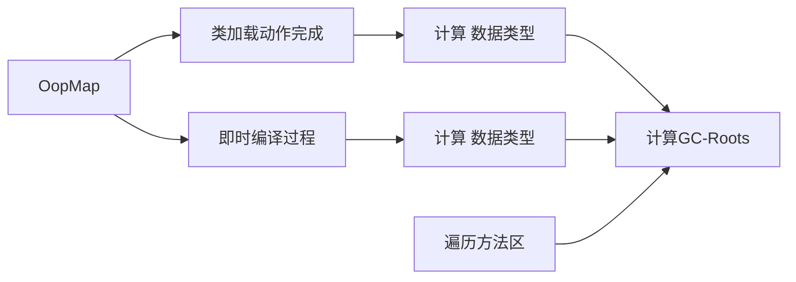
```mermaid
graph LR
	OopMap --> 类加载动作完成
	OopMap --> 即时编译过程
	类加载动作完成-->n1[计算 数据类型]
	即时编译过程-->n2[计算 数据类型]
	n1 --> 计算GC-Roots
	n2 --> 计算GC-Roots
	遍历方法区 --> 计算GC-Roots
```

- 安全点
  - 目的：stop the world，然后进入GC。
  - 只是在“特定的位置”记录了这些信息，这些位置被称为安全点（Safepoint）；
  - 用户程序执行时并非在代码指令流的任意位置都能够停顿下来开始垃圾收集；
  - 强制要求必须执行到达安全点后才能够暂停；
- 如何选择安全点？
  - 标准：`让程序长时间执行的特征。`
  - 不能太少；
  - 不能太多。

```txt
“长时间执行”的最明显特征就是指令序列的复用，例如方法调用、循环跳转、异常跳转等都属于指令序列复用，所以只有具有这些功能的指令才会产生安全点。
```

- 如何在垃圾收集发生时让所有线程（这里其实不包括执行JNI调用的线程）都跑到最近的安全点，然后停顿下来？
  - 抢先式中断（Preemptive Suspension）
```TXT
抢先式中断不需要线程的执行代码主动去配合，在垃圾收集发生时，系统首先把所有用户线程全部中断，如果发现有用户线程中断的地方不在安全点上，就恢复这条线程执行，让它一会再重新中断，直到跑到安全点上。

现在几乎没有虚拟机实现采用抢先式中断来暂停线程响应GC事件。
```
  - 主动式中断（Voluntary Suspension）
```TXT
主动式中断的思想是当垃圾收集需要中断线程的时候，不直接对线程操作，仅仅简单地设置一个标志位，各个线程执行过程时会不停地主动去轮询这个标志，一旦发现中断标志为真时就自己在最近的安全点上主动中断挂起。

轮询标志的地方和安全点是重合的，另外还要加上所有创建对象和其他需要在Java堆上分配内存的地方，这是为了检查是否即将要发生垃圾收集，避免没有足够内存分配新对象。
```

- 安全点的缺点

  - 针对执行程序
  - 无法应对不执行的程序
```txt
程序“不执行”的时候(用户线程处于Sleep状态或者Blocked状态)，线程无法响应虚拟机的中断请求，不能再走到安全的地方去中断挂起自己，虚拟机也显然不可能持续等待线程重新被激活分配处理器时间。
```

- 引入安全区域（Safe Region），解决安全点的不足。

```TXT
安全区域是指能够确保在某一段代码片段之中，引用关系不会发生变化，因此，在这个区域中任意地方开始垃圾收集都是安全的。我们也可以把安全区域看作被扩展拉伸了的安全点。
```

- 进出安全区域的方法

```txt
当用户线程执行到安全区域里面的代码时，首先会标识自己已经进入了安全区域，那样当这段时间里虚拟机要发起垃圾收集时就不必去管这些已声明自己在安全区域内的线程了。

当线程要离开安全区域时，它要检查虚拟机是否已经完成了根节点枚举（或者垃圾收集过程中其他需要暂停用户线程的阶段），如果完成了，那线程就当作没事发生过，继续执行；否则它就必须一直等待，直到收到可以离开安全区域的信号为止。
```

- 标记安全区域的方法？


#### 记忆集与卡片表

- 目的 or 解决的问题
  - 1、对象跨代引用的场景：
  - 2、缩减GC Roots扫描范围的问题；

```txt
分代收集理论的时候，提到了为解决对象跨代引用所带来的问题（效率问题），垃圾收集器在新生代中建立了名为记忆集（Remembered Set）的数据结构，用以避免把整个老年代加进GC Roots扫描范围。

事实上并不只是新生代、老年代之间才有跨代引用的问题，所有涉及部分区域收集（Partial GC）行为的垃圾收集器，典型的如G1、ZGC和Shenandoah收集器，都会面临相同的问题。
```

- 定义

```TXT
记忆集是一种用于记录从非收集区域指向收集区域的指针集合的抽象数据结构。
```

- 实现示例
```java
Class RememberedSet {
    Object[] set[OBJECT_INTERGENERATIONAL_REFERENCE_SIZE];
}
```


- 记录精度

  - 字长精度：32、64位指针
  - 对象精度：每个记录精确的一个对象，对象里有字段含有跨代指针；
  - 卡精度`卡表`：每个记录精确到一块内存区域，区域内有对象含有跨代指针。

    - 字节数组

#### 写屏障

- 目的
  - 维护卡表；
  - 何时修改；
    - 其它分代引用了本区域对象时；
    - 引用类型赋值的时刻；
  - 谁负责修改。

```TXT
虚拟机的记录操作都是通过写屏障实现的；
	对引用关系记录的插入、删除等操作，
```


#### 并发的可达性分析

- 如何解决发扫描时的对象消失问题？
  - 增量更新（Incremental Update）
  - 原始快照（Snapshot At The Beginning，SATB）


- 在HotSpot虚拟机中，增量更新和原始快照这两种解决方案都有实际应用；
  - CMS是基于增量更新来做并发标记的；
  - G1、Shenandoah则是用原始快照来实现并发标记。


# 垃圾收集器

## 基础

<font color=red>Minor GC 和 Full GC</font>

- **新生代GC（Minor GC）**：指发生在新生代的垃圾收集动作，因为Java对象大多都具备朝生夕灭的特性，所以Minor GC非常频繁，一般回收速度也比较快。具体原理见上一篇文章。
- **老年代GC（Major GC ）**：指发生在老年代的GC，出现了Major GC，经常会伴随至少一次的Minor GC（但非绝对的，在Parallel Scavenge收集器的收集策略里就有直接进行Major GC的策略选择过程）。Major GC的速度一般会比Minor GC慢10倍以上
- Full GC：针对整个Java堆。

## 指标

衡量垃圾收集器的三项最重要的指标是：内存占用（Footprint）、吞吐量（Throughput）和延迟（Latency），三者共同构成了一个“不可能三角。

## 经典垃圾收集器

```txt
使用“经典”二字是为了与几款目前仍处于实验状态，但执行效果上有革命性改进的高性能低延迟收集器区分开来，这些经典的收集器尽管已经算不上是最先进的技术，但它们曾在实践中千锤百炼，足够成熟，基本上可认为是现在到未来两、三年内，能够在商用生产环境上放心使用的全部垃圾收集器了。
```


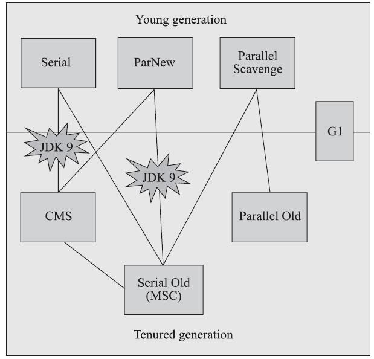

- 七种作用于不同分代的收集器，如果两个收集器之间存在连线，就说明它们可以搭配使用。


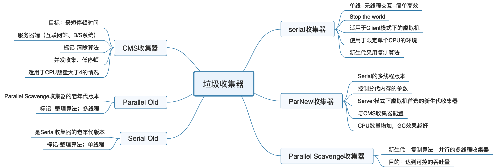


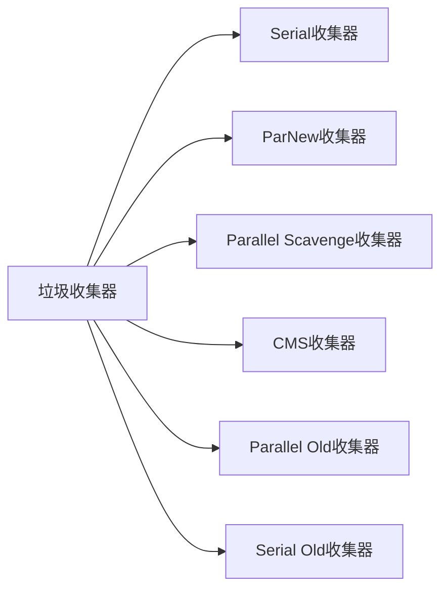
```mermaid
graph LR
gc[垃圾收集器]--> Serial[Serial收集器]
gc --> ParNew[ParNew收集器]
gc --> Parallel[Parallel Scavenge收集器]
gc --> CMS[CMS收集器]
gc --> Parallel-Old[Parallel Old收集器]
gc --> Serial-Old[Serial Old收集器]
```
## GC收集器对比

|        收集器         | 串行、并行or并发 | 新生代/老年代 |        算法        |     目标     |                 适用场景                  |
| :-------------------: | :--------------: | :-----------: | :----------------: | :----------: | :---------------------------------------: |
|      **Serial**       |       串行       |    新生代     |      复制算法      | 响应速度优先 |          单CPU环境下的Client模式          |
|    **Serial Old**     |       串行       |    老年代     |     标记-整理      | 响应速度优先 |  单CPU环境下的Client模式、CMS的后备预案   |
|      **ParNew**       |       并行       |    新生代     |      复制算法      | 响应速度优先 |    多CPU环境时在Server模式下与CMS配合     |
| **Parallel Scavenge** |       并行       |    新生代     |      复制算法      |  吞吐量优先  |     在后台运算而不需要太多交互的任务      |
|   **Parallel Old**    |       并行       |    老年代     |     标记-整理      |  吞吐量优先  |     在后台运算而不需要太多交互的任务      |
|        **CMS**        |       并发       |    老年代     |     标记-清除      | 响应速度优先 | 集中在互联网站或B/S系统服务端上的Java应用 |
|        **G1**         |       并发       |     both      | 标记-整理+复制算法 | 响应速度优先 |        面向服务端应用，将来替换CMS        |

## GC收集器简称

| 名称                               | 收集器                | 作用区域               | 启用参数                                                  |
| :--------------------------------- | :-------------------- | :--------------------- | :-------------------------------------------------------- |
| Copy                               | Serial                | Young                  | -XX:+UseSerialGC                                          |
| MSC                                | Serial Old            | Old                    | -XX:+UseSerialGC                                          |
| PSScavenge                         | Parallel Scavenge     | Young                  | -XX:+UseParallelGC                                        |
| PSMarkSweep                        | Parallel Scavenge     | Old                    | -XX:+UseParallelGC -XX:-UseParallelOldGC                  |
| PSParallelCompact                  | Parallel Old          | Old                    | -XX:+UseParallelGC                                        |
| PCopy                              | ParNew                | Young                  | -XX:+UseConcMarkSweepGC 或者 -XX:+UseParNewGC(JDK9起废除) |
| CMS                                | Concurrent Mark Sweep | Old                    | -XX:+UseConcMarkSweepGC (JDK9起标识为过期，由G1接班)      |
| G1 incremental collections         | G1                    | Young或者Young+部分Old | -XX:+UseG1GC(JDK9起默认收集器)                            |
| G1 stop-the-world full collections | G1                    | Full                   | -XX:+UseG1GC                                              |


## 默认收集器


| 版本  | Young                         | Old                             |
| :---- | :---------------------------- | :------------------------------ |
| JDK6  | PSScavenge(Parallel Scavenge) | PSMarkSweep (Parallel Scavenge) |
| JDK7  | PSScavenge(Parallel Scavenge) | PSParallelCompact(Parallel Old) |
| JDK8  | PSScavenge(Parallel Scavenge) | PSParallelCompact(Parallel Old) |
| JDK11 | G1                            | G1                              |


## Serial收集器

- JDK 1.3.1之前是虚拟机新生代收集器的唯一选择。

- Serial和Serial Old示意图

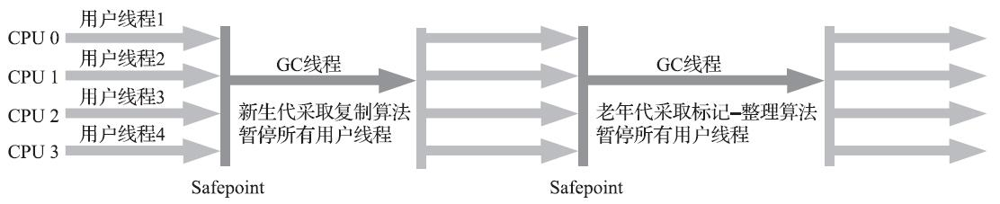

## Parallel New

- Parallel和Serial Old示意图

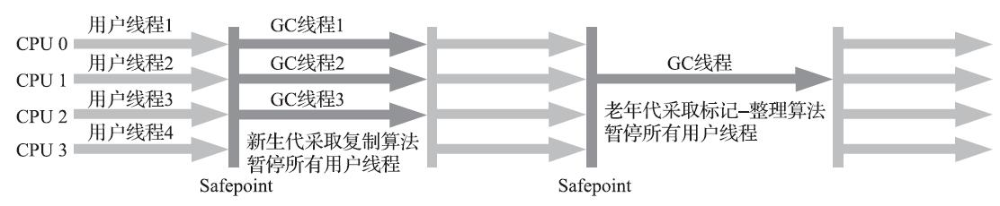


ParNew收集器实质上是Serial收集器的多线程并行版本，除了同时使用多条线程进行垃圾收集之外，其余的行为包括Serial收集器可用的所有控制参数（例如：-XX：SurvivorRatio、-XX：PretenureSizeThreshold、-XX：HandlePromotionFailure等）、收集算法、Stop The World、对象分配规则、回收策略等都与Serial收集器完全一致，在实现上这两种收集器也共用了相当多的代码。ParNew收集器的工作过程如图3-8所示。

，所以在JDK 5中使用CMS来收集老年代的时候，新生代只能选择ParNew或者Serial收集器中的一个。ParNew收集器是激活CMS后（使用-XX：+UseConcMarkSweepGC选项）的默认新生代收集器，也可以使用-XX：+/-UseParNewGC选项来强制指定或者禁用它。

- ParNew收集器除了支持多线程并行收集之外，其他与Serial收集器相比并没有太多创新之处;
- 服务端模式下的HotSpot虚拟机首选的新生代收集器;
- 除了Serial收集器外，目前只有它能与CMS收集器配合工作。


## Parallel Scavenge

- JDK1.4.0

- 吞吐量优先收集器
- 自适应策略也是Parallel Scavenge收集器区别于ParNew收集器的一个重要特性。
  - -XX：MaxGCPauseMillis
  - -XX：GCTimeRatio
  - -XX: -XX:+UseAdaptiveSizePolicy


- 停顿时间越短就越适合需要与用户交互或需要保证服务响应质量的程序，良好的响应速度能提升用户体验；而高吞吐量则可以最高效率地利用处理器资源，尽快完成程序的运算任务，主要适合在后台运算而不需要太多交互的分析任务。

## Serial Old

- Serial和Serial Old示意图

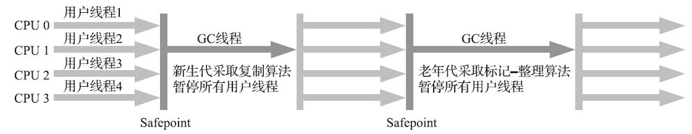

## Parallel Old

- JDK1.6开始提供


Parallel Scavenge和parallel Old示意图

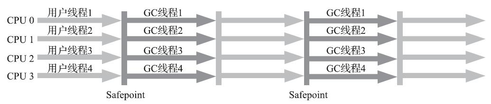


## CMS收集器

- 在JDK5法布施，退出的一款再强交互应用中几乎可称为具有划时代意义的垃圾收集器--CMS收集器。


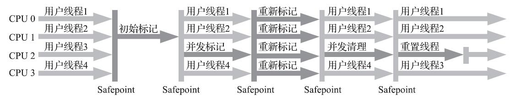

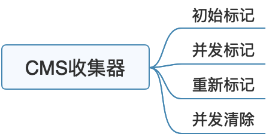

## G1收集器

- JDK7 Update 4
- JDK8 Update40
- G1收集器Region分区示意图
- 经验：目前在小内存应用上CMS的表现大概率仍然要会优于G1，而在大内存应用上G1则大多能发挥其优势，这个优劣势的Java堆容量平衡点通常在6GB至8GB之间。


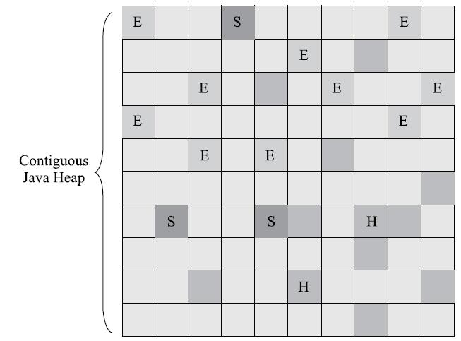

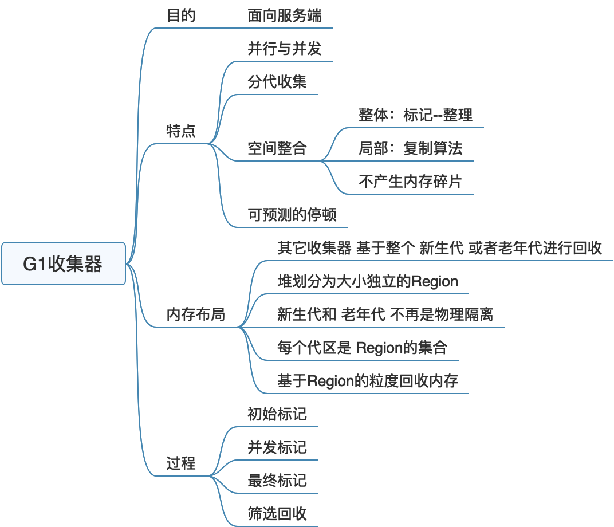

## 低延迟垃圾收集器

- Shenandoah和ZGC
- 实现垃圾收集的停顿都不超过十毫秒
- 实验状态
- “低延迟垃圾收集器”（Low-Latency Garbage Collector或者Low-Pause-Time Garbage Collector）

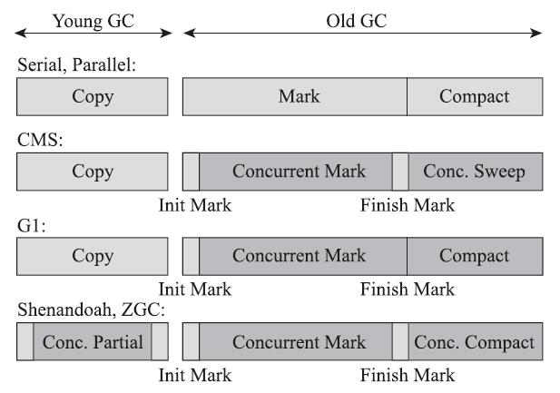


- 浅色阶段表示必须挂起用户线程；
- 深色表示收集器线程与用户线程是并发工作的。
- CMS和G1分别使用增量更新和原始快照（见3.4.6节）技术，实现了标记阶段的并发，不会因管理的堆内存变大，要标记的对象变多而导致停顿时间随之增长。
- CMS使用标记-清除算法，虽然避免了整理阶段收集器带来的停顿，但是清除算法不论如何优化改进，在设计原理上避免不了空间碎片的产生，随着空间碎片不断淤积最终依然逃不过“Stop The World”的命运。
- G1虽然可以按更小的粒度进行回收，从而抑制整理阶段出现时间过长的停顿，但毕竟也还是要暂停的。

## shenandoah

- JDK12
- OpenJDK支持，OracleJDK 不支持
- Redhat贡献

## Epsilon

- 传统Java有着内存占用较大，在容器中启动时间长，即时编译需要缓慢优化等特点；
  - 大型系统从传统单体应用向微服务化、无服务化方向发展的趋势已越发明显。
  - 了应对新的技术潮流，最近几个版本的JDK逐渐加入了提前编译、面向应用的类数据共享等支持。

- 短时间、小规模的应用服务。

- Epsilon也是有着类似的目标，如果读者的应用只要运行数分钟甚至数秒，只要Java虚拟机能正确分配内存，在堆耗尽之前就会退出，那显然运行负载极小、没有任何回收行为的Epsilon便是很恰当的选择。


## ZGC

- JDK11

# 类加载

## 类的生命周期

- 一个类型从被加载到虚拟机内存中开始，到卸载出内存为止，它的整个生命周期将会经历
  - 1、加载（Loading）、
  - 2、验证（Verification）、
  - 3、准备（Preparation）、
  - 4、解析（Resolution）、
  - 5、初始化（Initialization）、
  - 6、使用（Using）和
  - 7、卸载（Unloading）七个阶段；
  - 其中验证、准备、解析三个部分统称为连接（Linking）。

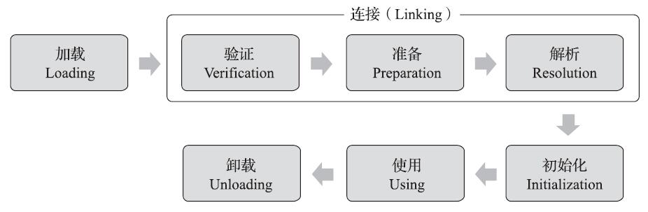
- 加载、验证、准备、初始化和卸载这五个阶段的顺序是确定的，类型的加载过程必须按照这种顺序按部就班地开始；
- 而解析阶段则不一定：它在某些情况下可以在初始化阶段之后再开始，这是为了支持Java语言的运行时绑定特性（也称为动态绑定或晚期绑定）。请注意，这里笔者写的是按部就班地“开始”，而不是按部就班地“进行”或按部就班地“完成”，强调这点是因为这些阶段通常都是互相交叉地混合进行的，会在一个阶段执行的过程中调用、激活另一个阶段。


## 类的加载过程

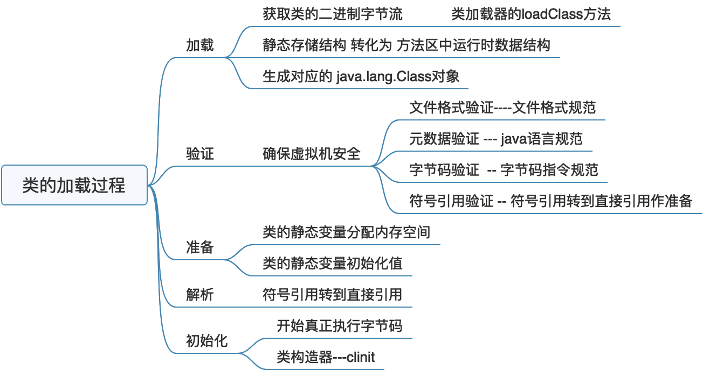

## 类加载器

1. 根类加载器是由JVM实现的；【sun.misc.Launcher】

2. Bootstrap ClassLoader负责加载java的核心类。

3. 在Sun的JVM中，当执行java命令时，使用-Xbootclasspath选项或者使用-D选项指定sun.boot.class.path系统属性值可以指定加载附加的类。

4. 扩展类加载器的加载路径通过“java.ext.dirs”系统属性指定；

5. 系统类加载器的加载路径通过“java.class.path”系统属性指定；

6. 系统类加载器的加载路径通过java命令的“-classpath”选项指定；

7. 系统类加载器的加载路径通过“CLASSPATH”环境变量指定。

## 类加载


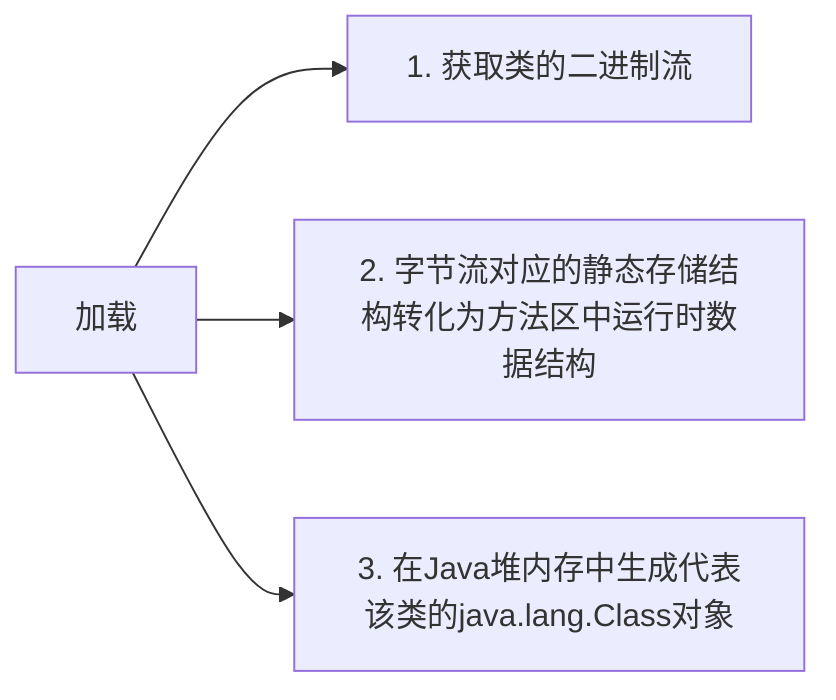
```mermaid
graph LR;
加载 --> s1[1. 获取类的二进制流]
加载 --> s2[2. 字节流对应的静态存储结构转化为方法区中运行时数据结构]
加载 --> s3[3. 在Java堆内存中生成代表该类的java.lang.Class对象]
```
- 加载阶段结束后，Java虚拟机外部的**二进制字节流**就按照虚拟机所设定的格式存储在方法区之中了；
- 方法区中的数据存储格式完全由虚拟机实现自行定义，《Java虚拟机规范》未规定此区域的具体数据结构。
- 类型数据妥善安置在**方法区**之后，会在**Java堆内存**中实例化一个java.lang.Class类的对象，这个对象将作为程序访问方法区中的类型数据的外部接口。

### 二进制流来源

- 1、从ZIP压缩包中读取，这很常见，最终成为日后JAR、EAR、WAR格式的基础。
- 2、从网络中获取，这种场景最典型的应用就是Web Applet。
- 3、运行时计算生成；
  - 这种场景使用得最多的就是动态代理技术；
  - 在`java.lang.reflect.Proxy`中，就是用了`ProxyGenerator.generateProxyClass()`来为特定接口生成形式为`*$Proxy`的代理类的二进制字节流。
- 4、由其他文件生成，典型场景是JSP应用，由**JSP文件**生成对应的Class文件。
- 5、从**数据库**中读取，这种场景相对少见些，例如有些中间件服务器（如SAP Netweaver）可以选择把程序安装到数据库中来完成程序代码在集群间的分发。
- 6、可以**从加密文件中获取**，这是典型的防Class文件被反编译的保护措施，通过**加载时解密Class文件**来保障程序运行逻辑不被窥探。
- 7、……


### 类加载器

- 加载阶段既可以使用Java虚拟机里内置的引导类加载器来完成；
- 也可以由用户自定义的类加载器去完成，开发人员通过定义自己的类加载器去控制字节流的获取方式（重写一个类加载器的findClass()或loadClass()方法），实现根据自己的想法来赋予应用程序获取运行代码的动态性。


### 数组类

- 数组类本身不通过类加载器创建，它是由Java虚拟机直接在内存中动态构造出来的。
- 但数组类与类加载器仍然有很密切的关系，因为数组类的元素类型（Element Type，指的是数组去掉所有维度的类型）最终还是要靠类加载器来完成加载；
- 一个数组类（下面简称为C）创建过程遵循以下规则：


## 验证

- 第一阶段：文件格式规范
  - 第一阶段要验证字节流是否符合Class文件格式的规范，并且能被当前版本的虚拟机处理。这一阶段可能包括下面这些验证点：
  - 魔数字 0xcafababe
  - 主次版本号
  - 常量池类型
- 第二阶段：元数据
  - java语言规范
- 第三阶段
  - 字节码指令规范
- 第四阶段：
  - 符号引用验证

## 准备

- 准备阶段是正式为类中定义的变量（即静态变量，被static修饰的变量）分配内存并设置类变量初始值的阶段;
  - 分配内存
  - 初始化值

```java
public static int value = 123;
```


- 那变量value在准备阶段过后的初始值为0而不是123；
- 因为这时尚未开始执行任何Java方法；
- 而把value赋值为123的putstatic指令是程序被编译后，存放于类构造器`<clinit>()`方法之中；
- 所以把value赋值为123的动作要到类的初始化阶段才会被执行。


- “通常情况”下初始值是零值;
  - 那言外之意是相对的会有某些“特殊情况”：
  - 如果类字段的字段属性表中存在ConstantValue属性，那在准备阶段变量值就会被初始化为ConstantValue属性所指定的初始值.

```java
public static final int value = 123;
```

- 编译时Javac将会为value生成ConstantValue属性;
- 在准备阶段虚拟机就会根据Con-stantValue的设置将value赋值为123。

## 解析

- 解析阶段是Java虚拟机将常量池内的符号引用替换为直接引用的过程。

### 符号引用与直接引用

- **符号引用**
  - 在Class文件中它以CONSTANT_Class_info、CONSTANT_Fieldref_info、CONSTANT_Methodref_info等类型的常量出现；

```TXT
符号引用（Symbolic References）：符号引用以一组符号来描述所引用的目标，符号可以是任何形式的字面量，只要使用时能无歧义地定位到目标即可。

符号引用与虚拟机实现的内存布局无关，引用的目标并不一定是已经加载到虚拟机内存当中的内容。

各种虚拟机实现的内存布局可以各不相同，但是它们能接受的符号引用必须都是一致的，因为符号引用的字面量形式明确定义在《Java虚拟机规范》的Class文件格式中。
```


- 直接引用

```txt
直接引用（Direct References）：直接引用是可以直接指向目标的指针、相对偏移量或者是一个能间接定位到目标的句柄。
直接引用是和虚拟机实现的内存布局直接相关的，同一个符号引用在不同虚拟机实例上翻译出来的直接引用一般不会相同。
如果有了直接引用，那引用的目标必定已经在虚拟机的内存中存在。
```


1. 类、接口解析
2. 字段解析
3. 方法解析
4. 接口方法解析

## 类初始化

类初始化之前必须进行类的加载过程。

### Clinit

进行准备阶段时，变量已经赋过一次系统要求的初始零值，而在初始化阶段，则会根据程序员通过程序编码制定的主观计划去初始化类变量和其他资源。

- 初始化阶段就是执行类构造器**`<clinit>()`**方法的过程。
  -  **`<clinit>()`**并不是程序员在Java代码中直接编写的方法；
  - 它是Javac编译器的自动生成物。

- **`<clinit>()`**方法是由编译器自动收集类中的所有类变量的赋值动作和静态语句块（static{}块）中的语句合并产生的；
	- 编译器收集的顺序是由语句在源文件中出现的顺序决定的；
	- 静态语句块中只能访问到定义在静态语句块之前的变量；
	- 定义在它之后的变量，在前面的静态语句块可以赋值，但是不能访问
```java
public class Test {
    static {
        i = 0;  //  给变量复制可以正常编译通过
        System.out.print(i);  // 这句编译器会提示“非法向前引用”
    }
    static int i = 1;
}
```

- Java虚拟机会保证在子类的**`<clinit>()`**方法执行前，父类的**`<clinit>()`**方法已经执行完毕。
- 因此在Java虚拟机中第一个被执行的**`<clinit>()`**方法的类型肯定是java.lang.Object。


- Java虚拟机必须保证一个类的**`<clinit>()`**方法在多线程环境中被正确地加锁同步，如果多个线程同时去初始化一个类，那么只会有其中一个线程去执行这个类的**`<clinit>()`**方法，其他线程都需要阻塞等待，直到活动线程执行完毕**`<clinit>()`**方法。如果在一个类的**`<clinit>()`**方法中有耗时很长的操作，那就可能造成多个进程阻塞


### 触发类初始化

- 有且仅有六种场景必须立即对类进行初始化。

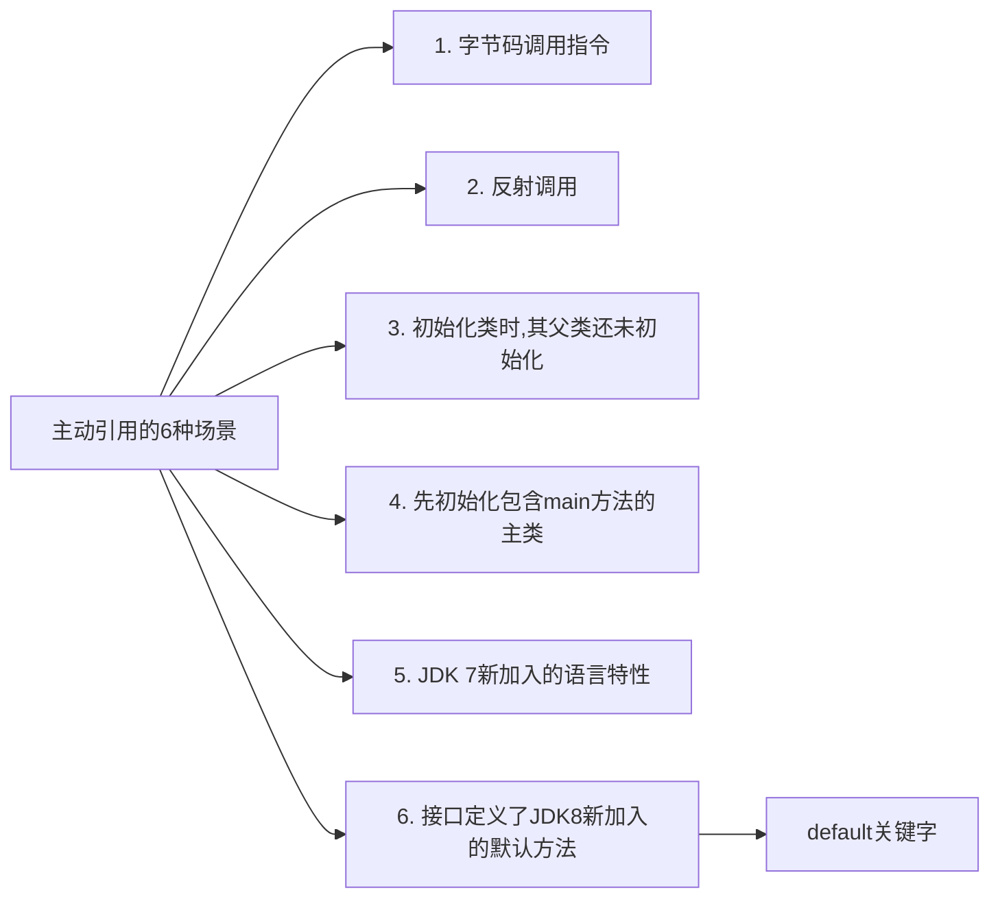
```mermaid
graph LR
	
  主动引用的6种场景 --> n1[1. 字节码调用指令]
  主动引用的6种场景 --> n2[2. 反射调用]
  主动引用的6种场景 --> n3[3. 初始化类时,其父类还未初始化]
  主动引用的6种场景 --> n4[4. 先初始化包含main方法的主类]
  主动引用的6种场景 --> n5[5. JDK 7新加入的语言特性]
  主动引用的6种场景 --> n6[6. 接口定义了JDK8新加入的默认方法]
  n6--> n7[default关键字]
```


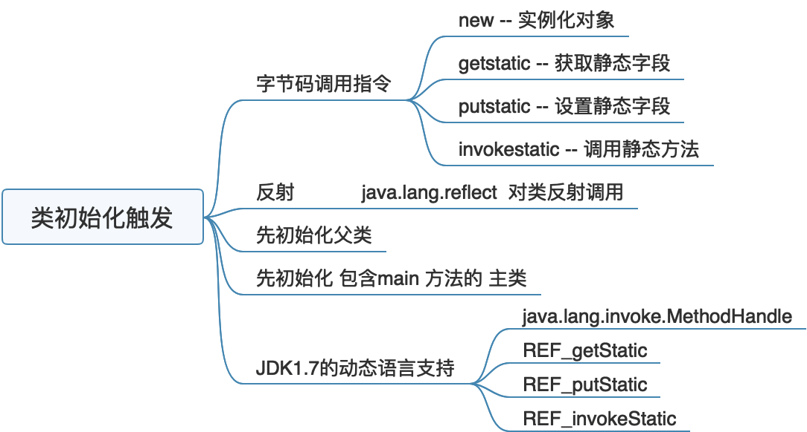

### 被动引用


- 被动引用，不触发类初始化

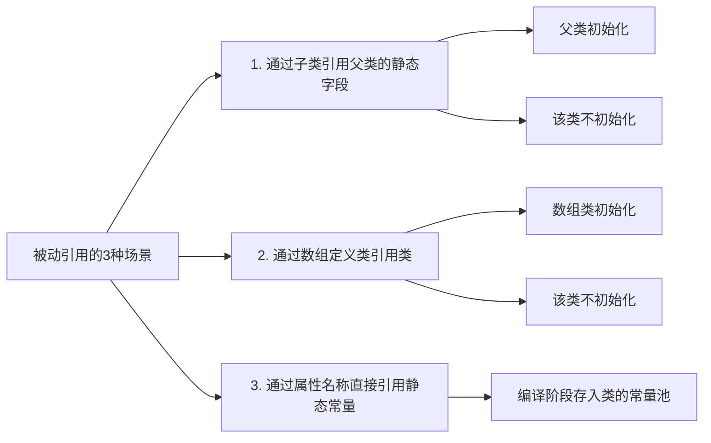
```mermaid
graph LR
	
  被动引用的3种场景 --> n1[1. 通过子类引用父类的静态字段]
  被动引用的3种场景 --> n2[2. 通过数组定义类引用类]
  被动引用的3种场景 --> n3[3. 通过属性名称直接引用静态常量]
  n1 --> n1_1[父类初始化]
  n1 --> n1_2[该类不初始化]
  n2 --> n2_1[数组类初始化]
  n2 --> n2_2[该类不初始化]
  n3 --> n3_1[编译阶段存入类的常量池]
```

### 接口初始化

接口的加载过程与类加载过程稍有不同，针对接口需要做一些特殊说明：接口也有初始化过程，这点与类是一致的，上面的代码都是用静态语句块“static{}”来输出初始化信息的，而接口中不能使用“static{}”语句块，但编译器仍然会为接口生成类构造器，用于初始化接口中所定义的成员变量。

- 接口与类真正有所区别的是前面讲述的六种“有且仅有”需要触发初始化场景中的第三种：
  - 当一个类在初始化时，要求其父类全部都已经初始化过了；
  - 但是一个接口在初始化时，并不要求其父接口全部都完成了初始化，只有在真正使用到父接口的时候（如引用接口中定义的常量）才会初始化。
- 接口、类的构造器
  - <font color = red> `<clinit>()>`</font>
- 方法构造器
  - <font color = red> `<init>()>`</font>


## 类加载器

- 作用

```txt
通过一个类的全限定名来获取描述该类的二进制字节流”这个动作放到Java虚拟机外部去实现，以便让应用程序自己决定如何去获取所需的类。

实现这个动作的代码被称为“类加载器”（Class Loader）。
```


- 应用场景
  - 类层次划分；
  - OSGi；
  - 程序热部署；
  - 代码加密。

### 类与类加载器


- 唯一确定类： 类加载器 + 类名；
  - 对于任意一个类，都必须由加载它的类加载器和这个类本身一起共同确立其在Java虚拟机中的唯一性；
  - 每一个类加载器，都拥有一个独立的类名称空间。

```txt
这句话可以表达得更通俗一些：比较两个类是否“相等”，只有在这两个类是由同一个类加载器加载的前提下才有意义，否则，即使这两个类来源于同一个Class文件，被同一个Java虚拟机加载，只要加载它们的类加载器不同，那这两个类就必定不相等。
```

### ClassLoaderTest

- 重写loadClass实现类加载

```java
/**
 * 类加载器与instanceof关键字演示
 *
 * @author zzm
 */
public class ClassLoaderTest {

    public static void main(String[] args) throws Exception {

        ClassLoader myLoader = new ClassLoader() {
            @Override
            public Class<?> loadClass(String name) throws ClassNotFoundException {
                try {
                    String fileName = name.substring(name.lastIndexOf(".") + 1)+".class";
                    InputStream is = getClass().getResourceAsStream(fileName);
                    if (is == null) {
                        return super.loadClass(name);
                    }
                    byte[] b = new byte[is.available()];
                    is.read(b);
                    return defineClass(name, b, 0, b.length);
                } catch (IOException e) {
                    throw new ClassNotFoundException(name);
                }
            }
        };

        Object obj = myLoader
                .loadClass("org.hapihu.study.ClassLoaderTest")
                .newInstance();

        System.out.println(obj.getClass());
        System.out.println(obj instanceof org.hapihu.study.ClassLoaderTest);

        System.out.println(obj.getClass().getClassLoader());
        System.out.println(ClassLoaderTest.class.getClassLoader());
    }
}
```
- 运行结果
```bash
class org.hapihu.study.ClassLoaderTest
false
org.hapihu.study.ClassLoaderTest$1@d716361
sun.misc.Launcher$AppClassLoader@18b4aac2
```


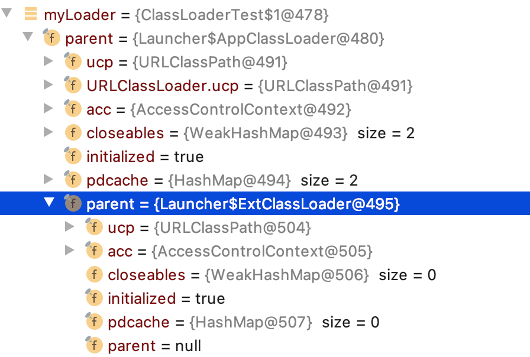

#### defineClass

```java
 public abstract class ClassLoader {
   	//二进制文件生成class 类
     protected final Class<?> defineClass(String name, byte[] b, int off, int len,
                                         ProtectionDomain protectionDomain)
        throws ClassFormatError
    {
        protectionDomain = preDefineClass(name, protectionDomain);
        String source = defineClassSourceLocation(protectionDomain);
        Class<?> c = defineClass1(name, b, off, len, protectionDomain, source);
        postDefineClass(c, protectionDomain);
        return c;
    }
     
     
} 
```


### 启动类加载器

- 启动类加载器（Bootstrap Class Loader）：前面已经介绍过，这个类加载器负责加载存放在**`<JAVA_HOME>\lib`**目录，或者被-Xbootclasspath参数所指定的路径中存放的，而且是Java虚拟机能够识别的（按照文件名识别，如**`rt.jar、tools.jar`**，名字不符合的类库即使放在lib目录中也不会被加载）类库加载到虚拟机的内存中。

- 启动类加载器无法被Java程序直接引用，用户在编写自定义类加载器时，如果需要把加载请求委派给引导类加载器去处理，那直接使用**null**代替即可

```txt
·启动类加载器（Bootstrap Class Loader）：前面已经介绍过，这个类加载器负责加载存放在<JAVA_HOME>\lib目录，或者被-Xbootclasspath参数所指定的路径中存放的，而且是Java虚拟机能够识别的（按照文件名识别，如rt.jar、tools.jar，名字不符合的类库即使放在lib目录中也不会被加载）类库加载到虚拟机的内存中。启动类加载器无法被Java程序直接引用，用户在编写自定义类加载器时，如果需要把加载请求委派给引导类加载器去处理，那直接使用null代替即可，代码清单7-9展示的就是java.lang.ClassLoader.getClassLoader()方法的代码片段，其中的注释和代码实现都明确地说明了以null值来代表引导类加载器的约定规则。
```

```java
/**
Returns the class loader for the class.  Some implementations may use null to represent the bootstrap class loader. 
This method will return  null in such implementations if this class was loaded by the bootstrap class loader.
*/
public ClassLoader getClassLoader() {
    ClassLoader cl = getClassLoader0();
    if (cl == null)
        return null;
    SecurityManager sm = System.getSecurityManager();
    if (sm != null) {
        ClassLoader ccl = ClassLoader.getCallerClassLoader();
        if (ccl != null && ccl != cl && !cl.isAncestor(ccl)) {
            sm.checkPermission(SecurityConstants.GET_CLASSLOADER_PERMISSION);
        }
    }
    return cl;
}
```


### 扩展类加载器


- 扩展类加载器（Extension Class Loader）;
- 这个类加载器是在类**`sun.misc.Launcher$ExtClassLoader`**中以Java代码的形式实现的。
- 它负责加载**`<JAVA_HOME>\lib\ext`**目录中，或者被**`java.ext.dirs`**系统变量所指定的路径中所有的类库。
- 根据“扩展类加载器”这个名称，就可以推断出这是一种Java系统类库的扩展机制，JDK的开发团队允许用户将具有通用性的类库放置在ext目录里以扩展Java SE的功能;
- 在JDK 9之后，这种扩展机制被模块化带来的天然的扩展能力所取代。由于扩展类加载器是由Java代码实现的，开发者可以直接在程序中使用扩展类加载器来加载Class文件。

### 应用程序类加载器

- 应用程序类加载器（Application Class Loader）：
- 这个类加载器由**`sun.misc.Launcher$AppClassLoader`**来实现。
- 由于应用程序类加载器是ClassLoader类中的getSystem-ClassLoader()方法的返回值，所以有些场合中也称它为“**系统类加载器**”。
- 它负责加载用户类路径（**`ClassPath`**）上所有的类库，开发者同样可以直接在代码中使用这个类加载器。
- 如果应用程序中没有自定义过自己的类加载器，一般情况下这个就是程序中**默认的类加载器**。

### 自定义类加载器

- 自定义类加载器的场景
  - 1、扩展Class文件的来源
  - 2、通过类加载器实现类的隔离、重载等功能；


### 双亲委派模型


**双亲委派模型（Parents Delegation Model）**：下图展示的各种类加载器之间的层次关系被称为类加载器的“双亲委派模型（Parents Delegation Model）”。


- 双亲委派模型要求除了顶层的启动类加载器外，其余的类加载器都应有自己的父类加载器。
- 不过这里类加载器之间的父子关系一般不是以继承（Inheritance）的关系来实现的，而是通常使用组合（**Composition**）关系来复用父加载器的代码。

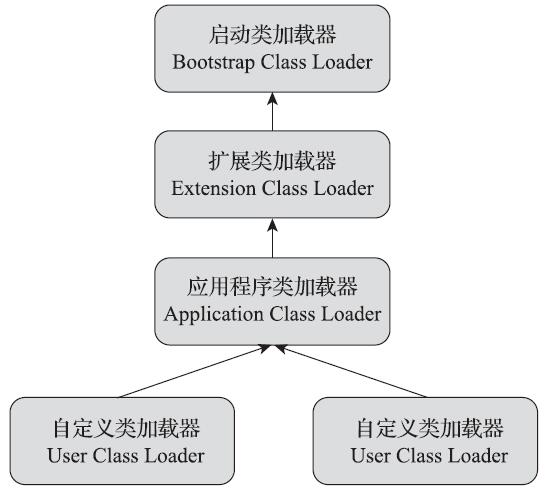


- 双亲委派模型的工作过程是：
  - 1、如果一个类加载器收到了类加载的请求，它首先不会自己去尝试加载这个类，而是把这个请求委派给父类加载器去完成；
  - 2、每一个层次的类加载器都是如此，因此所有的加载请求最终都应该传送到最顶层的启动类加载器中，
  - 3、只有当父加载器反馈自己无法完成这个加载请求（**<font color=red>它的搜索范围中没有找到所需的类</font>**）时，子加载器才会尝试自己去完成加载。

- <font colore=red>好处</font>
  - 1、优先级的层次关系
  - 2、保证基础类在各种类加载器环境中是同一个类。

```txt
类java.lang.Object，它存放在rt.jar之中

无论哪一个类加载器要加载这个类，最终都是委派给处于模型最顶端的启动类加载器进行加载;
因此Object类在程序的各种类加载器环境中都能够保证是同一个类。

反之，如果没有使用双亲委派模型，都由各个类加载器自行去加载的话，如果用户自己也编写了一个名为java.lang.Object的类，并放在程序的ClassPath中，那系统中就会出现多个不同的Object类，Java类型体系中最基础的行为也就无从保证，应用程序将会变得一片混乱。
```

> 如果读者有兴趣的话，可以尝试去写一个与rt.jar类库中已有类重名的Java类，将会发现它可以正常编译，但永远无法被加载运行。


>  即使自定义了自己的类加载器，强行用defineClass()方法去加载一个以“java.lang”开头的类也不会成功。如果读者尝试这样做的话，将会收到一个由Java虚拟机内部抛出的“java.lang.SecurityException：Prohibited package name：java.lang”异常。

​	

- 双亲委派模型的局限性：
  - 父级加载器无法加载子级类加载器路径中的类。

### 实现

- 双亲委派模型对于保证Java程序的稳定运作极为重要，但它的实现却异常简单，用以实现双亲委派的代码只有短短十余行，全部集中在java.lang.ClassLoader的loadClass()方法之中。

```java
package java.lang;
/**
	@param  name : 全路径名称
	@param  resolve:	If <tt>true</tt> then resolve the class
**/
public abstract class ClassLoader {
  protected Class<?> loadClass(String name, boolean resolve)
        throws ClassNotFoundException
    {
        synchronized (getClassLoadingLock(name)) {
            // First, check if the class has already been loaded
            Class<?> c = findLoadedClass(name);
            if (c == null) {
                long t0 = System.nanoTime();
                try {
                    if (parent != null) {
                        c = parent.loadClass(name, false);
                    } else {
                        c = findBootstrapClassOrNull(name);
                    }
                } catch (ClassNotFoundException e) {
                    // ClassNotFoundException thrown if class not found
                    // from the non-null parent class loader
                }

                if (c == null) {
                    // If still not found, then invoke findClass in order
                    // to find the class.
                    long t1 = System.nanoTime();
                    c = findClass(name);

                    // this is the defining class loader; record the stats
                    sun.misc.PerfCounter.getParentDelegationTime().addTime(t1 - t0);
                    sun.misc.PerfCounter.getFindClassTime().addElapsedTimeFrom(t1);
                    sun.misc.PerfCounter.getFindClasses().increment();
                }
            }
            if (resolve) {
                resolveClass(c);
            }
            return c;
        }
    }

}
```


```java
/**
	@param  name : 全路径名称
	@param  resolve:	If <tt>true</tt> then resolve the class
**/
protected synchronized Class<?> loadClass(
  		String name, 
  		boolean resolve) throws ClassNotFoundException
{
    // 首先，检查请求的类是否已经被加载过了
    Class c = findLoadedClass(name);
    if (c == null) {
        try {
        if (parent != null) {
            c = parent.loadClass(name, false);
        } else {
            c = findBootstrapClassOrNull(name);
        }
        } catch (ClassNotFoundException e) {
            // 如果父类加载器抛出ClassNotFoundException
            // 说明父类加载器无法完成加载请求
        }
        if (c == null) {
            // 在父类加载器无法加载时
            // 再调用本身的findClass方法来进行类加载
            c = findClass(name);
        }
    }
    if (resolve) {
        resolveClass(c);
    }
    return c;
}
```

### 破坏双亲委派模型

- **第一次破坏场景：**
  - JDK1.2 才出现双亲委派
  - 兼容JDK1.2之前的用户自定义类加载器
    - 重写`java.lang.ClassLoader`的`loadClass`方法；
  - JDK1.2之后
    - 建议重写`java.lang.ClassLoader`的`findClass`方法；


- **第二次破坏场景：**
  - 基础类型回调用户代码；
    - JDIN服务

```txt
一个典型的例子便是JNDI服务，JNDI现在已经是Java的标准服务，它的代码由启动类加载器来完成加载（在JDK 1.3时加入到rt.jar的），肯定属于Java中很基础的类型了。
但JNDI存在的目的就是对资源进行查找和集中管理，它需要调用由其他厂商实现并部署在应用程序的ClassPath下的JNDI服务提供者接口（Service Provider Interface，SPI）的代码，现在问题来了，启动类加载器是绝不可能认识、加载这些代码的，那该怎么办？
```

- 解决办法：<font color=red>线程上下文类加载器（Thread Context ClassLoader）</font>
  - `java.lang.Thread`类的`setContext-ClassLoader()`

```txt
为了解决这个困境，Java的设计团队只好引入了一个不太优雅的设计：线程上下文类加载器（Thread Context ClassLoader）。
这个类加载器可以通过java.lang.Thread类的setContext-ClassLoader()方法进行设置;
如果创建线程时还未设置，它将会从父线程中继承一个;
如果在应用程序的全局范围内都没有设置过的话，那这个类加载器默认就是应用程序类加载器。
```


- 父类加载器去请求子类加载器完成类加载

```txt
有了线程上下文类加载器，程序就可以做一些“舞弊”的事情了。
JNDI服务使用这个线程上下文类加载器去加载所需的SPI服务代码，这是一种父类加载器去请求子类加载器完成类加载的行为，这种行为实际上是打通了双亲委派模型的层次结构来逆向使用类加载器，已经违背了双亲委派模型的一般性原则，但也是无可奈何的事情。

Java中涉及SPI的加载基本上都采用这种方式来完成，例如JNDI、JDBC、JCE、JAXB和JBI等。

不过，当SPI的服务提供者多于一个的时候，代码就只能根据具体提供者的类型来硬编码判断，为了消除这种极不优雅的实现方式，在JDK 6时，JDK提供了java.util.ServiceLoader类，以META-INF/services中的配置信息，辅以责任链模式，这才算是给SPI的加载提供了一种相对合理的解决方案。
```

- **第三次破坏场景**
  - 用户对程序动态性的追求而导致的;
  - 代码热替换（Hot Swap）
  - 模块热部署（Hot Deployment）

```txt
希望Java应用程序能像我们的电脑外设那样，接上鼠标、U盘，不用重启机器就能立即使用;
```


- **OSGI**
  - OSGi实现模块化热部署的关键是它自定义的类加载器机制的实现;
  - 每一个程序模块（OSGi中称为Bundle）都有一个自己的类加载器;
  - 当需要更换一个Bundle时，就把Bundle连同类加载器一起换掉以实现代码的热替换。
  - 在OSGi环境下，类加载器不再双亲委派模型推荐的树状结构，而是进一步发展为更加复杂的网状结构，当收到类加载请求时，OSGi将按照下面的顺序进行类搜索：


-  如果读者对Java模块化之争或者OSGi本身感兴趣，欢迎阅读笔者的另一本书《深入理解OSGi：Equinox原理、应用与最佳实践》。


#### 设置线程上下文类加载器

```java
package sun.misc;

public Launcher() {
    ...
    try {
        this.loader = Launcher.AppClassLoader.getAppClassLoader(var1);
    } catch (IOException var9) {
        throw new InternalError("Could not create application class loader", var9);
    }
    Thread.currentThread().setContextClassLoader(this.loader);
    ...
}
```

- 在 sun.misc.Launcher 初始化的时候，会获取AppClassLoader，然后将其设置为上下文类加载器，所以**线程上下文类加载器默认情况下就是系统加载器**。


# 字节码

## 介绍

- java虚拟机指令
  - Java虚拟机的指令由一个字节长度的、代表着某种特定操作含义的数字（称为操作码，Opcode）以及跟随其后的零至多个代表此操作所需的参数（称为操作数，Operand）构成。
  - 由于Java虚拟机采用面向操作数栈而不是面向寄存器的架构（这两种架构的执行过程、区别和影响将在第8章中探讨），所以大多数指令都不包含操作数，只有一个操作码，指令参数都存放在操作数栈中。


- Java虚拟机操作码的长度为一个字节（即0～255）
  - 这意味着指令集的操作码总数不能够超过256条；

- 字节码指令流基本上都是单字节对齐的，
  - 只有“tableswitch”和“lookupswitch”两条指令例外，由于它们的操作数比较特殊，是以4字节为界划分开的，所以这两条指令也需要预留出相应的空位填充来实现对齐。


- 将一个16位长度的无符号整数使用两个无符号字节存储起来（假设将它们命名为byte1和byte2）;
  - 那它们的值应该是这样的:
  - 0x0102
  - 大端序

```java
(byte1 << 8) | byte2
```


## 字节码指令


- `invokestatic`: 用于调用静态方法。
- `invokespecial`:用于调用实例构造器`<init>()`方法、私有方法和父类中的方法。
- `invokevirtual`:用于调用所有的虚方法。
- `invokeinterface`:用于调用接口方法，会在运行时再确定一个实现该接口的对象。
- `invokedynamic`:先在运行时动态解析出调用点限定符所引用的方法，然后再执行该方法。

> 前面4条调用指令，分派逻辑都固化在Java虚拟机内部，而invokedynamic指令的分派逻辑是由用户设定的引导方法来决定的。


### 字节码与操作数类型

- 在Java虚拟机的指令集中，大多数指令都包含其操作所对应的数据类型信息
  - iload指令用于从局部变量表中加载int型的数据到操作数栈中；
  - load指令加载的则是float类型的数据。
  - 这两条指令的操作在虚拟机内部可能会是由同一段代码来实现的，但在Class文件中它们必须拥有各自独立的操作码。

- 1、i代表对int类型的数据操作；
- 2、l代表long；
- 3、s代表short；
- 4、b代表byte；
- 5、c代表char，；
- 6、f代表float；
- 7、d代表double；
- 8、a代表reference。
- 9、也有一些指令的助记符中没有明确指明操作类型的字母，
  - 例如**arraylength**指令，它没有代表数据类型的特殊字符，但操作数永远只能是一个**数组类型**的对象。
- 10、还有另外一些指令，例如无条件跳转指令goto则是与数据类型无关的指令。


因为Java虚拟机的操作码长度只有一字节，所以包含了数据类型的操作码就为指令集的设计带来了很大的压力：如果每一种与数据类型相关的指令都支持Java虚拟机所有运行时数据类型的话，那么指令的数量恐怕就会超出一字节所能表示的数量范围了。因此，Java虚拟机的指令集对于特定的操作只提供了有限的类型相关指令去支持它，换句话说，指令集将会被故意设计成非完全独立的。（《Java虚拟机规范》中把这种特性称为“Not Orthogonal”，即并非每种数据类型和每一种操作都有对应的指令。）有一些单独的指令可以在必要的时候用来将一些不支持的类型转换为可被支持的类型。


- 并非没中操作码都与数据类型对应。
  - 只提供了有限的类型相关指令去支持它，换句话说，指令集将会被故意设计成非完全独立的。
  - 有一些单独的指令可以在必要的时候用来将一些不支持的类型转换为可被支持的类型。
  - （《Java虚拟机规范》中把这种特性称为“Not Orthogonal”，即并非每种数据类型和每一种操作都有对应的指令。）
- 示例
  - 通过使用数据类型列所代表的特殊字符替换opcode列的指令模板中的T，就可以得到一个具体的字节码指令。
  - 如果在表中指令模板与数据类型两列共同确定的格为空，则说明虚拟机不支持对这种数据类型执行这项操作。例如load指令有操作int类型的iload，但是没有操作byte类型的同类指令。


### 操作码示例

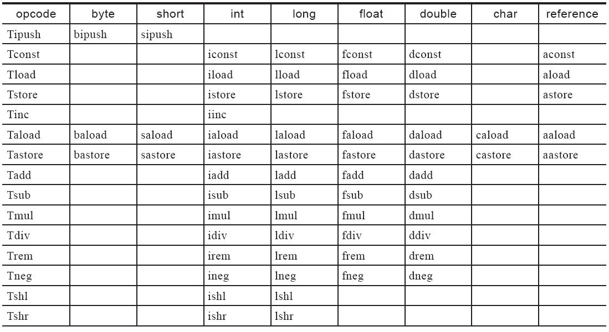


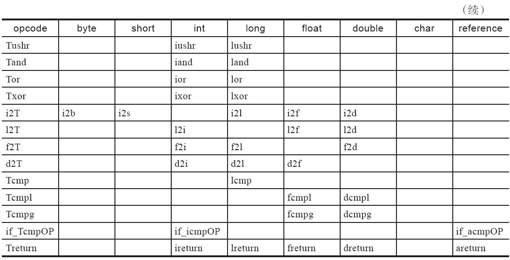

### 加载和存储指令

- 加载和存储指令用于将数据在栈帧中的**局部变量表**和**操作数栈**之间来回传输；


- load
  - 将一个局部变量加载到操作栈;
  - `iload、iload_<n>、lload、lload_<n>、fload、fload_<n>、dload、dload_<n>、aload、aload_<n>`

- store
  - 将一个数值从操作数栈存储到局部变量表：
  - `istore、istore_<n>、lstore、lstore_<n>、fstore、fstore_<n>、dstore、dstore_<n>、astore、astore_<n>`
  - istore_2，表示将变量存储到第二个局部变量槽。

- 加载常量
  - 将一个常量加载到操作数栈：
  - bipush、sipush、ldc、ldc_w、ldc2_w、aconst_null、iconst_m1、iconst_<i>、lconst_<l>、fconst_<f>、dconst_<d>
- 扩充局部变量表的访问索引的指令：wide


- 有一部分是以尖括号结尾的（例如iload_<n>），这些指令助记符实际上代表了一组指令（例如iload_<n>，它代表了iload_0、iload_1、iload_2和iload_3这几条指令）。
- 这几组指令都是某个带有一个操作数的通用指令（例如iload）的特殊形式，对于这几组特殊指令，它们省略掉了显式的操作数，不需要进行取操作数的动作，因为实际上操作数就隐含在指令中。除了这点不同以外，它们的语义与原生的通用指令是完全一致的（例如iload_0的语义与操作数为0时的iload指令语义完全一致）。这种指令表示方法，在本书和《Java虚拟机规范》中都是通用的。


### 操作数栈管理指令

- `pop、pop2`
  - 将操作数栈的栈顶一个或两个元素出栈：


- `dup、dup2、`
- `dup_x1、dup2_x1、`
- `dup_x2、dup2_x2`
  - 复制栈顶一个或两个数值并将复制值或双份的复制值重新压入栈顶：	


- `swap`
  - 将栈最顶端的两个数值互换：swap

### 运算指令

- 算术指令用于对两个操作数栈上的值进行某种特定运算，并把结果重新存入到操作栈顶。
- 大体上运算指令可以分为两种：
  - 1、对整型数据进行运算的指令
  - 2、对浮点型数据进行运算的指令。
- 整数与浮点数的算术指令在溢出和被零除的时候也有各自不同的行为表现。无论是哪种算术指令，均是使用Java虚拟机的算术类型来进行计算的，换句话说是不存在直接支持byte、short、char和boolean类型的算术指令，对于上述几种数据的运算，应使用操作int类型的指令代替。


- 所有的算术指令包括：
  - 1、加法指令：iadd、ladd、fadd、dadd
  - 2、减法指令：isub、lsub、fsub、dsub
  - 3、乘法指令：imul、lmul、fmul、dmul
  - 4、除法指令：idiv、ldiv、fdiv、ddiv
  - 5、求余指令：irem、lrem、frem、drem
  - 6、取反指令：ineg、lneg、fneg、dneg
  - 7、位移指令：ishl、ishr、iushr、lshl、lshr、lushr
  - 8、按位或指令：ior、lor
  - 9、按位与指令：iand、land
  - 10、按位异或指令：ixor、lxor
  - 11、局部变量自增指令：iinc
  - 12、比较指令：dcmpg、dcmpl、fcmpg、fcmpl、lcmp


### 同步指令

```java
void onlyMe(Foo f) {
    synchronized(f) {
        doSomething();
    }
}
```


```bash
Method void onlyMe(Foo)
0 aload_1                         // 将对象f入栈
1 dup                        　　 // 复制栈顶元素（即f的引用）
2 astore_2                        // 将栈顶元素存储到局部变量表变量槽 2中
3 monitorenter                    // 以栈定元素（即f）作为锁，开始同步
4 aload_0                         // 将局部变量槽 0（即this指针）的元素入栈
5 invokevirtual #5                // 调用doSomething()方法
8 aload_2                         // 将局部变量Slow 2的元素（即f）入栈
9 monitorexit                     // 退出同步
10 goto 18                        // 方法正常结束，跳转到18返回
13 astore_3                       // 从这步开始是异常路径，见下面异常表的Taget 13
14 aload_2                        // 将局部变量Slow 2的元素（即f）入栈
15 monitorexit                    // 退出同步
16 aload_3                        // 将局部变量Slow 3的元素（即异常对象）入栈
17 athrow                         // 把异常对象重新抛出给onlyMe()方法的调用者
18 return                         // 方法正常返回

Exception table:
FromTo Target Type
   4    10     13 any
  13    16     13 any
```


- 编译器必须确保无论方法通过何种方式完成，方法中调用过的每条`monitorenter`指令都必须有其对应的`monitorexit`指令，而无论这个方法是正常结束还是异常结束。

- 为了保证在方法异常完成时monitorenter和monitorexit指令依然可以正确配对执行，编译器会自动产生一个异常处理程序，这个异常处理程序声明可处理所有的异常，它的目的就是用来执行monitorexit指令。


# 字节码执行


## 解释器执行模型

- PC寄存器
- 操作码
- 操作数

```java
do {
    自动计算PC寄存器的值加1;
    根据PC寄存器指示的位置，从字节码流中取出操作码;
    if (字节码存在操作数) 
      从字节码流中取出操作数;
    执行操作码所定义的操作;
} while (字节码流长度 > 0);
```

## 栈帧

- Java虚拟机以方法作为最基本的执行单元；
- “栈帧”（Stack Frame）则是用于支持虚拟机进行方法调用和方法执行背后的数据结构，它也是虚拟机运行时数据区中的虚拟机栈（Virtual Machine Stack）的栈元素。
- 栈帧存储了方法的<font color=red>`局部变量表`、`操作数栈`、`动态连接`和`方法返回地址`</font>等信息;
  - 能从Class文件格式的方法表中找到以上大多数概念的静态对照物。
  - 每一个方法从调用开始至执行结束的过程，都对应着一个栈帧在虚拟机栈里面从入栈到出栈的过程。

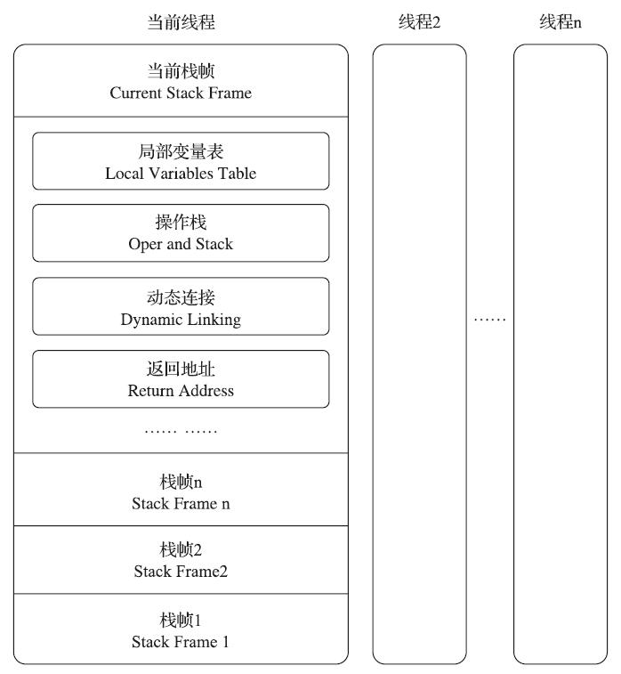


### 方法调用

- 下一条指令入栈；
- 保存栈基址；
- 更新栈基址；
- 更新PC计数器。

### 方法返回

- 恢复栈基址；
- 恢复PC计数器。

### 对比C语言

<font color=red> java 相对于C语言，多了局部变量表，把局部变量从栈中独立出来单独存放。</font>


[《Linux C语言编程一站式学习》p297](https://www.bookstack.cn/read/linux-c/db543e83a885d9cb.md)


- 在执行程序时，操作系统为进程分配一块栈空间来保存函数栈帧
- `esp`寄存器总是指向栈顶
- `ebp`寄存器指向当前栈基址，保存上级的基址。
- `eip`寄存器执行当前执行的code
- 在x86平台上这个栈是**从高地址向低地址**增长的
- 每次调用一个函数都要分配一个栈帧来保存参数和局部变量;


- 1、先将methodA 方法的参数入栈


- 2、通过Call指令调用methodA 
  - 保存`PC+1`
    - 方法的下一条指令入栈，所以`esp`向低地址生长，所以`esp = esp -4`
    - 修改`eip`寄存器，跳转到methodA的第一次code指令。


- 3、methodA 的初始化

  - 保存ebp

    - `push %ebp`指令把`ebp`寄存器的值压栈。【保存上一个方法的栈基址】同时把`esp`的值减4。
    - `mov    %esp,%ebp` 【设置新的栈基址】
    - <font color=red>函数的参数和局部变量都是通过`ebp`的值加上一个偏移量来访问</font>
    - <font color=red>`可以通过`ebp`的值找到上级函数的ebp`</font>
    - <font color=red>`可以通过`ebp`的值找到函数执行完毕的返回位置`</font>

  - `sub    $0x8,%esp`【分配栈空间 】

    

```txt

${ebp} 			指向 上级栈的ebp地址；
${ebp + 4}	指向 返回地址，即调用方法时的下一条指定
${ebp + 8}	指向 当前方法的第一个参数（如果有的话）
${ebp - 4}	指向 当前方法的第一个局部变量（如果有的话）

```

- 4、函数收尾，leave指令
  - 4.1、把ebp的值给esp；
  - 4.2、恢复`ebp`, esp = esp +4;


- 5、return指令
  - 恢复PC计数器
    - 恢复`eip`,修改了程序计数器`eip`


注意函数调用和返回过程中的这些规则：

1. 参数压栈传递，并且是从右向左依次压栈。
2. `ebp`总是指向当前栈帧的栈底。
3. 返回值通过`eax`寄存器传递。


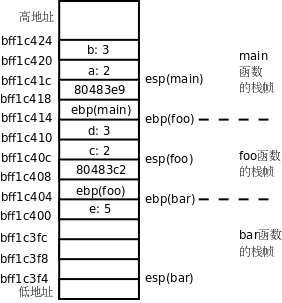


```c
int bar(int c, int d)
{
    int e = c + d;
    return e;
}
 
int foo(int a, int b)
{
    return bar(a, b);
}
 
int main(void)
{
    foo(2, 3);
    return 0;
}
```


### 问题


- C 语言中，为什么栈向下增长？

```txt
“这个问题与虚拟地址空间的分配规则有关，每一个可执行C程序，从低地址到高地址依次是：text，data，bss，堆，栈，环境参数变量；其中堆和栈之间有很大的地址空间空闲着，在需要分配空间的时候，堆向上涨，栈往下涨。”

这样设计可以使得堆和栈能够充分利用空闲的地址空间。
```


## 局部变量表

- 局部变量表的容量以变量槽（Variable Slot）为最小单位；

  

- 一个变量槽可以存放一个32位以内的数据类型

  - Java中占用不超过32位存储空间的数据类型有boolean、byte、char、short、int、float、reference或returnAddress类型；
  - 第8种returnAddress类型目前已经很少见了，它是为字节码指令jsr、jsr_w和ret服务的，指向了一条字节码指令的地址，某些很古老的Java虚拟机曾经使用这几条指令来实现异常处理时的跳转，但现在也已经全部改为采用异常表来代替了。
  - Java语言中明确的64位的数据类型只有long和double两种。
    - 这里把long和double数据类型分割存储的做法与“long和double的非原子性协定”中允许把一次long和double数据类型读写分割为两次32位读写的做法有些类似。

  

- 允许重用变量槽


- 局部变量不初始话，编译不通过。

````java
public static void main(String[] args) {
    int a;
    System.out.println(a);
}
````

## 操作数栈

- 操作数栈（Operand Stack）也常被称为操作栈，它是一个后入先出（Last In First Out，LIFO）栈。
- 同局部变量表一样，操作数栈的最大深度也在编译的时候被写入到**Code属性**的**max_stacks**数据项之中。
- 操作数栈的每一个元素都可以是包括long和double在内的任意Java数据类型。
- 32位数据类型所占的栈容量为1，64位数据类型所占的栈容量为2。
- Javac编译器的数据流分析工作保证了在方法执行的任何时候，操作数栈的深度都不会超过在max_stacks数据项中设定的最大值。


### 方法执行时

- 当一个方法刚刚开始执行的时候，这个方法的操作数栈是空的；
- 在方法的执行过程中，会有各种字节码指令往操作数栈中写入和提取内容，也就是出栈和入栈操作。
  - 譬如在做算术运算的时候是通过将运算涉及的操作数栈压入栈顶后调用运算指令来进行的；
  - 又譬如在调用其他方法的时候是通过操作数栈来进行方法参数的传递。
  - 举个例子例如整数加法的字节码指令iadd，
    - 这条指令在运行的时候要求操作数栈中最接近栈顶的两个元素已经存入了两个int型的数值，
    - 当执行这个指令时，会把这两个int值出栈并相加，然后将相加的结果重新入栈。

### JVM优化：共享数据


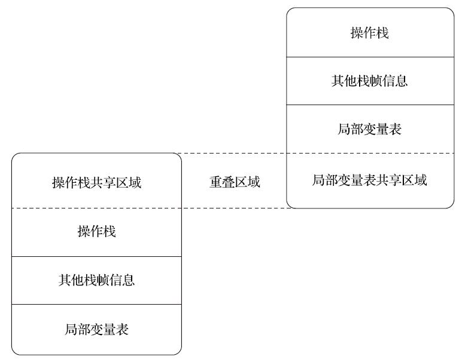

## 动态链接

- 每个栈帧都包含一个指向运行时常量池中该栈帧所属方法的引用；
- 持有这个引用是为了支持方法调用过程中的**动态连接**（Dynamic Linking）。


- 我们知道Class文件的常量池中存有大量的符号引用，字节码中的方法调用指令就以常量池里指向方法的符号引用作为参数。
  - 这些符号引用一部分会在**类加载阶段**或者**第一次使用的时候**就被转化为**直接引用**，这种转化被称为**静态解析**。
  - 另外一部分将在每一次运行期间都转化为直接引用，这部分就称为**动态连接**。


## 方法返回地址

- 两种返回方式
  - 正常调用完成
    - 有返回值的指令
    - 无返回值的指导
  - 异常调用完成
    - 本方法的异常表
    - athrow字节码


- 一般来说，方法正常退出时
  - 主调方法的PC计数器的值就可以作为返回地址，栈帧中很可能会保存这个计数器值。
  - 而方法异常退出时，返回地址是要通过异常处理器表来确定的，栈帧中就一般不会保存这部分信息。


- 方法退出的过程实际上等同于把当前栈帧出栈，因此退出时可能执行的操作有：
  - 恢复上层方法的局部变量表和操作数栈，把返回值（如果有的话）压入调用者栈帧的操作数栈中，
  - 调整PC计数器的值以指向方法调用指令后面的一条指令等。
  - 【具体依赖于Java虚拟机实现】


## 解析

- 解析
  - 符合引用转化为内存的直接引用。


- 静态方法 和 私有方法
  - 编译可知，运行期不可变。
  - 适合在类加载阶段解析。


- **解析调用**一定是个静态的过程，在编译期间就完全确定，在类加载的解析阶段就会把涉及的符号引用全部转变为明确的直接引用，不必延迟到运行期再去完成。
- 而另一种主要的方法调用形式：**分派（Dispatch）调用**则要复杂许多，它可能是静态的也可能是动态的，按照分派依据的宗量数可分为单分派和多分派


- 1、“虚方法”（Virtual Method）
  - 静态方法、私有方法、实例构造器、父类方法，final修饰的方法；
  - 类加载的时候就可以把符号引用解析为该方法的直接引用。

```txt
只要能被invokestatic和invokespecial指令调用的方法，都可以在解析阶段中确定唯一的调用版本，Java语言里符合这个条件的方法共有静态方法、私有方法、实例构造器、父类方法4种，再加上被final修饰的方法（尽管它使用invokevirtual指令调用）；

这5种方法调用会在类加载的时候就可以把符号引用解析为该方法的直接引用。
这些方法统称为“非虚方法”（Non-Virtual Method）。

与之相反，其他方法就被称为“虚方法”（Virtual Method）。
```


- 2、“非虚方法”（Non-Virtual Method）

## 分派

- 解析调用一定是个静态的过程，在编译期间就完全确定，在类加载的解析阶段就会把涉及的符号引用全部转变为明确的直接引用，不必延迟到运行期再去完成。

- 而另一种主要的方法调用形式：分派（Dispatch）调用则要复杂许多，它可能是静态的也可能是动态的，按照分派依据的宗量数可分为单分派和多分派

- 这两类分派方式两两组合就构成了静态单分派、静态多分派、动态单分派、动态多分派4种分派组合情况，下面我们来看看虚拟机中的方法分派是如何进行的。


- 多态的体现
  - 重载
  - 重写


- 静态类型和实际类型

```java
// 实际类型变化
Human human = (new Random()).nextBoolean() ? new Man() : new Woman();

// 静态类型变化
sr.sayHello((Man) human)
sr.sayHello((Woman) human)
```


### 静态分配-重载


- 所有依赖**静态类型**来决定方法执行版本的分派动作，都称为静态分派。
  - 静态分派的最典型应用表现就是方法重载。
  - 静态分派发生在编译阶段，因此确定静态分派的动作实际上不是由虚拟机来执行的，这点也是为何一些资料选择把它归入“解析”而不是“分派”的原因。


- 重载
- Overload


- 重载方法优先级

```java
package org.fenixsoft.polymorphic;

public class Overload {

    public static void sayHello(Object arg) {
        System.out.println("hello Object");
    }

    public static void sayHello(int arg) {
        System.out.println("hello int");
    }

    public static void sayHello(long arg) {
        System.out.println("hello long");
    }

    public static void sayHello(Character arg) {
        System.out.println("hello Character");
    }

    public static void sayHello(char arg) {
        System.out.println("hello char");
    }

    public static void sayHello(char... arg) {
        System.out.println("hello char ...");
    }

    public static void sayHello(Serializable arg) {
        System.out.println("hello Serializable");
    }

    public static void main(String[] args) {
        sayHello('a');
    }
}
```

- char>int>long>float>double

```txt
这时发生了两次自动类型转换，'a'转型为整数97之后，进一步转型为长整数97L，匹配了参数类型为long的重载。

笔者在代码中没有写其他的类型如float、double等的重载，不过实际上自动转型还能继续发生多次，按照char>int>long>float>double的顺序转型进行匹配，但不会匹配到byte和short类型的重载，因为char到byte或short的转型是不安全的。我们继续注释掉sayHello(long arg)方法，那输出会变为：
```


### 动态分派-重写

- 重写

- Override 

- 多态

- Java虚拟机是如何根据实际类型来分派方法执行版本的呢？我们使用javap命令输出这段代码的字节码，尝试从中寻找答案。

```java
package org.fenixsoft.polymorphic;

/**
 * 方法动态分派演示
 * @author zzm
 */
public class DynamicDispatch {

    static abstract class Human {
        protected abstract void sayHello();
    }

    static class Man extends Human {
        @Override
        protected void sayHello() {
            System.out.println("man say hello");
        }
    }

    static class Woman extends Human {
        @Override
        protected void sayHello() {
            System.out.println("woman say hello");
        }
    }

    public static void main(String[] args) {
        Human man = new Man();
        Human woman = new Woman();
        man.sayHello();
        woman.sayHello();
        man = new Woman();
        man.sayHello();
    }
}
```

- 输出结果

```bash
man say hello
woman say hello
woman say hello
```


- Javap 编译
  - 16行，20行，`aload`指令，把刚刚创建的对象引用压入栈顶；
    - 这两个对象是执行方法的**接收者**。
  - 17行，21行，`invokevirtual`是方法调用指令。

```bash
public static void main(java.lang.String[]);
    Code:
        Stack=2, Locals=3, Args_size=1
         0:   new     #16; //class org/fenixsoft/polymorphic/DynamicDispatch$Man
         3:   dup
         4:   invokespecial   #18; //Method org/fenixsoft/polymorphic/Dynamic Dispatch$Man."<init>":()V
         7:   astore_1
         8:   new     #19; //class org/fenixsoft/polymorphic/DynamicDispatch$Woman
        11:  dup
        12:  invokespecial   
        #21; //Method org/fenixsoft/polymorphic/DynamicDispatch$Woman."<init>":()V
        15:  astore_2
        16:  aload_1
        17:  invokevirtual   #22; //Method org/fenixsoft/polymorphic/Dynamic Dispatch$Human.sayHello:()V
        20:  aload_2
        21:  invokevirtual   #22; //Method org/fenixsoft/polymorphic/Dynamic Dispatch$Human.sayHello:()V
        24:  new     #19; //class org/fenixsoft/polymorphic/DynamicDispatch$Woman
        27:  dup
        28:  invokespecial   
        #21; //Method org/fenixsoft/polymorphic/DynamicDispatch$Woman."<init>":()V
        31:  astore_1
        32:  aload_1
        33:  invokevirtual   #22; //Method org/fenixsoft/polymorphic/Dynamic Dispatch$Human.sayHello:()V
        36:  return
```

- invokevirtual指令的运行时解析过程
  - 1、找到操作数栈顶的第一个元素所指向的对象的实际类型，记作C。
  - 2、如果在类型C中找到与常量中的描述符和简单名称都相符的方法，则进行访问权限校验，如果通过则返回这个方法的直接引用，查找过程结束；不通过则返回java.lang.IllegalAccessError异常。
  - 3、否则，按照继承关系从下往上依次对C的各个父类进行第二步的搜索和验证过程。
  - 4/如果始终没有找到合适的方法，则抛出java.lang.AbstractMethodError异常。


- 那看来解决问题的关键还必须从invokevirtual指令本身入手，要弄清楚它是如何确定调用方法版本、如何实现多态查找来着手分析才行。根据《Java虚拟机规范》，


```txt
正是因为invokevirtual指令执行的第一步就是在运行期确定接收者的实际类型，所以两次调用中的invokevirtual指令并不是把常量池中方法的符号引用解析到直接引用上就结束了，还会根据方法接收者的实际类型来选择方法版本，这个过程就是Java语言中方法重写的本质。

我们把这种在运行期根据实际类型确定方法执行版本的分派过程称为动态分派。
```


### 多态

- 多态对方法有效
- 多字段无效

```java
package org.fenixsoft.polymorphic;

/**
 * 字段不参与多态
 * @author zzm
 */
public class FieldHasNoPolymorphic {

    static class Father {
        public int money = 1;

        public Father() {
            money = 2;
            showMeTheMoney();
        }

        public void showMeTheMoney() {
            System.out.println("I am Father, i have $" + money);
        }
    }

    static class Son extends Father {
        public int money = 3;

        public Son() {
            money = 4;
            showMeTheMoney();
        }

        public void showMeTheMoney() {
            System.out.println("I am Son,  i have $" + money);
        }
    }

    public static void main(String[] args) {
      
        Father gay = new Son();
      	/*	
      			访问到了父类的局部变量
      	*/
        System.out.println("This gay has $" + gay.money);
    }
}
```

- 输出结果

```bash
I am Son, i have $0
I am Son, i have $4
This gay has $2
```


```txt
输出两句都是“I am Son”，这是因为Son类在创建的时候，首先隐式调用了Father的构造函数，而Father构造函数中对showMeTheMoney()的调用是一次虚方法调用，实际执行的版本是Son::showMeTheMoney()方法，所以输出的是“I am Son”。

而这时候虽然父类的money字段已经被初始化成2了，但Son::showMeTheMoney()方法中访问的却是子类的money字段，这时候结果自然还是0，因为它要到子类的构造函数执行时才会被初始化。

main()的最后一句通过静态类型访问到了父类中的money，输出了2。
```


# 异常


在《Java虚拟机规范》中，对这个内存区域规定了两类异常状况：如果线程请求的栈深度大于虚拟机所允许的深度，将抛出StackOverflowError异常；如果Java虚拟机栈容量可以动态扩展，当栈扩展时无法申请到足够的内存会抛出OutOfMemoryError异常。


HotSpot虚拟机的栈容量是不可以动态扩展的，以前的Classic虚拟机倒是可以。所以在HotSpot虚拟机上是不会由于虚拟机栈无法扩展而导致OutOfMemoryError异常——只要线程申请栈空间成功了就不会有OOM，但是如果申请时就失败，仍然是会出现OOM异常的

# 实现远程执行功能

## 四种方式

- 1）可以使用`BTrace`这类`JVMTI`工具去动态修改程序中某一部分的运行代码，这部分在第4章有简要的介绍，类似的`JVMTI`工具还有阿里巴巴的`Arthas`

- 2）使用JDK 6之后提供了`Compiler API`，可以`动态地编译Java`程序，这样虽然达不到动态语言的灵活度，但让服务器执行临时代码的需求是可以得到解决的。

- 3）也可以通过“曲线救国”的方式来做到，譬如写一个JSP文件上传到服务器，然后在浏览器中运行它，或者在服务端程序中加入一个BeanShell Script、JavaScript等的执行引擎（如Mozilla Rhino)

- 4）在应用程序中`内置动态执行`的功能。


 网站：https://github.com/btraceio/btrace。

 网站：https://github.com/alibaba/arthas。

 网站：http://www.mozilla.org/rhino/，Rhino已被收编入JDK 6中。

## 在服务端执行临时代码

### 目的

- 首先，在实现“在服务端执行临时代码”这个需求之前，先来明确一下本次实战的具体目标，我们希望最终的产品是这样的：
  - 不依赖某个JDK版本才加入的特性（包括JVMTI），能在目前还被普遍使用的JDK中部署，只要是使用JDK 1.4以上的JDK都可以运行。
  - 不侵入原有程序，即无须改动原程序的任何代码。也不会对原有程序的运行带来任何影响。
  - 考虑到BeanShell Script或JavaScript等脚本与Java对象交互起来不太方便，“临时代码”应该直接支持Java语言。
  - “临时代码”应当具备足够的自由度，不需要依赖特定的类或实现特定的接口。
    - 这里写的是“不需要”而不是“不可以”，当“临时代码”需要引用其他类库时也没有限制，只要服务端程序能使用的类型和接口，临时代码都应当能直接引用。
  - “临时代码”的执行结果能返回到客户端，执行结果可以包括程序中输出的信息及抛出的异常等。

### 思路

- 【1】<font color=red>**如何编译提交到服务器的Java代码？**</font>
- 方案一：在服务器上编译

```txt
在JDK 6以后可以使用Compiler API，在JDK 6以前可以使用tools.jar包（在JAVA_HOME/lib目录下）中的com.sun.tools.Javac.Main类来编译Java文件，它们其实和直接使用Javac命令来编译是一样的。

这种思路的缺点是引入了额外的依赖，而且把程序绑死在特定的JDK上了，要部署到其他公司的JDK中还得把tools.jar带上（虽然JRockit和J9虚拟机也有这个JAR包，但它总不是标准所规定必须存在的）。
```

- 方案二：**直接在客户端编译好，把字节码而不是Java代码传到服务端**


- 【2】<font color=red>**如何执行编译之后的Java代码？**</font>
  - 要执行编译后的Java代码，让类加载器加载这个类生成一个Class对象，然后反射调用一下某个方法就可以了（因为不实现任何接口，我们可以借用一下Java中约定俗成的“main()”方法）。
  - 其它问题：
    - 一段程序往往不是编写、运行一次就能达到效果，同一个类可能要被反复地修改、提交、执行。
    - 另外，提交上去的类要能访问到服务端的其他类库才行。
    - 还有就是既然提交的是临时代码，那提交的Java类在执行完后就应当能被卸载和回收掉。


- 【3】<font color=red>**如何收集Java代码的执行结果？**</font>
  - 我们想把程序往标准输出（System.out）和标准错误输出（System.err）中打印的信息收集起来。

```txt
但标准输出设备是整个虚拟机进程全局共享的资源，如果使用System.setOut()/System.setErr()方法把输出流重定向到自己定义的PrintStream对象上固然可以收集到输出信息，但也会对原有程序产生影响：会把其他线程向标准输出中打印的信息也收集了。

虽然这些并不是不能解决的问题，不过为了达到完全不影响原程序的目的，我们可以采用另外一种办法：直接在执行的类中把对System.out的符号引用替换为我们准备的PrintStream的符号引用，依赖前面学习到的知识，做到这一点并不困难。
```

### 实现

#### HotSwapClassLoader

- 类加载

- HotSwapClassLoader所做的事情仅仅是公开父类（即java.lang.ClassLoader）中的protected方法defineClass();
- 我们将会使用这个方法把提交执行的Java类的byte[]数组转变为Class对象。
- HotSwapClassLoader中并没有重写loadClass()或findClass()方法；
  - 因此如果不算外部手工调用loadByte()方法的话；
  - 这个类加载器的类查找范围与它的父类加载器是完全一致的，在被虚拟机调用时，它会按照双亲委派模型交给父类加载。
- 构造函数中指定为加载HotSwapClassLoader类的类加载器作为父类加载器;
  - <font color=red>这一步是实现提交的执行代码可以访问服务端引用类库的关键</font>。

```java
/**
 * 为了多次载入执行类而加入的加载器
 * 把defineClass方法开放出来，只有外部显式调用的时候才会使用到loadByte方法
 *
 * 由虚拟机调用时，仍然按照原有的双亲委派规则使用loadClass方法进行类加载
 *
 * @author zzm
 */
public class HotSwapClassLoader extends ClassLoader {

    public HotSwapClassLoader() {
        super(HotSwapClassLoader.class.getClassLoader());
    }

    public Class loadByte(byte[] classByte) {
        return defineClass(null, classByte, 0, classByte.length);
    }

}
```


#### ClassModifier


```java
/**
 * 修改Class文件，暂时只提供修改常量池常量的功能
 * @author zzm
 */
public class ClassModifier {

    /**
     * Class文件中常量池的起始偏移
     */
    private static final int CONSTANT_POOL_COUNT_INDEX = 8;

    /**
     * CONSTANT_Utf8_info常量的tag标志
     */
    private static final int CONSTANT_Utf8_info = 1;

    /**
     * 常量池中11种常量所占的长度，CONSTANT_Utf8_info型常量除外，因为它不是定长的
     */
    private static final int[] CONSTANT_ITEM_LENGTH = { -1, -1, -1, 5, 5, 9, 9, 3, 3, 5, 5, 5, 5 };

    private static final int u1 = 1;
    private static final int u2 = 2;

    private byte[] classByte;

    public ClassModifier(byte[] classByte) {
        this.classByte = classByte;
    }

    /**
     * 修改常量池中CONSTANT_Utf8_info常量的内容
     * @param oldStr 修改前的字符串
     * @param newStr 修改后的字符串
     * @return 修改结果
     */
    public byte[] modifyUTF8Constant(String oldStr, String newStr) {
        int cpc = getConstantPoolCount();
        int offset = CONSTANT_POOL_COUNT_INDEX + u2;
        for (int i = 0; i < cpc; i++) {
            int tag = ByteUtils.bytes2Int(classByte, offset, u1);
            if (tag == CONSTANT_Utf8_info) {
                int len = ByteUtils.bytes2Int(classByte, offset + u1, u2);
                offset += (u1 + u2);
                String str = ByteUtils.bytes2String(classByte, offset, len);
                if (str.equalsIgnoreCase(oldStr)) {
                    byte[] strBytes = ByteUtils.string2Bytes(newStr);
                    byte[] strLen = ByteUtils.int2Bytes(newStr.length(), u2);
                    classByte = ByteUtils.bytesReplace(classByte, offset - u2, u2, strLen);
                    classByte = ByteUtils.bytesReplace(classByte, offset, len, strBytes);
                    return classByte;
                } else {
                    offset += len;
                }
            } else {
                offset += CONSTANT_ITEM_LENGTH[tag];
            }
        }
        return classByte;
    }

    /**
     * 获取常量池中常量的数量
     * @return 常量池数量
     */
    public int getConstantPoolCount() {
        return ByteUtils.bytes2Int(classByte, CONSTANT_POOL_COUNT_INDEX, u2);
    }
}
```


#### ByteUtils

```java
/**
 * Bytes数组处理工具
 *		高位放在低地址 【大端序】
 * @author
 */
public class ByteUtils {

    public static int bytes2Int(byte[] b, int start, int len) {
        int sum = 0;
        int end = start + len;
        for (int i = start; i < end; i++) {
            int n = ((int) b[i]) & 0xff;
            n <<= (--len) * 8;
            sum = n + sum;
        }
        return sum;
    }

    public static byte[] int2Bytes(int value, int len) {
        byte[] b = new byte[len];
        for (int i = 0; i < len; i++) {
            b[len - i - 1] = (byte) ((value >> 8 * i) & 0xff);
        }
        return b;
    }

    public static String bytes2String(byte[] b, int start, int len) {
        return new String(b, start, len);
    }

    public static byte[] string2Bytes(String str) {
        return str.getBytes();
    }

    public static byte[] bytesReplace(byte[] originalBytes, int offset, int len, byte[] replaceBytes) {
        byte[] newBytes = new byte[originalBytes.length + (replaceBytes.length - len)];
        System.arraycopy(originalBytes, 0, newBytes, 0, offset);
        System.arraycopy(replaceBytes, 0, newBytes, offset, replaceBytes.length);
        System.arraycopy(originalBytes, offset + len, newBytes, offset + replaceBytes.length, originalBytes.length - offset - len);
        return newBytes;
    }
}
```


#### HackSystem

- HackSystem 替代了 java.lang.System

```java
/**
 * 为Javaclass劫持java.lang.System提供支持
 * 除了out和err外，其余的都直接转发给System处理
 *
 * @author zzm
 */
public class HackSystem {

    public final static InputStream in = System.in;

    private static ByteArrayOutputStream buffer = new ByteArrayOutputStream();

    public final static PrintStream out = new PrintStream(buffer);

    public final static PrintStream err = out;

    public static String getBufferString() {
        return buffer.toString();
    }

    public static void clearBuffer() {
        buffer.reset();
    }

    public static void setSecurityManager(final SecurityManager s) {
        System.setSecurityManager(s);
    }

    public static SecurityManager getSecurityManager() {
        return System.getSecurityManager();
    }

    public static long currentTimeMillis() {
        return System.currentTimeMillis();
    }

    public static void arraycopy(Object src, int srcPos, Object dest, int destPos, int length) {
        System.arraycopy(src, srcPos, dest, destPos, length);
    }

    public static int identityHashCode(Object x) {
        return System.identityHashCode(x);
    }

    // 下面所有的方法都与java.lang.System的名称一样
    // 实现都是字节转调System的对应方法
    // 因版面原因，省略了其他方法
}
```


#### JavaclassExecuter

- 【执行引擎】

- 类JavaclassExecuter，它是提供给外部调用的入口，调用前面几个支持类组装逻辑，完成类加载工作。
- JavaclassExecuter只有一个execute()方法;
  - 用输入的符合Class文件格式的byte[]数组替换掉java.lang.System的符号引用后;
  - 使用HotSwapClassLoader加载生成一个Class对象，由于每次执行execute()方法都会生成一个新的类加载器实例，因此同一个类<font color=red>**可以实现重复加载**</font>。
  - 然后反射调用这个Class对象的main()方法，如果期间出现任何异常，将异常信息打印到HackSystem.out中;
  - 最后把缓冲区中的信息作为方法的结果来返回。

```java
/**
 * Javaclass执行工具
 *
 * @author zzm
 */
public class JavaclassExecuter {

    /**
     * 执行外部传过来的代表一个Java类的Byte数组<br>
     * 将输入类的byte数组中代表java.lang.System的CONSTANT_Utf8_info常量修改为劫持后的HackSystem类
     * 执行方法为该类的static main(String[] args)方法，输出结果为该类向System.out/err输出的信息
     * @param classByte 代表一个Java类的Byte数组
     * @return 执行结果
     */
    public static String execute(byte[] classByte) {
        HackSystem.clearBuffer();
      
        ClassModifier cm = new ClassModifier(classByte);
        byte[] modiBytes = cm.modifyUTF8Constant("java/lang/System", "org/fenixsoft/classloading/execute/HackSystem");
      
        HotSwapClassLoader loader = new HotSwapClassLoader();
      
        Class clazz = loader.loadByte(modiBytes);
      
        try {
            Method method = clazz.getMethod("main", new Class[] { String[].class });
            method.invoke(null, new String[] { null });
          
        } catch (Throwable e) {
            e.printStackTrace(HackSystem.out);
        }
        return HackSystem.getBufferString();
    }
}
```

### 验证

- 只是测试的话，任意写一个Java类，内容无所谓，只要向System.out输出信息即可，取名为TestClass，放到服务器C盘的根目录中。
  - 生成中可以开发上传class文件的功能
- 然后建立一个JSP文件，就可以在浏览器中看到这个类的运行结果了。

```jsp
<%@ page import="java.lang.*" %>
<%@ page import="java.io.*" %>
<%@ page import="org.fenixsoft.classloading.execute.*" %>
<%
    InputStream is = new FileInputStream("c:/TestClass.class");
    byte[] b = new byte[is.available()];
    is.read(b);
    is.close();

    out.println("<textarea style='width:1000;height=800'>");
    out.println(JavaclassExecuter.execute(b));
    out.println("</textarea>");
%>
```


# 参考


- 《深入理解java虚拟机》
- [进程？线程？到底共享了什么私有了什么](https://blog.csdn.net/WangQYoho/article/details/52598859)
- CGLib开源项目：http://cglib.sourceforge.net/
- JDK源代码：https://hg.openjdk.java.net/jdk

- 周志明：https://github.com/fenixsoft
- https://github.com/fenixsoft/jvm_book


