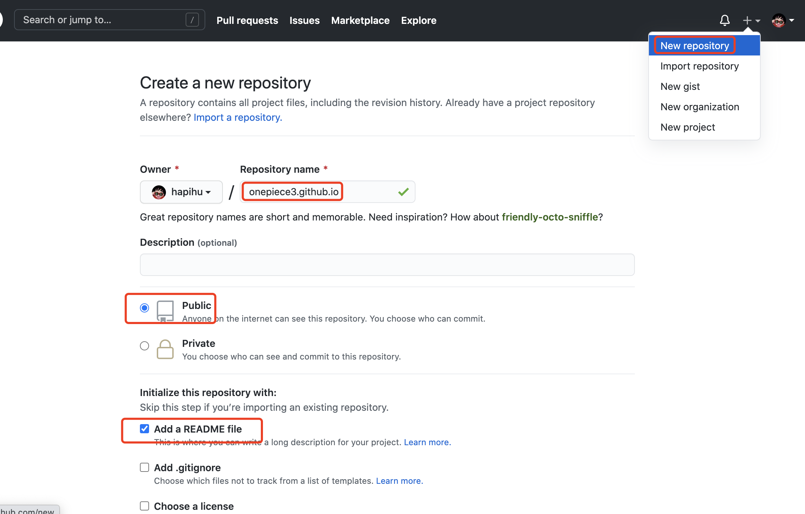
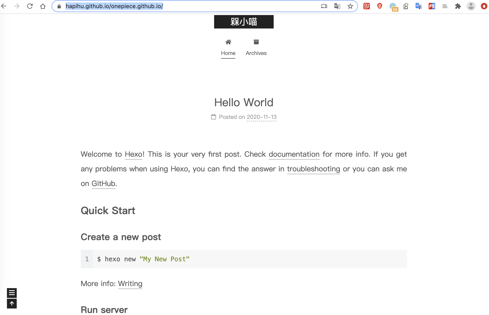
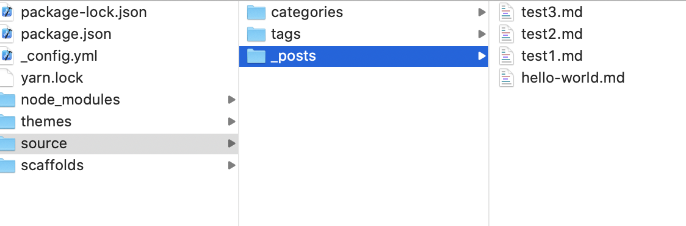
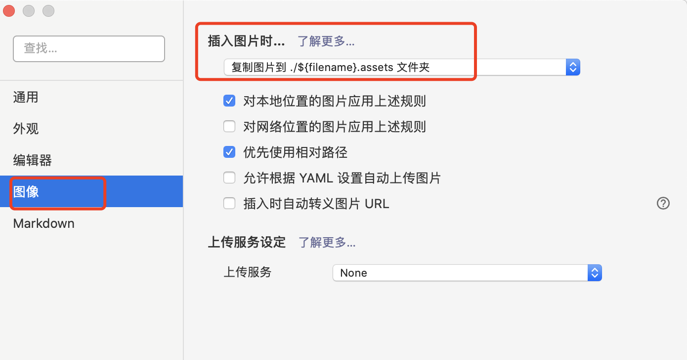
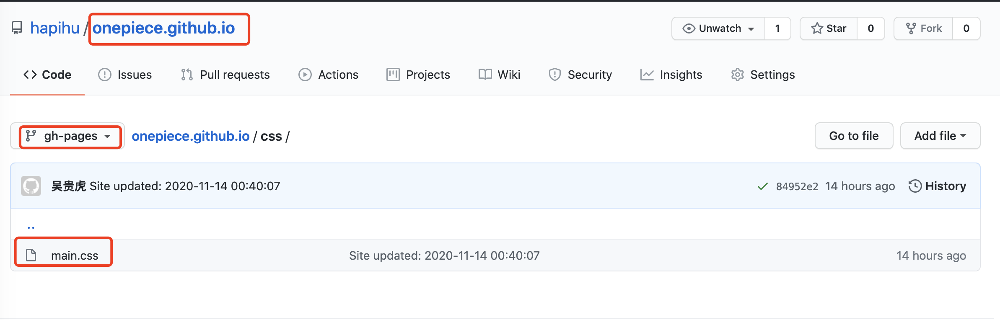
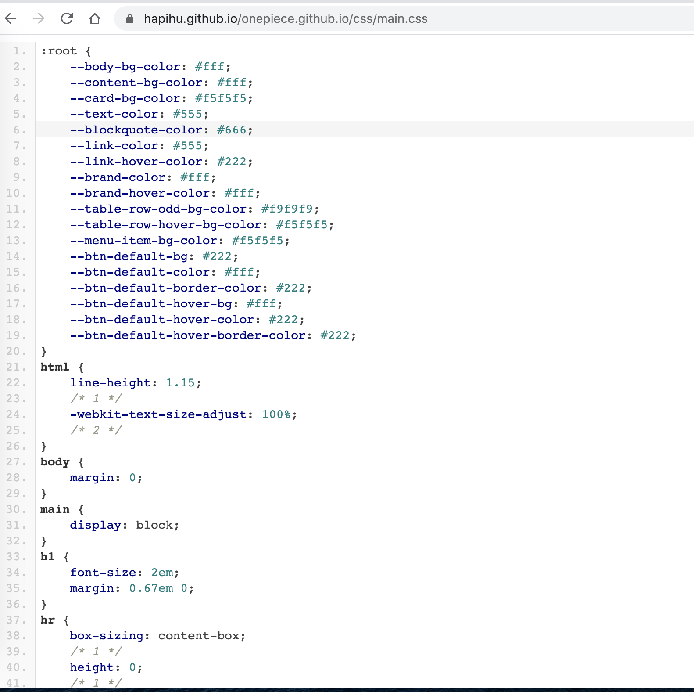

<!--more-->


# GitHub仓库准备

## 有个github账号xxx

## 创建一个xxx.github.io的public仓库

如果您的账户名是hapihu,则需要创建一个hapihu.github.io的public仓库.

- 在Github上创建仓库




# 搭建过程


## 安装Hexo

```bash
# 1、进入工作目录
cd /Users/hapihu/workspace

# 2、安装Hexo
sudo npm i hexo-cli -g

# 3、验证是否安装成功
hexo -v
```

## 搭建Hexo

### 创建目录

```baah
# 1、创建目录
hexo init onepiece.github.io

# 2、进入目录
cd onepiece.github.io

# 3、编译
npm config set registry https://registry.npm.taobao.org
npm install
```

### 生成静态页面

```bash
hexo clean
hexo generate
```

### 本地运行

```shell
hexo s
#  localhost:4000 
```


## 部署到Github

### 安装 hexo-deployer-git

```bash
npm install hexo-deployer-git --save
```

### 网站配置git

在网站的_config.yml中配置deploy

```yml
deploy:
  type: git
  repo: git@github.com:hapihu/onepiece.github.io.git
  branch: gh-pages
```

- branch为分支，哪个分支都行，改为gh-pages后，就会把部署后的web推送到该分支。

  

### 部署

```bash
# d 即deploy
hexo d
```

## 查看效果

- [访问地址](https://hapihu.github.io/onepiece.github.io)




## 基于Github版本控制

- 基于Github类进行版本控制（方便以后协同开发）

```bash
cd /Users/hapihu/workspace/onepiece.github.io
git init
git remote add origin git@github.com:hapihu/onepiece.github.io.git
git push origin master
```

# 使用Hexo

## 发一篇文章

### 命令方式

```bash
hexo new test
```

此时会在source/_posts目录下生成test.md文件，输入些许内容，然后保存.

生成下，看看效果

```bash
hexo clean
hexo g
hexo s
```

访问 localhost:4000 即可

### 直接方式

在 **source/_posts/**下新建一个.md文件也可

## 基本配置

网站的设置大部分都在**_config.yml**文件中，详细配置可以查看官方文档

下面只列出简单常用配置

title -> 网站标题
subtitle -> 网站副标题
description -> 网站描述
author -> 您的名字
language -> 网站使用的语言

>  坑：进行配置时，需要在冒号:后加一个英文空格


## 换一个好看的主题

Hexo 中有很多主题，可以在官网查看。 这里我推荐hexo-theme-next，下面列举更换主题的一般套路：

### 下载主题资源

```bash
git clone https://github.com/iissnan/hexo-theme-next themes/next
```

### 应用下载的主题

在网站配置文件**_config.yml中，配置theme**

theme: next
next是主题名称，具体的可查看主题的文档

### 主题其他配置

可在/theme/{theme}/_config.yml 主题的配置文件下进行主题的配置。

接下来，可以执行万能的调试命令看看效果

```bash
hexo clean
hexo g
hexo s
```


## 添加tag

```bash
hexo new page tags
```
- source/tags/index.md
```txt
title: tags
date: 2020-11-14 17:08:04
type: "tags"
comments: false
```


## 添加目录

```bash
hexo new page categories
```

- source/categories/index.md
```txt
title: tags
date: 2020-11-14 17:08:04
type: "tags"
comments: false
```





## 使用本地图片

效果：默认连接本地的图片。

```shell script
# 开始没加sudo，所以new文章的时候，没有生成对应的文件夹
sudo npm install https://github.com/CodeFalling/hexo-asset-image --save
```

- _config.yml
```yml
post_asset_folder: true
```


- 建议配置typora一起使用（typora针对图片有如下配置）
  - 可以把如下的.assets去掉，就完美匹配hexo的post_asset_folder配置了。




# 遇到问题


## hexo的主题本地有样式，部署到github没样式？

### 原因&&解决方法

- **问题原因：CSS文件找不到。**

- **解决方法**：修改_config.yml文件的如下两个配置：

```yml
url: https://{UserNameID}.github.io
root: /{repositoryID}/
```

- 示例：

```yml
url: https://{hapihu}.github.io
root: /{onepiece.github.io}/
```

> 开始没填写，所以本地测试有问题，github端不显示CSS

- 修改之后重新部署

```bash
hexo clean
hexo g
hexo d
```

- 参考：[Ubuntu下部署Hexo，本地serve预览成功，部署到网站却不能显示主题样式，如何解决？]


### 验证CSS文件找到的测试方法

- 在github上查看CSS文件的路径：

  

- 分支：gh-pages

- 仓库名：onepiece.github.io

- css路径：onepiece.github.io/css/main.css

- 完整的路径
  
  - ``https://hapihu.github.io/onepiece.github.io/css/main.css ``


- 测试方法：在浏览器输入如下地址，如果获取到CSS文件，则说明没有问题：

```TXT
https://hapihu.github.io/onepiece.github.io/css/main.css
```

- 结果如下图所示：




# 参考

- [Hexo 博客搭建指南](https://github.com/limedroid/HexoLearning)
- [hexo的主题本地有样式，部署到github没样式](https://www.zhihu.com/question/29808864)
- [Hexo设置主题以及Next主题个性设置](https://www.jianshu.com/p/b20fc983005f)
- [官网](https://hexo.io/)
- [Next主题配置](https://theme-next.iissnan.com/theme-settings.html#author-sites)
