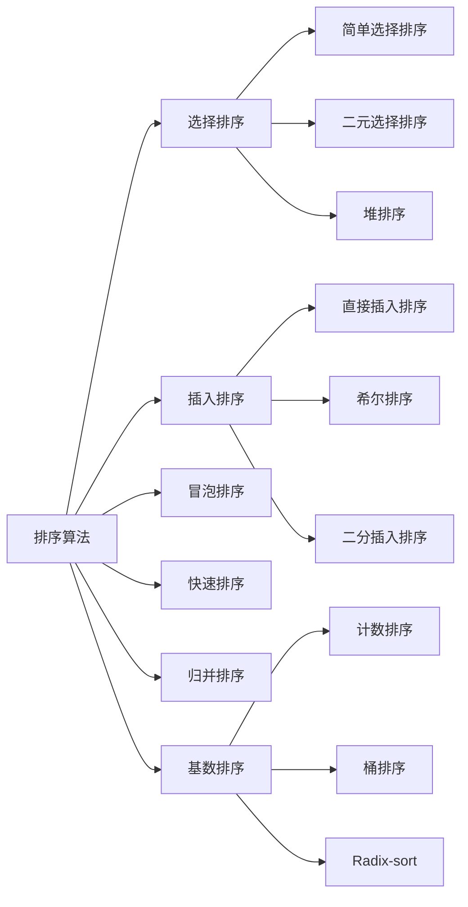
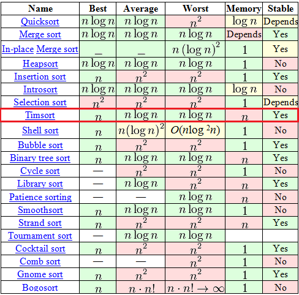

<!--more-->

[TOC]


# 排序算法

## 分类



## 对比



## 对比

- 排序算法可以分为内部排序和外部排序
  - 内部排序是数据记录在内存中进行排序
  - 而外部排序是因排序的数据很大，一次不能容纳全部的排序记录，在排序过程中需要访问外存。
- 常见的内部排序算法有：**插入排序、希尔排序、选择排序、冒泡排序、归并排序、快速排序、堆排序、基数排序**等。用一张图概括：


**关于时间复杂度**：

1. 平方阶 (O(n2)) 排序 各类简单排序：直接插入、直接选择和冒泡排序。
2. 线性对数阶 (O(nlog2n)) 排序 快速排序、堆排序和归并排序；
3. O(n1+§)) 排序，§ 是介于 0 和 1 之间的常数。 希尔排序
4. 线性阶 (O(n)) 排序 基数排序，此外还有桶、箱排序。

**关于稳定性**：

稳定的排序算法：冒泡排序、插入排序、归并排序和基数排序。

不是稳定的排序算法：选择排序、快速排序、希尔排序、堆排序。

**名词解释**：

**n**：数据规模

**k**：“桶”的个数

**In-place**：占用常数内存，不占用额外内存

**Out-place**：占用额外内存

**稳定性**：排序后 2 个相等键值的顺序和排序之前它们的顺序相同


# 简单选择排序

## 原理

- 简单选择排序是最简单直观的一种算法，基本思想为每一趟从待排序的数据元素中选择最小（或最大）的一个元素作为首元素，直到所有元素排完为止，简单选择排序是不稳定排序。

## 实现

- 找出最小元素，放在左面；
- 复杂度
  - 比较次数
  - 交换次数
- 简单选择排序通过上面优化之后，无论数组原始排列如何，比较次数是不变的；
- 对于交换操作，在最好情况下也就是数组完全有序的时候，无需任何交换移动；
- 在最差情况下，也就是数组倒序的时候，交换次数为n-1次。综合下来，时间复杂度为O(n2)

```java
		/**
     * 简单选择排序
     *
     */
    public static void selectSort(int[] arr) {
        for (int i = 0; i < arr.length - 1; i++) {
          /*
          每一趟循环比较时，min用于存放较小元素的数组下标，
          这样当前批次比较完毕最终存放的就是此趟内最小的元素的下标，避免每次遇到较小元素都要进行交换。
          */
            int min = i;
            for (int j = i + 1; j < arr.length; j++) {
                if (arr[j] < arr[min]) {
                    min = j;
                }
            }
            //进行交换，如果min发生变化，则进行交换
            if (min != i) {
                swap(arr, min, i);
            }
        }
    }

   /**
     * 交换数组元素
     * @param arr
     * @param a
     * @param b
     */
    public static void swap(int []arr,int a,int b){
        arr[a] = arr[a] + arr[b];
        arr[b] = arr[a] - arr[b];
        arr[a] = arr[a] - arr[b];
    }
```

# 二元选择排序

## 实现[h]

```java
    public static void selectSort(int[] arr) {
      	int k = 0;
        for (int i = 0; i < arr.length / 2 ; i++) {
          /*
          每一趟循环比较时，min用于存放较小元素的数组下标，
          这样当前批次比较完毕最终存放的就是此趟内最小的元素的下标，避免每次遇到较小元素都要进行交换。
          */
            int min = i;
          	int max = arr.length - 1;
            for (int j = i + 1; j < arr.length - i; j++) {
                if (arr[j] < arr[min]) {
                    min = j;
                }else if(arr[j] > arr[max]){
                  	max = j;
                }
               
            }
            //进行交换，如果min发生变化，则进行交换
            if (min != i) {
                swap(arr, min, i);
            }
          	if(max != arr.length - 1 - i){
              	swap(arr, max, arr.length - 1 - i)
            }
          
        }
    }
```


# 冒泡排序

## 原理

- 冒泡排序的基本思想是，对相邻的元素进行两两比较，顺序相反则进行交换；
- 每一趟会将最小或最大的元素“浮”到顶端，最终达到完全有序。

## 实现

- 根据上面这种冒泡实现，若原数组本身就是有序的（这是最好情况），仅需n-1次比较就可完成；
- 若是倒序，比较次数为 n-1+n-2+...+1=n(n-1)/2，交换次数和比较次数等值。
- 所以，其时间复杂度依然为O(n^2）。综合来看，冒泡排序性能还还是选择排序的。

```java
		/**
     * 冒泡排序
     *
     * @param arr
     */
    public static void bubbleSort(int[] arr) {
        for (int i = 0; i < arr.length - 1; i++) {
          //设定一个标记，若为true，则表示此次循环没有进行交换，也就是待排序列已经有序，排序已然完成。
            boolean flag = true;
            for (int j = 0; j < arr.length - 1 - i; j++) {
              	//把最大的 交换到 数组最后面
                if (arr[j] > arr[j + 1]) {
                    swap(arr,j,j+1);
                    flag = false;
                }
            }
            if (flag) {
                break;
            }
        }
    }
```


# 直接插入排序

## 原理

- 直接插入排序基本思想是每一步将一个待排序的记录，插入到前面已经排好序的有序序列中去，直到插完所有元素为止。

## 特点

- 简单插入排序在最好情况下，需要比较n-1次，无需交换元素，时间复杂度为O(n);
- 在最坏情况下，时间复杂度依然为O(n^2)。
- 但是在数组元素随机排列的情况下，插入排序还是要优于选择排序和冒泡排序。

## 实现

- 升序
- 后面的元素，倒序开始，依次和前面的元素比较，进行替换。
- 假设前面的元素都已经排好序了

```java
		/**
     * 插入排序
     *
     * @param arr
     */
    public static void insertionSort(int[] arr) {
        for (int i = 1; i < arr.length; i++) {
            int j = i;
            while (j > 0 && arr[j] < arr[j - 1]) {
                swap(arr, j, j-1);
                j--;
            }
        }
    }
```

## 实现[h]

```java
public static void insertionSort(int[] arr) {
  	for(int i = 1; i < arr.length; i++){
      int k = i;
      while( K > 0){
        if(arr[k] < arr[k - 1]){
          swap(arr, k , k-1);
          k--;
        }else{
          break;
        }
      }
    }
}

```


# 希尔排序

## 介绍

- **希尔排序(Shell Sort)**是插入排序的一种算法，是对直接插入排序的一个优化，也称**缩小增量排序**。
- 希尔排序是非稳定排序算法。
- 希尔排序因`DL．Shell`于1959年提出而得名。


- 针对插入排序的改进
  - 插入排序在对几乎已经排好序的数据操作时，效率高，即可以达到线性排序的效率。
  - 插入排序一般来说是低效的，因为插入排序每次只能将数据移动一位。

## 原理

- 1、希尔排序是将待排序的数组元素 按下标的一定增量分组 ，分成多个子序列；
- 2、然后对各个子序列进行直接插入排序算法排序；
- 3、然后依次缩减增量再进行排序，直到增量为1时，进行最后一次直接插入排序，排序结束。


- 增量的选择:
  -  第一个增量=数组的长度/2,
  -  第二个增量= 第一个增量/2,
  -  第三个增量=第二个增量/2,
  -  以此类推，最后一个增量=1。

```txt
增量d 的范围： 1<= d < 待排序数组的长度  （d 需为 int 值）
增量的取值： 一般的初次取序列（数组）的一半为增量，以后每次减半，直到增量为1。
```

## 时间复杂度

- **希尔排序的执行时间依赖于增量序列。    **
  -  希尔排序耗时的操作有：比较 + 后移赋值。

- **时间复杂度情况如下：**（n指待排序序列长度）
  - **1) 最好情况：**序列是正序排列，在这种情况下，需要进行的比较操作需（n-1）次。后移赋值操作为0次。即O(n)
  - **2) 最坏情况：**O(nlog2n)。
  - **3) 渐进时间复杂度（平均时间复杂度）：**O(nlog2n)

希尔排序是按照不同步长对元素进行插入排序，当刚开始元素很无序的时候，步长最大，所以插入排序的元素个数很少，速度很快；当元素基本有序了，步长很小，插入排序对于有序的序列效率很高。

所以，**希尔排序的时间复杂度会比O(n²)好一些。**

希尔算法的性能与所选取的增量（分组长度）序列有很大关系。只对特定的待排序记录序列，可以准确地估算比较次数和移动次数。想要弄清比较次数和记录移动次数与增量选择之间的关系，并给出完整的数学分析，至今仍然是数学难题。

希尔算法在最坏的情况下和平均情况下执行效率相差不是很多，与此同时快速排序在最坏的情况下执行的效率会非常差。

希尔排序没有快速排序算法快，因此中等大小规模表现良好，对规模非常大的数据排序不是最优选择。
 （**注：**专家们提倡，几乎任何排序工作在开始时都可以用希尔排序，若在实际使用中证明它不够快，再改成快速排序这样更高级的排序算法。）


作者：春莉姐姐
链接：https://www.jianshu.com/p/d730ae586cf3
来源：简书
著作权归作者所有。商业转载请联系作者获得授权，非商业转载请注明出处。

## 实现[h]

```java
public static int[] shellSort(int[] arr){
  
  for(int d = arr.length/2; d >= 1; d = d/2){
    for(int i = d; i < arr.length; i++){
      int k = i;
      while( K > 0){
        if(arr[k] < arr[k - d]){
          swap(arr, k , k - d);
          k -= d;
        }else{
          break;
        }
      }
    }
  }
}
```


## 实现[1]

- **三层for循环+if**

```java
public static int[]  insertionSort(int[] arr){
    if(arr == null || arr.length <= 1){
        return arr;
    }
    //希尔排序  升序
    for (int d = arr.length / 2; d > 0; d /= 2){ 
        for (int i = d; i < arr.length; i++){ 
            //i:代表即将插入的元素角标，作为每一组比较数据的最后一个元素角标 
            //j:代表与i同一组的数组元素角标
            for (int j = i - d; j >= 0; j -= d){ //在此处-d 为了避免下面数组角标越界
                if (arr[j] > arr[j + d]) {// j+d 代表即将插入的元素所在的角标
                    //符合条件，插入元素（交换位置）
                    int temp = arr[j];
                    arr[j] = arr[j + d];
                    arr[j + d] = temp;
                }
            }
        } 
    }
    return arr;
}
```


## 实现

```java
package sortdemo;

import java.util.Arrays;


public class ShellSort {
    public static void main(String []args){
        int []arr ={1,4,2,7,9,8,3,6};
        sort(arr);
        System.out.println(Arrays.toString(arr));
        int []arr1 ={1,4,2,7,9,8,3,6};
        sort1(arr1);
        System.out.println(Arrays.toString(arr1));
    }

    /**
     * 希尔排序 针对有序序列在插入时采用交换法
     * @param arr
     */
    public static void sort(int []arr){
        //增量gap，并逐步缩小增量
       for(int gap = arr.length/2; gap>0; gap /= 2){
           //从第gap个元素，逐个对其所在组进行直接插入排序操作
           for(int i = gap ; i < arr.length; i++){
               int j = i;
               while(j-gap >= 0 && arr[j]<arr[j-gap]){
                   //插入排序采用交换法
                   swap(arr,j,j-gap);
                   j-=gap;
               }
           }
       }
    }

    /**
     * 希尔排序 针对有序序列在插入时采用移动法。
     * @param arr
     */
    public static void sort1(int []arr){
        //增量gap，并逐步缩小增量
        for(int gap=arr.length/2;gap>0;gap/=2){
            //从第gap个元素，逐个对其所在组进行直接插入排序操作
            for(int i=gap;i<arr.length;i++){
                int j = i;
                int temp = arr[j];
                if(arr[j]<arr[j-gap]){
                    while(j-gap>=0 && temp<arr[j-gap]){
                        //移动法
                        arr[j] = arr[j-gap];
                        j-=gap;
                    }
                    arr[j] = temp;
                }
            }
        }
    }

}
```

## 实现

```java
void shellsort3(int a[], int n)
{
	int i, j, gap;
 
	for (gap = n / 2; gap > 0; gap /= 2)
		for (i = gap; i < n; i++)
			for (j = i - gap; j >= 0 && a[j] > a[j + gap]; j -= gap)
				Swap(a[j], a[j + gap]);
}
```

- 参考·《白话经典算法》


# 二分插入排序

- 折半插入排序

## 基本思路


二分插入排序，改进插入直接插入排序
在新元素插入到已序数组时，用二分法查找插入的位置


## 算法复杂度分析 

| 最坏   | 最好      | 稳定性 | 空间复杂度 |
| ------ | --------- | ------ | ---------- |
| O(n^2) | O(nlog2n) | 稳定   | O(1)       |


- 最好情况：每次插入的位置k都是已序数组的最后的位置，则无需再执行移位赋值操作 O(n*log2n)
- 最坏情况：每次插入的位置k都是已序数组的最前的位置，则整个已序数组需要移位赋值 O(n^2)
- 二分查找时间复杂度 O(log2n)


## Timsort::binarySort

- 假设左面是排序好的

- 先实现升序排列

- 再用`Comparator<? super T> c`来替换比较的部分。

  

```java
public class Timsort{
		/*二分插入排序*/
  	/*
  		a 数组
  		lo	第一个元素索引
  		hi	最后一个元素索引
  		start	，lo <= start <= hi，第一个未被排序的元素
  			
  			假设：[lo, start),是已经排序好的
  	*/
		private static <T> void binarySort(T[] a, int lo, int hi, int start,
                                       Comparator<? super T> c) {
        assert lo <= start && start <= hi;
        if (start == lo)
            start++;
        for ( ; start < hi; start++) {
            T pivot = a[start];

            // Set left (and right) to the index where a[start] (pivot) belongs
          	// lo <= left <= right <=start
            int left = lo;
            int right = start;
            assert left <= right;
            /*
             * Invariants:
             *   pivot >= all in [lo, left).
             *   pivot <  all in [right, start).
             */
          	/*
          		二分查找，找到插入的位置。
          	*/
            while (left < right) {
              	//中间的值
                int mid = (left + right) >>> 1;
              	/**
              	【 小于0 时，顺序不对，需要调整】
              	【 大于0 时，顺序正确，不用调整】
              	
              	pivot 小于 a[mid]，等效于 c.compare(pivot, a[mid]) < 0
              			在前半部分继续找
              	pivot 大于 a[mid]，等效于 c.compare(pivot, a[mid]) > 0
              			在后半部分继续好
              	**/
                if (c.compare(pivot, a[mid]) < 0)
                    right = mid;
                else
                    left = mid + 1;
            }
            assert left == right;

            /*
             * The invariants still hold: pivot >= all in [lo, left) and
             * pivot < all in [left, start), so pivot belongs at left.  Note
             * that if there are elements equal to pivot, left points to the
             * first slot after them -- that's why this sort is stable.
             * Slide elements over to make room for pivot.
             */
            int n = start - left;  // The number of elements to move
            // Switch is just an optimization for arraycopy in default case
          	//优化方案，当n小的时候，不用调用System.arraycopy方法。
            switch (n) {
                case 2:  a[left + 2] = a[left + 1];
                case 1:  a[left + 1] = a[left];
                         break;
                default: System.arraycopy(a, left, a, left + 1, n);
            }
            a[left] = pivot;
        }
    }
}
/*    public static native void arraycopy(Object src,  int  srcPos,
                                        Object dest, int destPos,
                                        int length);
                                        */
```

## java[1]

```java
import java.util.Arrays;
import java.util.Random;
/** 
* 二分插入排序，改进插入直接插入排序 
* 在新元素插入到已序数组时，用二分法查找插入的位置 
* 最好情况：每次插入的位置k都是已序数组的最后的位置，则无需再执行移位赋值操作 O(n*log2n) 
* 最坏情况：每次插入的位置k都是已序数组的最前的位置，则整个已序数组需要移位赋值 O(n^2) 
* 空间复杂度 O(1) 
* 稳定性 稳定 
* 二分查找时间复杂度 O(log2n) 
* @author Wayne Zhang * @date 2018/07/17 */
public class BinaryInsertion {    
  public static void main(String[] args) {        
    int[] a = new int[10];        
    //random array        
    for (int i = 0; i < a.length; i++) {            
      Random rd = new Random();            
      a[i] = rd.nextInt(10);        
    }        
    System.out.println("Random Array :");        
    System.out.println(Arrays.toString(a));        
    System.out.println();        
    System.out.println("Binary Insertion Sort :");        
    //插入排序        
    //外循环规定从第二个元素开始，将元素插入到已排好的数组中        
    for (int i = 1; i < a.length; i++) {            
      //得到插入的位置            
      int k = findByBinary(a, i);            
      //保存a[i]            
      int key = a[i];            
      //元素后移            
      for (int j = i - 1; j >= k; j--) {                
        a[j + 1] = a[j];            
      }            
      a[k] = key;        
    }        
    System.out.println(Arrays.toString(a));    
  }    
  
  /**
  	[0, i - 1] 是已经排序好的；
  	将a[i],插入到a数组中，返回插入位置
  **/
  public static int findByBinary(int[] a, int i) {        
    int highIndex = i - 1;        
    int lowIndex = 0;        
    int mid = -1;        
    while (lowIndex <= highIndex) {            
      mid = (highIndex + lowIndex) / 2;            
      if (a[i] >= a[mid]) {                
        //若相等，保证新元素插在旧元素后面                
        lowIndex = mid + 1;            
      } else {                
        highIndex = mid - 1;            
      }        
    }        
    return lowIndex;    
  }
}
```

## java[2]

```java
package binarySort;
public class BinarySort {

    public static void sort(int a[])
    {
        int temp,left,right,mid;
        for(int i=1;i<a.length;i++)
        {
            temp = a[i];
            left = 0;
            right = i-1;
          	//查找
            while(left <= right)
            {
                mid = (left+right)/2;
                if(temp < a[mid])
                {
                    right = mid-1;
                }
                else 
                {
                    left = mid+1;
                }
            }
          	
          	//移位
            for(int j = i-1; j>= left; j--)
            {
                a[j+1] = a[j];
            }
            if(i!=left)
            {
                a[left] = temp;
            }
        }
    }
    public static void main(String agrs[])
    {
        int []a = {49,38,65,97,76,13,27,49};
        BinarySort.sort(a);
        for(int element :a)
        {
            System.out.print(element+" ");
        }
    }
}
```


## C语言[1]

```c
/*
二分插入排序算法（升序）
 */
#include<stdio.h>
#include<stdlib.h>

void binSort(int *a,int len);
void binSort(int *a,int len)
{
    int mid,left,right,temp;
    for(int i=1;i<len;i++)
    {
        left = 0;//初始化已拍好序的左边界为0
        right = i-1;//右边界为待排序元素的前一个位置
        temp = a[i];//待排序元素
        while(left<=right)
        {
            mid = (left+right)/2;//计算中间位置
            if(temp<a[mid])
            {
                right = mid-1;//如果比中间位置小则缩小右边的范围为mid-1
            }
            else
            {
                left = mid+1;//如果比中间位置大则扩大右边的范围为mid+1，
            }
        }
        for(int j=i-1;j>=left;j--)
        {
            a[j+1] = a[j];//将大于等于左边界值的元素全部后移
        }
        if(left!=i)
        {
            a[left] = temp;//待插入元素插入位置不等于现在所处位置时，则插入空处
        }
    }
}

int main()
{
    int a[]={49,38,65,97,76,13,27,49};//待排序数组
    int len = sizeof(a)/(sizeof(a[0]));
    binSort(a,len);
    for(int i=0;i<len;i++)
    {
        printf("%d ", a[i]);
    }
    printf("\n");
    return 0;
}
```

## C语言[2]

```c
#include <stdio.h>
void print(int a[], int n ,int i){
    printf("%d:",i);
    for(int j=0; j<8; j++){
        printf("%d",a[j]);
    }
    printf("\n");
}
void BInsertSort(int a[],int size){
    int i,j,low = 0,high = 0,mid;
    int temp = 0;
    for (i=1; i<size; i++) {
        low=0;
        high=i-1;
        temp=a[i];
        //采用折半查找法判断插入位置，最终变量 low 表示插入位置
        while (low<=high) {
            mid=(low+high)/2;
            if (a[mid]>temp) {
                high=mid-1;
            }else{
                low=mid+1;
            }
        }
        //有序表中插入位置后的元素统一后移
        for (j=i; j>low; j--) {
            a[j]=a[j-1];
        }
        a[low]=temp;//插入元素
        print(a, 8, i);
    }
   
}
int main(){
    int a[8] = {3,1,7,5,2,4,9,6};
    BInsertSort(a, 8);
    return 0;
}
```


# 快速排序

## 介绍

- 快速排序是由东尼·霍尔所发展的一种排序算法。

- 快速排序使用分治法（Divide and conquer）策略来把一个串行（list）分为两个子串行（sub-lists）。

- 快速排序又是一种分而治之思想在排序算法上的典型应用。
- 本质上来看，快速排序应该算是在冒泡排序基础上的递归分治法。

## 原理

1. 从数列中挑出一个元素，称为 “基准”（pivot）;
2. **这个称为分区（partition）操作**:重新排序数列，所有元素比基准值小的摆放在基准前面，所有元素比基准值大的摆在基准的后面（相同的数可以到任一边）。在这个分区退出之后，该基准就处于数列的中间位置。；
3. 递归地（recursive）把小于基准值元素的子数列和大于基准值元素的子数列排序；


递归的最底部情形，是数列的大小是零或一，也就是永远都已经被排序好了。

虽然一直递归下去，但是这个算法总会退出，因为在每次的迭代（iteration）中，它至少会把一个元素摆到它最后的位置去。

## 特点

- 在平均状况下，排序 n 个项目要 Ο(nlogn) 次比较。
- 在最坏状况下则需要 Ο(n2) 次比较，但这种状况并不常见。
- 事实上，快速排序通常明显比其他 Ο(nlogn) 算法更快，因为它的内部循环（inner loop）可以在大部分的架构上很有效率地被实现出来。
- 它是处理大数据最快的排序算法之一了。


- 《算法艺术与信息学竞赛》

> 快速排序的最坏运行情况是 O(n²)，比如说顺序数列的快排。
>
> 但它的平摊期望时间是 O(nlogn)，且 O(nlogn) 记号中隐含的常数因子很小，比复杂度稳定等于 O(nlogn) 的归并排序要小很多。
>
> 所以，对绝大多数顺序性较弱的随机数列而言，快速排序总是优于归并排序。


## 实现

### 实现[1]

```java
public class QuickSort implements IArraySort {
    @Override
    public int[] sort(int[] sourceArray) throws Exception {
        // 对 arr 进行拷贝，不改变参数内容
        int[] arr = Arrays.copyOf(sourceArray, sourceArray.length);
        return quickSort(arr, 0, arr.length - 1);
    }
    private int[] quickSort(int[] arr, int left, int right) {
        if (left < right) {
            int partitionIndex = partition(arr, left, right);
            quickSort(arr, left, partitionIndex - 1);
            quickSort(arr, partitionIndex + 1, right);
        }
        return arr;
    }
    private int partition(int[] arr, int left, int right) {
        // 设定基准值（pivot）
        int pivot = left;
      
      	//待替换的位置索引，记录第一个大于arr[pivot]的元素位置
        int index = pivot + 1;	
        for (int i = index; i <= right; i++) {
          	// 只要比基准值小，就放到前面来
            if (arr[i] < arr[pivot]) {
              	
                swap(arr, i, index);
                index++;
              	
            }
        }
      	
      	// 从 [pivot + 1, index - 1]的数据，都比arr[pivot]小
        // 所以，要将arr[pivot] 放到最右边
        swap(arr, pivot, index - 1);
      
      	// [pivot , index - 1] 的数据 都是小于 arr[index - 1]
        return index - 1;
    }
    private void swap(int[] arr, int i, int j) {
        int temp = arr[i];
        arr[i] = arr[j];
        arr[j] = temp;
    }
}
```


### DualPivotQuicksort::sort

- dual	二元
- pivot 中心点


```java
package java.util;
final class DualPivotQuicksort {
  	private static final int QUICKSORT_THRESHOLD = 286;
  
		static void sort(int[] a, int left, int right,
                     int[] work, int workBase, int workLen) {
        // Use Quicksort on small arrays
      	// 数组小于286时，使用快速排序
        if (right - left < QUICKSORT_THRESHOLD) {
            sort(a, left, right, true);
            return;
        }

        /*
         * Index run[i] is the start of i-th run
         * (ascending or descending sequence).
         */
        int[] run = new int[MAX_RUN_COUNT + 1];
        int count = 0; run[0] = left;

        // Check if the array is nearly sorted
        for (int k = left; k < right; run[count] = k) {
            if (a[k] < a[k + 1]) { // ascending
                while (++k <= right && a[k - 1] <= a[k]);
            } else if (a[k] > a[k + 1]) { // descending
                while (++k <= right && a[k - 1] >= a[k]);
                for (int lo = run[count] - 1, hi = k; ++lo < --hi; ) {
                    int t = a[lo]; a[lo] = a[hi]; a[hi] = t;
                }
            } else { // equal
                for (int m = MAX_RUN_LENGTH; ++k <= right && a[k - 1] == a[k]; ) {
                    if (--m == 0) {
                        sort(a, left, right, true);
                        return;
                    }
                }
            }

            /*
             * The array is not highly structured,
             * use Quicksort instead of merge sort.
             */
            if (++count == MAX_RUN_COUNT) {
                sort(a, left, right, true);
                return;
            }
        }

        // Check special cases
        // Implementation note: variable "right" is increased by 1.
        if (run[count] == right++) { // The last run contains one element
            run[++count] = right;
        } else if (count == 1) { // The array is already sorted
            return;
        }

        // Determine alternation base for merge
        byte odd = 0;
        for (int n = 1; (n <<= 1) < count; odd ^= 1);

        // Use or create temporary array b for merging
        int[] b;                 // temp array; alternates with a
        int ao, bo;              // array offsets from 'left'
        int blen = right - left; // space needed for b
        if (work == null || workLen < blen || workBase + blen > work.length) {
            work = new int[blen];
            workBase = 0;
        }
        if (odd == 0) {
            System.arraycopy(a, left, work, workBase, blen);
            b = a;
            bo = 0;
            a = work;
            ao = workBase - left;
        } else {
            b = work;
            ao = 0;
            bo = workBase - left;
        }

        // Merging
        for (int last; count > 1; count = last) {
            for (int k = (last = 0) + 2; k <= count; k += 2) {
                int hi = run[k], mi = run[k - 1];
                for (int i = run[k - 2], p = i, q = mi; i < hi; ++i) {
                    if (q >= hi || p < mi && a[p + ao] <= a[q + ao]) {
                        b[i + bo] = a[p++ + ao];
                    } else {
                        b[i + bo] = a[q++ + ao];
                    }
                }
                run[++last] = hi;
            }
            if ((count & 1) != 0) {
                for (int i = right, lo = run[count - 1]; --i >= lo;
                    b[i + bo] = a[i + ao]
                );
                run[++last] = right;
            }
            int[] t = a; a = b; b = t;
            int o = ao; ao = bo; bo = o;
        }
    }
}
```

# 堆排序-选择排序

## Java堆


```java
/* 大顶堆，存储左半边元素 */ //降序
private PriorityQueue<Integer> left = new PriorityQueue<>((o1, o2) -> o2 - o1);


/* 小顶堆，存储右半边元素，并且右半边元素都大于左半边 */
private PriorityQueue<Integer> right = new PriorityQueue<>();
```
- 堆的特性与应用
  - 用于求最大值
      - 大顶堆 ： heap.peek() 
  - 用于求最小值
      - 小顶堆 ： heap.peek() 

## 实现

### 实现[1]

- 数组 ==> 堆
  - 1、构建大顶堆；
  - 2、遍历`len - 1`次
    - 2.1、将对顶元素替换到最后面；
    - 2.2、重新平衡大顶堆；
      - 2.2.1、递归平衡大顶堆

```java
public class HeapSort implements IArraySort {
    @Override
    public int[] sort(int[] sourceArray) throws Exception {
        // 对 arr 进行拷贝，不改变参数内容
        int[] arr = Arrays.copyOf(sourceArray, sourceArray.length);
        int len = arr.length;
        buildMaxHeap(arr, len);
        for (int i = len - 1; i > 0; i--) {
          	// a[0]是当前最大值，替换到最后
            swap(arr, 0, i);
            len--;
            heapify(arr, 0, len);
        }
        return arr;
    }
    private void buildMaxHeap(int[] arr, int len) {
      	/*
      			从倒数第二层开始平衡
      	*/
        for (int i = (int) Math.floor(len / 2); i >= 0; i--) {
            heapify(arr, i, len);
        }
    }
  
  	/*
  		 从i的孩子中，找到最大的，替换到i的位置
  		 假设 i->left和i->right已经完成了平衡
  	*/
    private void heapify(int[] arr, int i, int len) {
        int left = 2 * i + 1;
        int right = 2 * i + 2;
        int largest = i;
        if (left < len && arr[left] > arr[largest]) {
            largest = left;
        }
        if (right < len && arr[right] > arr[largest]) {
            largest = right;
        }
        if (largest != i) {
            swap(arr, i, largest);
            heapify(arr, largest, len);
        }
    }
    private void swap(int[] arr, int i, int j) {
        int temp = arr[i];
        arr[i] = arr[j];
        arr[j] = temp;
    }
}
```


# 基数排序-Radix-Sort

- 桶排序

- 扑克牌
  - 类似归并


## 介绍


基数排序是一种非比较型整数排序算法，其原理是将整数按<font color=red>**位数**</font>切割成不同的数字，然后按每个位数分别比较。由于整数也可以表达字符串（比如名字或日期）和特定格式的浮点数，所以基数排序也不是只能使用于整数。


基数排序是非比较排序算法,算法的时间复杂度是O(n). 相比于快速排序的O(nlgn),从表面上看具有不小的优势.但事实上可能有些出入,因为基数排序的n可能具有比较大的系数K.因此在具体的应用中,应首先对这个排序函数的效率进行评估.

## 原理

基数排序的主要思路是,将所有待比较数值(**注意,必须是正整数**)统一为同样的数位长度,数位较短的数前面补零.

 然后, 从最低位开始, 依次进行一次**稳定排序**(我们常用上一篇blog介绍的计数排序算法, 因为**每个位可能的取值范围是固定的从0到9**).这样从最低位排序一直到最高位排序完成以后, 数列就变成一个有序序列.

- 示例数据
  - 以下描述演示了具体的排序过程(红色字体表示正在排序的数位)

```txt
数列排序: 342 58 576 356
```


- 1、第一次排序(个位):

3 4 <font color=red>2</font>

5 7 <font color=red>6</font>

3 5 <font color=red>6</font>

0 5 <font color=red>8</font>

- 2、第二次排序(十位):

3 <font color=red>4</font> 2

3 <font color=red>5</font> 6

0 <font color=red>5</font> 8

5 <font color=red>7</font> 6

- 3、第三次排序(百位):

<font color=red>0</font> 5 8

<font color=red>3</font> 4 2

<font color=red>3</font> 5 6

<font color=red>5</font> 7 6


```txt
结果: 58 342 356 576
```


### 问题


- **问题一**：为什么要从低位开始向高位排序?

> ​    **如果要从高位排序, 那么次高位的排序会影响高位已经排好的大小关系. **
>
> **在数学中, 数位越高,数位值对数的大小的影响就越大.从低位开始排序,就是对这种影响的排序. **
>
> **数位按照影响力从低到高的顺序排序, 数位影响力相同则比较数位值.**


- **问题二**：为什么同一数位的排序子程序要使用稳定排序?

> ​    **稳定排序的意思是指, 待排序相同元素之间的相对前后关系,在各次排序中不会改变.比如实例中具有十位数字5的两个数字58和356, 在十位排序之前356在58之前,在十位排序之后, 356依然在58之前.**
>
> ​    **稳定排序能保证,上一次的排序成果被保留,**
>
> **十位数的排序过程能保留个位数的排序成果,**
>
> **百位数的排序过程能保留十位数的排序成果.**


## 原理

这三种排序算法都利用了桶的概念，但对桶的使用方法上有明显差异：

- 基数排序：根据键值的每位数字来分配桶；
- 计数排序：每个桶只存储单一键值；
- 桶排序：每个桶存储**一定范围**的数值；

## 实现

### 实现[1]

```java
/**
 * 基数排序
 * 考虑负数的情况还可以参考： https://code.i-harness.com/zh-CN/q/e98fa9
 */
public class RadixSort implements IArraySort {
    @Override
    public int[] sort(int[] sourceArray) throws Exception {
        // 对 arr 进行拷贝，不改变参数内容
        int[] arr = Arrays.copyOf(sourceArray, sourceArray.length);
        int maxDigit = getMaxDigit(arr);
        return radixSort(arr, maxDigit);
    }
    /**
     * 获取最高位数
     */
    private int getMaxDigit(int[] arr) {
        int maxValue = getMaxValue(arr);
        return getNumLenght(maxValue);
    }
    private int getMaxValue(int[] arr) {
        int maxValue = arr[0];
        for (int value : arr) {
            if (maxValue < value) {
                maxValue = value;
            }
        }
        return maxValue;
    }
    protected int getNumLenght(long num) {
        if (num == 0) {
            return 1;
        }
        int lenght = 0;
        for (long temp = num; temp != 0; temp /= 10) {
            lenght++;
        }
        return lenght;
    }
    private int[] radixSort(int[] arr, int maxDigit) {
        int mod = 10;
        int dev = 1;
        for (int i = 0; i < maxDigit; i++, dev *= 10, mod *= 10) {
            // 考虑负数的情况，这里扩展一倍队列数，其中 [0-9]对应负数，[10-19]对应正数 (bucket + 10)
            int[][] counter = new int[mod * 2][0];
            for (int j = 0; j < arr.length; j++) {
                int bucket = ((arr[j] % mod) / dev) + mod;
                counter[bucket] = arrayAppend(counter[bucket], arr[j]);
            }
            int pos = 0; 
            for (int[] bucket : counter) {
                for (int value : bucket) {
                    arr[pos++] = value;
                }
            }
        }
        return arr;
    }
    /**
     * 自动扩容，并保存数据
     *
     * @param arr
     * @param value
     */
    private int[] arrayAppend(int[] arr, int value) {
        arr = Arrays.copyOf(arr, arr.length + 1);
        arr[arr.length - 1] = value;
        return arr;
    }
}
```

### 实现[2]


```java
public static int[] RadixSort(int[] ArrayToSort, int digit)
{
    //low to high digit
  	//  数字位数，低位数字 到 高位数字
  	// digit = 3,到百位
    for (int k = 1; k <= digit; k++)
    {
        //temp array to store the sort result inside digit
        int[] tmpArray = new int[ArrayToSort.Length];
 
        //temp array for countingsort
        int[] tmpCountingSortArray = new int[10]{0,0,0,0,0,0,0,0,0,0};
 
        //CountingSort
        for (int i = 0; i < ArrayToSort.Length; i++)
        {
            //split the specified digit from the element
            int tmpSplitDigit = ArrayToSort[i]/(int)Math.Pow(10,k-1) - (ArrayToSort[i]/(int)Math.Pow(10,k))*10;
            tmpCountingSortArray[tmpSplitDigit] += 1; 
        }
 
        for (int m = 1; m < 10; m++)
        {
            tmpCountingSortArray[m] += tmpCountingSortArray[m - 1];
        }
 
        //output the value to result
        for (int n = ArrayToSort.Length - 1; n >= 0; n--)
        {
            int tmpSplitDigit = ArrayToSort[n] / (int)Math.Pow(10,k - 1) - (ArrayToSort[n]/(int)Math.Pow(10,k)) * 10;
          
          	//存储 tmpSplitDigit  n 的映射关系
            tmpArray[tmpCountingSortArray[tmpSplitDigit]-1] = ArrayToSort[n];
            tmpCountingSortArray[tmpSplitDigit] -= 1;
        }
 
        //copy the digit-inside sort result to source array
        for (int p = 0; p < ArrayToSort.Length; p++)
        {
            ArrayToSort[p] = tmpArray[p];
        }
    }
 
    return ArrayToSort;
}
```

### 实现[h]

- 基于二维数组，实现hash桶。

```java


		private int[] radixSort(int[] arr, int maxDigit) {
        int mod = 10;
        int dev = 1;
  			/*
  				i = 1, 	对应个位数字, int[][] counter = new int[20][0];
  				i = 2,	对应十位数字,	int[][] counter = new int[200][0];
  				i = 3,	对应百位数字,	int[][] counter = new int[2000][0];
  			*/
  			for(int i = 1; i<= maxDigit; i++){
          /*
          	HashMap结构，拉链式
          */
          
          int mod =  (int)Math.Pow(10, i);
      		int dev =  (int)Math.Pow(10, i - 1);
          
          int[][] counter = new int[mod * 2][0];
          
          for（int k = 0; k < arr.length; k++）{
            	// 求第i位的数字
            	int bucket = arr[k] % mod / dev + mod;
            	
            	counter[bucket] = arrayAppend(counter[bucket], arr[k]);
          }
          
          int pos = 0; 
          for (int[] bucket : counter) {
            for (int value : bucket) {
              arr[pos++] = value;
            }
          }
        }

        return arr;
    }
```


# 计数排序

## 原理

- 计数排序的核心在于将输入的数据值转化为键存储在额外开辟的数组空间中。
- 作为一种线性时间复杂度的排序，计数排序要求输入的数据必须是**有确定范围的整数**。

## 图示


## 实现

```java
public class CountingSort implements IArraySort {
    @Override
    public int[] sort(int[] sourceArray) throws Exception {
        // 对 arr 进行拷贝，不改变参数内容
        int[] arr = Arrays.copyOf(sourceArray, sourceArray.length);
        int maxValue = getMaxValue(arr);
        return countingSort(arr, maxValue);
    }
    private int[] countingSort(int[] arr, int maxValue) {
        int bucketLen = maxValue + 1;
        int[] bucket = new int[bucketLen];
        for (int value : arr) {
            bucket[value]++;
        }
        int sortedIndex = 0;
        for (int j = 0; j < bucketLen; j++) {
            while (bucket[j] > 0) {
                arr[sortedIndex++] = j;
                bucket[j]--;
            }
        }
        return arr;
    }
    private int getMaxValue(int[] arr) {
        int maxValue = arr[0];
        for (int value : arr) {
            if (maxValue < value) {
                maxValue = value;
            }
        }
        return maxValue;
    }
}
```

# 桶排序

## 原理

桶排序是计数排序的升级版。它利用了函数的映射关系，高效与否的关键就在于这个映射函数的确定。为了使桶排序更加高效，我们需要做到这两点：

1. 在额外空间充足的情况下，尽量增大桶的数量
2. 使用的映射函数能够将输入的 N 个数据均匀的分配到 K 个桶中

同时，对于桶中元素的排序，选择何种比较排序算法对于性能的影响至关重要。


## 实现


```java
public class BucketSort implements IArraySort {
    private static final InsertSort insertSort = new InsertSort();
    @Override
    public int[] sort(int[] sourceArray) throws Exception {
        // 对 arr 进行拷贝，不改变参数内容
        int[] arr = Arrays.copyOf(sourceArray, sourceArray.length);
        return bucketSort(arr, 5);
    }
    private int[] bucketSort(int[] arr, int bucketSize) throws Exception {
        if (arr.length == 0) {
            return arr;
        }
        int minValue = arr[0];
        int maxValue = arr[0];
        for (int value : arr) {
            if (value < minValue) {
                minValue = value;
            } else if (value > maxValue) {
                maxValue = value;
            }
        }
      	
        int bucketCount = (int) Math.floor((maxValue - minValue) / bucketSize) + 1;
        int[][] buckets = new int[bucketCount][0];
        // 利用映射函数将数据分配到各个桶中
        for (int i = 0; i < arr.length; i++) {
            int index = (int) Math.floor((arr[i] - minValue) / bucketSize);
            buckets[index] = arrAppend(buckets[index], arr[i]);
        }
        int arrIndex = 0;
        for (int[] bucket : buckets) {
            if (bucket.length <= 0) {
                continue;
            }
            // 对每个桶进行排序，这里使用了插入排序
            bucket = insertSort.sort(bucket);
            for (int value : bucket) {
                arr[arrIndex++] = value;
            }
        }
        return arr;
    }
    /**
     * 自动扩容，并保存数据
     *
     * @param arr
     * @param value
     */
    private int[] arrAppend(int[] arr, int value) {
        arr = Arrays.copyOf(arr, arr.length + 1);
        arr[arr.length - 1] = value;
        return arr;
    }
}
```


# 归并排序

## 实现

### 实现[1]

```java
public class MergeSort implements IArraySort {
    @Override
    public int[] sort(int[] sourceArray) throws Exception {
        // 对 arr 进行拷贝，不改变参数内容
        int[] arr = Arrays.copyOf(sourceArray, sourceArray.length);
        if (arr.length < 2) {
            return arr;
        }
        int middle = (int) Math.floor(arr.length / 2);
        int[] left = Arrays.copyOfRange(arr, 0, middle);
        int[] right = Arrays.copyOfRange(arr, middle, arr.length);
        return merge(sort(left), sort(right));
    }
    protected int[] merge(int[] left, int[] right) {
        int[] result = new int[left.length + right.length];
        int i = 0;
        while (left.length > 0 && right.length > 0) {
            if (left[0] <= right[0]) {
                result[i++] = left[0];
                left = Arrays.copyOfRange(left, 1, left.length);
            } else {
                result[i++] = right[0];
                right = Arrays.copyOfRange(right, 1, right.length);
            }
        }
        while (left.length > 0) {
            result[i++] = left[0];
            left = Arrays.copyOfRange(left, 1, left.length);
        }
        while (right.length > 0) {
            result[i++] = right[0];
            right = Arrays.copyOfRange(right, 1, right.length);
        }
        return result;
    }
}
```

### 实现[2]

```java
protected int[] merge(int[] left, int[] right) {
        int[] result = new int[left.length + right.length];
        int i = 0;
  			int k = 0;
  			int j = 0;
  
  			while(k < left.length && j < right.length){
          if (left[k] <= right[j]) {
            result[i] = left[k];
            i++;
            k++;
          }else{
            k++;
            j++:
          }
        }
				while(k < left.length){
          result[i++] = left[k++];
        }
  			
  			while(j < right.length){
          result[j++] = right[j++];
        }
        
        return result;
    }
```


# Timsort::sort

## 介绍

- TimSort算法是一种起源于归并排序和插入排序的混合排序算法，设计初衷是为了在真实世界中的各种数据中可以有较好的性能。

- `TimSort`的本质是插入排序和归并排序的结合体。


## 原理


- 基本工作过程是：

- 1、扫描数组，确定其中的单调上升段和严格单调下降段，将严格下降段反转；

- 2、定义最小基本片段长度，短于此的单调片段通过插入排序集中为长于此的段；

- 3、反复归并一些相邻片段，过程中避免归并长度相差很大的片段，直至整个排序完成，所用分段选择策略可以保证**O(n log n)**时间复杂性。 


## 特点

- `TimSort`的本质是插入排序和归并排序的结合体，有以下特点：

- 1.是稳定的排序算法，最坏时间复杂度为O(N*log(N))

- 2.对小块进行插入排序，然后进行归并排序

- 总之，timsort是工业级算法，其混用**插入排序**与归并排序，**二分搜索**等算法，**亮点是充分利用待排序数据可能部分有序的事实，并且依据待排序数据内容动态改变排序策略——选择性进行归并以及galloping**。

> 原则上TimSort是归并排序，但小片段的合并中用了插入排序。


## 源码

- `Timsort::sort()`

```java
public class Timsort{
  	/*     
  	 * @param a the array to be sorted
     * @param lo the index of the first element, inclusive, to be sorted
     * @param hi the index of the last element, exclusive, to be sorted
     * @param c the comparator to use
     * @param work a workspace array (slice)
     * @param workBase origin of usable space in work array
     * @param workLen usable size of work array
     * @since 1.8
     */
      static <T> void sort(T[] a, int lo, int hi, Comparator<? super T> c,
                         T[] work, int workBase, int workLen) {
        assert c != null && a != null && lo >= 0 && lo <= hi && hi <= a.length;

        int nRemaining  = hi - lo;
        if (nRemaining < 2)
            return;  // Arrays of size 0 and 1 are always sorted

        // If array is small, do a "mini-TimSort" with no merges
        //如果数组长度小于32，调用 binarySort，也就是二分插入排序
        if (nRemaining < MIN_MERGE) {
            int initRunLen = countRunAndMakeAscending(a, lo, hi, c);
            binarySort(a, lo, hi, lo + initRunLen, c);
            return;
        }

        /**
         * March over the array once, left to right, finding natural runs,
         * extending short natural runs to minRun elements, and merging runs
         * to maintain stack invariant.
         */
        TimSort<T> ts = new TimSort<>(a, c, work, workBase, workLen);
        int minRun = minRunLength(nRemaining);
        do {
            // Identify next run
            int runLen = countRunAndMakeAscending(a, lo, hi, c);

            // If run is short, extend to min(minRun, nRemaining)
            if (runLen < minRun) {
                int force = nRemaining <= minRun ? nRemaining : minRun;
                binarySort(a, lo, lo + force, lo + runLen, c);
                runLen = force;
            }

            // Push run onto pending-run stack, and maybe merge
            ts.pushRun(lo, runLen);
            ts.mergeCollapse();

            // Advance to find next run
            lo += runLen;
            nRemaining -= runLen;
        } while (nRemaining != 0);

        // Merge all remaining runs to complete sort
        assert lo == hi;
        ts.mergeForceCollapse();
        assert ts.stackSize == 1;
    }
  
  
		/*插入排序*/
		private static <T> void binarySort(T[] a, int lo, int hi, int start,
                                       Comparator<? super T> c) {
        assert lo <= start && start <= hi;
        if (start == lo)
            start++;
        for ( ; start < hi; start++) {
            T pivot = a[start];

            // Set left (and right) to the index where a[start] (pivot) belongs
            int left = lo;
            int right = start;
            assert left <= right;
            /*
             * Invariants:
             *   pivot >= all in [lo, left).
             *   pivot <  all in [right, start).
             */
            while (left < right) {
                int mid = (left + right) >>> 1;
                if (c.compare(pivot, a[mid]) < 0)
                    right = mid;
                else
                    left = mid + 1;
            }
            assert left == right;

            /*
             * The invariants still hold: pivot >= all in [lo, left) and
             * pivot < all in [left, start), so pivot belongs at left.  Note
             * that if there are elements equal to pivot, left points to the
             * first slot after them -- that's why this sort is stable.
             * Slide elements over to make room for pivot.
             */
            int n = start - left;  // The number of elements to move
            // Switch is just an optimization for arraycopy in default case
            switch (n) {
                case 2:  a[left + 2] = a[left + 1];
                case 1:  a[left + 1] = a[left];
                         break;
                default: System.arraycopy(a, left, a, left + 1, n);
            }
            a[left] = pivot;
        }
    }
}
```

## 参考


- [Timsort](https://www.infopulse.com/blog/timsort-sorting-algorithm/)


# Comparator

## 升序

- `后面的.compareTo(前面的) 返回1` ==> 升序

- <font  color=red>若compare 返回 -1 ，则将 a 和 b的位置换一下</font>
  - 后面的比前面的大，返回1，不变；
  - 后面的比前面的小，返回-1，换一个位置。

```java
// 若compare 返回 1 ，则将 a 和 b的位置换一下
        List<Integer> list = Arrays.asList(1,2,3);
				//Collections::sort(List<T> list, Comparator<? super T> c)
        Collections.sort(list, new Comparator<Integer>() {
            @Override
            public int compare(Integer o1, Integer o2) {
								// o1 是第二个参数，o2是第一个参数
                return o1.compareTo(o2);
            }
        });
        System.out.println(list);
//[1, 2, 3]
```

## 降序

- **后面的比前面的大，返回-1**
- `后面的.compareTo(前面的) 返回1` ==> 升序

- 若compare 返回 -1 ，则将 o1 和 o2的位置换一下

```java
        List<Integer> list = Arrays.asList(1,2,3);
				Collections.sort(list, new Comparator<Integer>() {
            @Override
            public int compare(Integer o1, Integer o2) {

                if(o1 < o2){
                    return 1;
                }
                if (o1 >o2){
                    return -1;
                }
                return 0;
            }
        });
        System.out.println(list);
			//[3, 2, 1]
```

```java
				List<Integer> list = Arrays.asList(1,2,3);

        Collections.sort(list, new Comparator<Integer>() {
            @Override
            public int compare(Integer o1, Integer o2) {

                System.out.println("o1 = " + o1 + ", o2 = " + o2);
                Integer res = o1.compareTo(o2);
                System.out.println("res = " + res);
                if(o1 < o2){
                    return 1;
                }
                if (o1 >o2){
                    return -1;
                }
                return 0;
            }
        });
        System.out.println(list);
```

```bash
o1 = 2, o2 = 1	# 后面的参数是o1,前面的参数是o2
res = 1					
o1 = 3, o2 = 2
res = 1
[3, 2, 1]
```

## 源码

### compareTo函数

```java
package java.lang;

public final class Integer extends Number implements Comparable<Integer> {
    public int compareTo(Integer anotherInteger) {
        return compare(this.value, anotherInteger.value);
    }
  
  	
    public static int compare(int x, int y) {
        return (x < y) ? -1 : ((x == y) ? 0 : 1);
    }
}
```


- compareTo函数
  - 默认升序   
  - 如果a小于b 返回-1； 
  - 如果a大于b 返回1；

```java
    Integer a = 1;
    Integer b = 2;
    System.out.println(a.compareTo(b));
    //-1
```

### Collections::sort


- `Collections.sort()`

```java
package java.util;
public class Collections {
  public static <T> void sort(List<T> list, Comparator<? super T> c) {
    list.sort(c);
  }
}
```

### List::sort

- `List::sort()`

```java
package java.util;
public interface List<E> extends Collection<E> {
  	default void sort(Comparator<? super E> c) {
        Object[] a = this.toArray();
        Arrays.sort(a, (Comparator) c);
        ListIterator<E> i = this.listIterator();
        for (Object e : a) {
            i.next();
            i.set((E) e);
        }
    }
}
```

### Arrays::sort

- `Arrays.sort()`

```java
package java.util;
public class Arrays {
  		// 升序
      public static void sort(int[] a) {
        DualPivotQuicksort.sort(a, 0, a.length - 1, null, 0, 0);
    	}
      public static void sort(long[] a) {
        DualPivotQuicksort.sort(a, 0, a.length - 1, null, 0, 0);
    	}
  
      public static void sort(Object[] a) {
        if (LegacyMergeSort.userRequested)
          legacyMergeSort(a);
        else
          ComparableTimSort.sort(a, 0, a.length, null, 0, 0);
      }
  
      private static void legacyMergeSort(Object[] a) {
        Object[] aux = a.clone();
        mergeSort(aux, a, 0, a.length, 0);
    	}
  
      public static <T> void sort(T[] a, Comparator<? super T> c) {
        if (c == null) {
          sort(a);
        } else {
          if (LegacyMergeSort.userRequested)
            legacyMergeSort(a, c);
          else
            TimSort.sort(a, 0, a.length, c, null, 0, 0);
        }
     
     }
}
```

# Java Math所有方法

Math类包含完成基本数学函数所需的方法。这些方法分为三类：三角函数方法、指数函数方法和服务方法。除了这些方法以外，Math类还提供了PI（π）和E（自然对数的底）可以直接使用Math.PI和Math.E来使用这两个常量。

### 1. 三角函数方法

```java
public static double sin(double radians)             //正弦函数  
public static double cos(double radians)             //余弦函数  
public static double tan(double radians)             //正切函数  
public static double toRadians(double degree)        //度转换成弧度  
public static double toDegree(double radians)        //弧度转换成度  
public static double asin(double a)                  //反正弦  
public static double acos(double a)                  //反余弦  
public static double atan(double a)                  //反正切
```

### 2. 指数函数方法

```java
public static double exp(double x)                   //e^x  
public static double log(double x)                   //ln（x）  
public static double log10(double x)                 //log 10（x）  
public static double pow(double a,double b)          //a^b  
public static double sqrt(double x)                  //√x 
```

### 3. 取整方法

```java
public static double ceil(double x)                 // 得到不小于某数的最大整数  
public static double floor(double x)                //得到不大于某数的最小整数  
public static double rint(double x)                 //返回值为最接近参数的double值。如果这两个整数的double值都同样接近，就取偶数  
public static int round(float x)                    //返回（int）Math.floor（x+0.5）  
public static long round(double x)                  //返回（long）Math.floor（x+0.5） 
```

### 4. min,max,abs,random方法

min()返回两个数的最小值

max()返回两个数的最大值

abs()返回一个数的绝对值

random()可以生成大于等于0.0且小于1.0的double型随机数

# Arrays

## Arrays::copyOf

```java
package java.util;
public class Arrays {
      public static byte[] copyOf(byte[] original, int newLength) {
        byte[] copy = new byte[newLength];
        System.arraycopy(original, 0, copy, 0,
                         Math.min(original.length, newLength));
        return copy;
    }
}
```


# 参考

- [十大经典排序算法](https://www.bookstack.cn/read/JS-Sorting-Algorithm/README.md#64ovt4)

